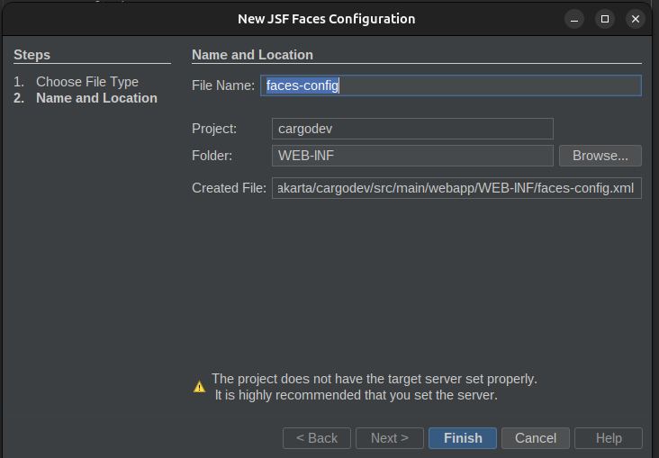
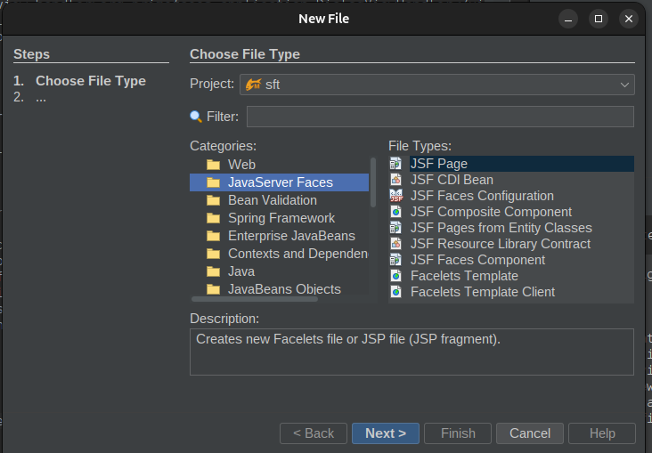
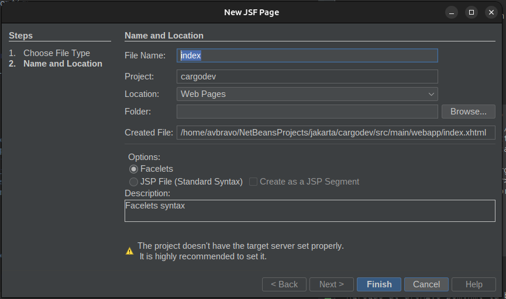
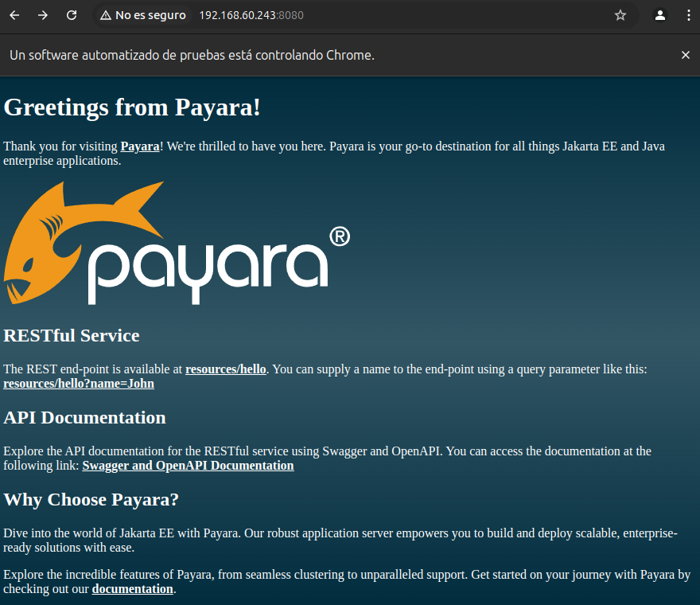

# 01. Proyecto

Vamos a desarrollar una aplicación Web que implementa los patrones definidos en el proyecto cargo.

Comandos

| Comando                                            | Explicación             |
|---                                                 |---                      |
|mvn clean package payara-micro:dev                  | Ejecutar la aplicación  |
|mvn payara-micro:stop                               | Detener la ejecución    |
|mvn docker:build                                    | Crear imagen Docker                        |
|docker run -p 8080:8080 cargodev:${project.version} | Ejecutar imagen Docker                        |

 

Proyecto: **cargodev**

Fuente:
[https://github.com/avbravo/jakarta/](https://github.com/avbravo/jakarta/)

## 01.1 Crear proyecto

Lo haremos mediante Payara Starter.

Ingrese a  [https://start.payara.fish/](https://start.payara.fish/) y especifique:

* Project Description

```
Build: Maven
Group ID: com.avbravo
Artifact ID: cargodev
Version: 0.1-SNAPSHOT

```

* Jakarta EE

```
Jakarta EE version: Jakarta EE 10.
Jakarta EE Profile: Platform

```

* Payara Platform

```
Platform: Payara Micro

```

* Project Configuration

```
Package: com.avbravo

(*) Include Tests 

Java Version: Java SE 21


```

* MicroProfile

```
(*) Full MP
(*) MicroProfile Config
(*) MicroProfile Open API
(*) MicroProfile Fault Tolerance
(*) MicroProfile Metrics

```

* Deployment Options

```
(*) Docker

```

* ER Diagram Designer

```
( ) ---

```

* Security Configuration

```
(*) None

```

Descargue el archivo cargodev.zip, descomprima el archivo y abralo en su IDE.

Edite el archivo HelloWorldResourceTest.java y corriga el error de importación.

Agregue los siguientes import

```java
import com.avbravo.resource.HelloWorldResource;
import com.avbravo.resource.RestConfiguration;
```

## 01.2 Construccir y Ejecutar el proyecto

Ingrese al directorio de su proyecto desde la consola.


Para ejecutar el proyecto debe dar permisos de ejecución mediante

```shell
chmod 775 mvnw mvnw.cmd 
```

Lea el archivo README.md donde se indican las instrucciones para contruir y ejecutar el proyecto.

* Ejecutando la aplicación
```
mvn clean package payara-micro:dev
```

* Docker
Crear la imagen de Docker

```
mvn docker:build
```

* Ejecutar la imagen de Docker

```
docker run -p 8080:8080 cargodev:${project.version}
```


## 01.3 Probar el proyecto

Ingrese al url [http://192.168.60.243:8080/](http://192.168.60.243:8080/)

Pruebe los endpoints:

* [http://192.168.60.243:8080/resources/hello](http://192.168.60.243:8080/resources/hello)

* [http://192.168.60.243:8080/resources/hello?name=John](http://192.168.60.243:8080/resources/hello?name=John)


## 01.4 Configurar proyecto

Ubiquese en la carpeta WebPages/WEB-INF y cree el archivo faces-config.xml.

Desde el menu seleccione New File --> Categories: Java Server Faces File Types: JSF Faces Configuration


Seleccione el nombre




Agregue al contenido

```xml

<faces-config version="4.0"
              xmlns="https://jakarta.ee/xml/ns/jakartaee"
              xmlns:xsi="http://www.w3.org/2001/XMLSchema-instance"
              xsi:schemaLocation="https://jakarta.ee/xml/ns/jakartaee https://jakarta.ee/xml/ns/jakartaee/web-facesconfig_4_0.xsd">
    <application>
        <action-listener>org.primefaces.application.DialogActionListener</action-listener>
        <navigation-handler>org.primefaces.application.DialogNavigationHandler</navigation-handler>
        <view-handler>org.primefaces.application.DialogViewHandler</view-handler>
    </application>
</faces-config>


```

## 01.5 Primefaces

Agregue al archivo pom.xml la biblioteca de primefaces

```xml
<!--
        Primefaces
-->
<dependency>
    <groupId>org.primefaces</groupId>
    <artifactId>primefaces</artifactId>
    <version>15.0.3</version>
    <classifier>jakarta</classifier>
</dependency>


```


Ahora cree una pagina JSF, desde el menú seleccione File --> New --> 



Indique como nombre index



Observer que el archivo web.xml se modifico

```xml


<?xml version="1.0" encoding="UTF-8"?>
<web-app version="6.0" xmlns="https://jakarta.ee/xml/ns/jakartaee" xmlns:xsi="http://www.w3.org/2001/XMLSchema-instance" xsi:schemaLocation="https://jakarta.ee/xml/ns/jakartaee https://jakarta.ee/xml/ns/jakartaee/web-app_6_0.xsd">
    <context-param>
        <param-name>jakarta.faces.PROJECT_STAGE</param-name>
        <param-value>Development</param-value>
    </context-param>
    <servlet>
        <servlet-name>Faces Servlet</servlet-name>
        <servlet-class>jakarta.faces.webapp.FacesServlet</servlet-class>
        <load-on-startup>1</load-on-startup>
    </servlet>
    <servlet-mapping>
        <servlet-name>Faces Servlet</servlet-name>
        <url-pattern>/faces/*</url-pattern>
    </servlet-mapping>
    <welcome-file-list>
        <welcome-file>faces/index.xhtml</welcome-file>
        <welcome-file>index.html</welcome-file>
    </welcome-file-list>
</web-app>

```

Si ingresa al navegador [http://192.168.60.243:8081/faces/index.xhtml](http://192.168.60.243:8081/faces/index.xhtml)

Obtendra la respuesta **Hello from Facelets**


* Modifique la sección **<servlet-mapping>** cambiando

```xml
<servlet-mapping>
    <servlet-name>Faces Servlet</servlet-name>
    <url-pattern>/faces/*</url-pattern>
</servlet-mapping>
```

por

```xml
<servlet-mapping>
<servlet-name>Faces Servlet</servlet-name>
<url-pattern>*.xhtml</url-pattern>
</servlet-mapping>
```

 Modifique la sección **<welcome-file-list>** cambiando

```xml
<welcome-file-list>
    <welcome-file>faces/index.xhtml</welcome-file>
    <welcome-file>index.html</welcome-file>
</welcome-file-list>
```

por

```xml
<welcome-file-list>
    <welcome-file>index.xhtml</welcome-file>
    <welcome-file>index.html</welcome-file>
</welcome-file-list>
```

Si ingresa al navegador [http://192.168.60.243:8081/index.xhtml](http://192.168.60.243:8081/index.xhtml)


* Ahora modifique el archivo index.xhtml

```
<?xml version='1.0' encoding='UTF-8' ?>
<!DOCTYPE html PUBLIC "-//W3C//DTD XHTML 1.0 Transitional//EN" "http://www.w3.org/TR/xhtml1/DTD/xhtml1-transitional.dtd">
<html xmlns="http://www.w3.org/1999/xhtml"
      xmlns:h="jakarta.faces.html"
      xmlns:f="jakarta.faces.core">
    <h:head>
        <title>Facelet Title</title>
        <style>
            body {
                background-image: linear-gradient(rgba(0,44,62), rgba(0,44,62,.8), rgba(0,44,62));
                color: #fff;
            }
            a {
                font-weight: bold;`
                color: white;
            }
        </style>
    </h:head>
    <h:body>
        <f:view contentType="text/html">
      <h1>Greetings from Payara!</h1>
        <p>
            Thank you for visiting <a href="https://www.payara.fish/">Payara</a>! We're thrilled to have you here. Payara is your go-to destination for all things Jakarta EE and Java enterprise applications.
        </p>
        <p>
            <a href="https://www.payara.fish/"></a>
        </p>
        
        <h2>RESTful Service</h2>
        <p>
            The REST end-point is available at <a href="resources/hello">resources/hello</a>.
            You can supply a name to the end-point using a query parameter like this: <a href="resources/hello?name=John">resources/hello?name=John</a>
        </p>
        
                
        <h2>API Documentation</h2>
        <p>
            Explore the API documentation for the RESTful service using Swagger and OpenAPI. You can access the documentation at the following link:
            <a href="swagger.html">Swagger and OpenAPI Documentation</a>
        </p>
        
        <h2>Why Choose Payara?</h2>
        <p>
            Dive into the world of Jakarta EE with Payara. Our robust application server empowers you to build and deploy scalable, enterprise-ready solutions with ease.
        </p>
        <p>
            Explore the incredible features of Payara, from seamless clustering to unparalleled support. Get started on your journey with Payara by checking out our <a href="https://docs.payara.fish/">documentation</a>.
        </p>
        </f:view>
    </h:body>
</html>
```


Al ingresar al navegador se muestra la pagina




# Archivo Pom.xml

##  Configurar swagger-ui

Si observa el archivo pom.xml, se realiza el proceso de descarga de swagger-ui, en cada ocasión que se ejecuta 

```java


<plugin>
    <groupId>com.googlecode.maven-download-plugin</groupId>
    <artifactId>download-maven-plugin</artifactId>
    <version>1.9.0</version>
    <executions>
        <execution>
            <id>swagger-ui</id>
            <phase>generate-resources</phase>
            <goals>
                <goal>wget</goal>
            </goals>
            <configuration>
                <skipCache>true</skipCache>
                <url>https://github.com/swagger-api/swagger-ui/archive/master.tar.gz</url>
                <unpack>true</unpack>
                <outputDirectory>${project.build.directory}</outputDirectory>
            </configuration>
        </execution>
    </executions>
</plugin>

```

Procedemos a realizar el proceso de descarga en un directorio en nuestro disco mediante

```shell
cd /home/avbravo/software/payara

wget https://github.com/swagger-api/swagger-ui/archive/master.tar.gz 

```

A continuación comente el plugin 

```xml

<!--            <plugin>
                <groupId>com.googlecode.maven-download-plugin</groupId>
                <artifactId>download-maven-plugin</artifactId>
                <version>1.9.0</version>
                <executions>
                    <execution>
                        <id>swagger-ui</id>
                        <phase>generate-resources</phase>
                        <goals>
                            <goal>wget</goal>
                        </goals>
                        <configuration>
                            <skipCache>true</skipCache>
                            <url>https://github.com/swagger-api/swagger-ui/archive/master.tar.gz</url>
                            <unpack>true</unpack>
                            <outputDirectory>${project.build.directory}</outputDirectory>
                        </configuration>
                    </execution>
                </executions>
            </plugin>-->
            

```

Anada el siguiente plugin, especificando la ruta donde se almacena el archivo master.tar.gz


```xml

<!--Descarga Swaggerui -->
<plugin>
    <groupId>org.apache.maven.plugins</groupId>
    <artifactId>maven-antrun-plugin</artifactId>
    <version>3.1.0</version>
    <executions>
        <execution>
            <phase>generate-resources</phase>
            <configuration>
                <tasks>
                    <copy file="~/software/payara/master.tar.gz" todir="${project.build.directory}"/>
                </tasks>
            </configuration>                   
        </execution>
    </executions>
</plugin>

```
Con este procedimiento, evitamos la descarga en cada ocasión del archivo master.tar.gz.


## Modificar el plugin de Payara

 Se realizan las siguientes configuraciones:
 
 * Desabilitar Hazelcast
 * Mostrar el logo
 * Cambiar el context ${final.name}
 * Si desea indicar un puerto en especial utilice

```xml
       <option>
            <key>--port</key>
            <value>9003</value>
       </option>
```

Resultado

```xml
  <!-- Execute 'mvn clean package payara-micro:dev' to run the application. -->           
            <plugin>
                <groupId>fish.payara.maven.plugins</groupId>
                <artifactId>payara-micro-maven-plugin</artifactId>
                <version>2.4</version>
                <configuration>
                    <payaraVersion>${payara.version}</payaraVersion>
                    <deployWar>true</deployWar>
                    <commandLineOptions>
                        <option>
                            <key>--autoBindHttp</key>
                        </option>
                    
                        <!-- desabilita Hazelcas -->
                        <option>
                            <key>--noHazelcast</key>
                        </option>
                        <option>
                            <key>--logo</key>
                        </option>

                        <option>
                            <key>--deploy</key>
                            <value>${project.build.directory}/${project.build.finalName}</value>
                        </option>
                        
                    </commandLineOptions>
                    <!--<contextRoot>/</contextRoot>-->
                    <contextRoot>/${final.name}</contextRoot>
                </configuration>
            </plugin>


```

## Añadir depencias
* Agregar repositorio

```xml
<repository>
        <id>jitpack.io</id>
        <url>https://jitpack.io</url>
 </repository>
```

* Agregar propiedades
* 
```xml
 <properties>
        <project.build.sourceEncoding>UTF-8</project.build.sourceEncoding>
        <maven.compiler.release>21</maven.compiler.release>
        <jakartaee-api.version>10.0.0</jakartaee-api.version>
        <payara.version>6.2025.3</payara.version>
        <final.name>cargodev</final.name>
        <jmoordbencripter.version>2.1</jmoordbencripter.version>
        <jmoordbcoreui.version>0.6.1</jmoordbcoreui.version>
        <jmoordbcorecomponent.version>0.5.1</jmoordbcorecomponent.version>
        <jmoordb-core-annotations.version>2.0.2</jmoordb-core-annotations.version>
        
    </properties>

```

* Añadir dependencias

```xml
 <!--
                Primefaces
        -->
        <dependency>
            <groupId>org.primefaces</groupId>
            <artifactId>primefaces</artifactId>
            <version>15.0.3</version>
            <classifier>jakarta</classifier>
        </dependency>
        

        

        <dependency>
            <groupId>com.github.avbravo</groupId>
            <artifactId>jmoordbencripter</artifactId>
            <version>${jmoordbencripter.version}</version>
        </dependency>
        
        <dependency>
            <groupId>com.github.avbravo</groupId>
            <artifactId>jmoordb-core-annotations</artifactId>
            <version>${jmoordb-core-annotations.version}</version>
        </dependency>
        <!--
           Graficas 
        -->
        
        <dependency>
            <groupId>software.xdev</groupId>
            <artifactId>chartjs-java-model</artifactId>
            <version>2.8.0</version>
        </dependency>
        
        <!--
           Jmoordbcoreui 
        -->

        <dependency>
            <groupId>${project.groupId}</groupId>
            <artifactId>jmoordbcoreui</artifactId>
            <version>${jmoordbcoreui.version}</version>
        </dependency>
        <!--              	<dependency>
            <groupId>com.github.avbravo</groupId>
            <artifactId>jmoordbcoreui</artifactId>
            <version>${jmoordbcoreui.version}</version>
        </dependency>-->
       
        <!--
jmoordbcorecomponent

        -->

        <dependency>
            <groupId>${project.groupId}</groupId>
            <artifactId>jmoordbcorecomponent</artifactId>
            <version>${jmoordbcorecomponent.version}</version>
        </dependency>
        
        <!--        <dependency>
            <groupId>com.github.avbravo</groupId>
            <artifactId>jmoordbcorecomponent</artifactId>
            <version>${jmoordbcorecomponent.version}</version>
        </dependency>-->
```


