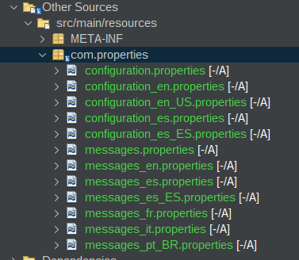
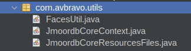

# 03. Configuración

En esta sección realizaremos la configuración de archivos de imagenes, css y js.


Dentro de Web Pages cree una carpeta llamada resources y dentro de ella cree las carpetas:

* css
* images
* js
* vendor


Quedaria

```

Web Pages/resources/css
Web Pages/resources/images
Web Pages/resources/js

```


En esta carpeta puede incluir los css, imagenes y js.


## Imagenes

Por ejemplo si desea utilizar una imagen que se almacena en la carpeta imagenes puede utilizar.

* library: images
* name:folder/imagen

```html

     <h:graphicImage library="images" name="primefaces/favicon-32x32_1.png" />


```


## CSS

Generalmente se utilizan dentro de **<h:head/>**
De manera similar a las imagenes utilice la siguiente sintaxis.

* library: css
* name: folder/archivo.css

```html
 <h:outputStylesheet library="css" name="css/core/libs.min.css" />
```


## Java Script

Continua el mismo principio usado anteriormente


* library: js
* name: folder/archivo.js

```html
    <h:outputScript name="avbravo/archivo.js" library="js"/>

```

---

# Archivos de Properties

Cree la carpeta **com.properties** en src/main/resources/


Aparecen en la sección Other Sources  src/main/resources


Cree los archivos:

* configuration.properties

* information.properties

* messages


Archivo de configuración 


```
#Application
application.title=Cargo Dev
application.subtitle=Cargo Dev
application.slogan=Permite organizar su trabajo en Proyectos y tareas
application.footer=Cargo Dev
application.developmentby=Desarrollado por
application.sigla=Cargo Dev
application.shorttitle=Cargo Dev
#footer
application.login=Login
application.loading=Loading
application.dashboard=Dashboard
application.version=0.0.1

#session expired
application.sessionexpired =Sesión expirada
page404.urlnotfound=This requested URL was not found on this server.

#LoginFeature
loginfeature.tite1=Gestión de proyectos
loginfeature.image1=live-collaboration.svg
loginfeature.text1=Gestione sus proyectos y administre los equipos
loginfeature.tite2=Seguridad
loginfeature.image2=security.svg
loginfeature.text2=Su información es confidencial y protegida
loginfeature.tite3=Reportes y tareas
loginfeature.image3=subscribe.svg
loginfeature.text3=Cree y administre sus tareas y genere reportes


```

Cree el archivo **messages.properties** con algunas etiquetas

* field.
* menubar.
* menuitem.
* label.
* dialog.
* selectonemenu.
* info.
* barratitle.
* barralabel.
* print.
* headerText.
* columna.
* warning.
* title.
* inputmask.
`

```

# To change this license header, choose License Headers in Project Properties.
# To change this template file, choose Tools | Templates
# and open the template in the editor.
menubar.home=Home
menuitem.logout=Salir
menuitem.password=Password
button.newproject=Nuevo proyecto
field.avance=Avance
label.plan=Plan
tab.resumen=Resumen
button.sprint=Plan
dialog.tarjetaadd=Agregar tarjeta
selectonemenu.prioridadalta=Alta
info.savetarjeta=Se guardo exitosamente la tarjeta
dialog.tarjetaclone=Clonar Tarjeta
barratitle.tarjetas=Tarjetas
barralabel.pendiente=Pendiente
breadcrumb.schedule=Calendario
info.cambiarcolaboradortarjeta=Se cambio colaborador de la tarjeta
print.fecha=Fecha
info.saveproyecto=Proyecto se guardó exitosamente
headerText.sprint=Plan
columna.backlog=Reserva
breadcrumb.backlog=Reserva
menuitem.ia=IA
breadcrumb.informacion=Información
menuitem.user=Usuarios
menubar.settings=Configuración
warning.ingresetexto=Ingrese un texto
title.tarjetaclickeditar=De clic dara editar la tarjeta
inputmask.formatoestimacion=Formato [d] HH:mm
form.departament=Departamento
menuitem.departament=Departamento


```


Resultado final



# Configurar Tipos

Edite el archivo web.xml y añada:


```xml

 <context-param>
        <param-name>jakarta.faces.CLIENT_WINDOW_MODE</param-name>
        <param-value>url</param-value>
    </context-param>
    <context-param>
        <param-name>primefaces.THEME</param-name>
        <param-value>saga</param-value>
    </context-param>
    <context-param>
        <param-name>primefaces.FONT_AWESOME</param-name>
        <param-value>true</param-value>
    </context-param>
    <context-param>
        <param-name>primefaces.MOVE_SCRIPTS_TO_BOTTOM</param-name>
        <param-value>true</param-value>
    </context-param>
    <mime-mapping>
        <extension>ttf</extension>
        <mime-type>application/font-sfnt</mime-type>
    </mime-mapping>
    <mime-mapping>
        <extension>woff</extension>
        <mime-type>application/font-woff</mime-type>
    </mime-mapping>
    <mime-mapping>
        <extension>woff2</extension>
        <mime-type>application/font-woff2</mime-type>
    </mime-mapping>
    <mime-mapping>
        <extension>eot</extension>
        <mime-type>application/vnd.ms-fontobject</mime-type>
    </mime-mapping>
    
    
    <!--

    -->


    <mime-mapping>
        <extension>eot?#iefix</extension>
        <mime-type>application/vnd.ms-fontobject</mime-type>
    </mime-mapping>
    <mime-mapping>
        <extension>svg</extension>
        <mime-type>image/svg+xml</mime-type>
    </mime-mapping>
    <mime-mapping>
        <extension>svg#exosemibold</extension>
        <mime-type>image/svg+xml</mime-type>
    </mime-mapping>
    <mime-mapping>
        <extension>svg#exobolditalic</extension>
        <mime-type>image/svg+xml</mime-type>
    </mime-mapping>
    <mime-mapping>
        <extension>svg#exomedium</extension>
        <mime-type>image/svg+xml</mime-type>
    </mime-mapping>
    <mime-mapping>
        <extension>svg#exoregular</extension>
        <mime-type>image/svg+xml</mime-type>
    </mime-mapping>
    <mime-mapping>
        <extension>svg#fontawesomeregular</extension>
        <mime-type>image/svg+xml</mime-type>
    </mime-mapping>
  

```

# Archivo pom.xml

Edite el archivo pom.xml

Agregue las propiedades

```
<final.name>sales</final.name>
<jmoordbencripter.version>2.1</jmoordbencripter.version>
<jmoordbcoreui.version>0.6</jmoordbcoreui.version>
<jmoordbcorecomponent.version>0.5</jmoordbcorecomponent.version>
<jmoordb-core-annotations.version>2.0.2</jmoordb-core-annotations.version>

```

Añada en la sección repositories

```xml
<repository>
    <id>jitpack.io</id>
    <url>https://jitpack.io</url>
</repository>

```

Añada las dependencias

```xml
<dependency>
            <groupId>com.github.avbravo</groupId>
            <artifactId>jmoordbencripter</artifactId>
            <version>${jmoordbencripter.version}</version>
        </dependency>
        
        <dependency>
            <groupId>com.github.avbravo</groupId>
            <artifactId>jmoordb-core-annotations</artifactId>
            <version>${jmoordb-core-annotations.version}</version>
        </dependency>
        <!--
           Graficas 
        -->
        
        <dependency>
            <groupId>software.xdev</groupId>
            <artifactId>chartjs-java-model</artifactId>
            <version>2.8.0</version>
        </dependency>
        
        <!--
           Jmoordbcoreui 
        -->

        <dependency>
            <groupId>com.github.avbravo</groupId>
            <artifactId>jmoordbcoreui</artifactId>
            <version>${jmoordbcoreui.version}</version>
        </dependency>
       
        <!--
jmoordbcorecomponent

        -->


        
            <dependency>
            <groupId>com.github.avbravo</groupId>
            <artifactId>jmoordbcorecomponent</artifactId>
            <version>${jmoordbcorecomponent.version}</version>
        </dependency>

```


---

# Paquetes de Utilidades

 Crear el paquete .utils y agregar las clases

* FacesUtil.java
* JmoordbCoreContext.java
* JmoordbCoreResourcesFiles.java




---

# Archivos de Configuracion

Crear el parquete .configuration y crear dentro de el las clases

* ApplicationConfig.java
* SecuritySessionListener.java
* StartupObserver.java


* ApplicationConfig.java

```java
package com.avbravo.configuration;

import jakarta.enterprise.context.ApplicationScoped;
import jakarta.faces.annotation.FacesConfig;
import jakarta.security.enterprise.authentication.mechanism.http.CustomFormAuthenticationMechanismDefinition;
import jakarta.security.enterprise.authentication.mechanism.http.LoginToContinue;

/**
 *
 * @author avbravo
 */
@CustomFormAuthenticationMechanismDefinition(
        loginToContinue = @LoginToContinue(
                loginPage = "/index.xhtml",
                errorPage="/error.xhtml",
                useForwardToLogin = false
            )
)
@FacesConfig
@ApplicationScoped
public class ApplicationConfig {
    
}


```

* SecuritySessionListener.java


```java

import jakarta.servlet.http.HttpSession;
import jakarta.servlet.http.HttpSessionEvent;
import jakarta.servlet.http.HttpSessionListener;
import java.io.Serializable;
import java.util.Date;

/**
 *
 * @author avbravo
 */
public class SecuritySessionListener implements HttpSessionListener, Serializable {

    @Override
    public void sessionCreated(HttpSessionEvent se) {
        System.out.println("********************************************************************");
        System.out.println("Session created : " + se.getSession().getId() + " at " + new Date());
        System.out.println("********************************************************************");
    }

    @Override
    public void sessionDestroyed(HttpSessionEvent se) {
        HttpSession session = se.getSession();
        System.out.println("********************************************************************");
        System.out.println("session destroyed :" + session.getId() + " Logging out user... at  " + new Date());
        System.out.println("********************************************************************");
    }
}


```

* StartupObserver.java

```java
package com.avbravo.configuration;


import com.avbravo.utils.FacesUtil;
import jakarta.enterprise.context.ApplicationScoped;
import jakarta.enterprise.event.Observes;
import jakarta.enterprise.event.Shutdown;
import jakarta.enterprise.event.Startup;

/**
 *
 * @author avbravo
 */
@ApplicationScoped
public class StartupObserver {


    // <editor-fold defaultstate="collapsed" desc="Microprofile Config">
//    @Inject
//    private Config config;
//    @Inject
//    @ConfigProperty(name = "idapplicative")
//    private Provider<Integer> idapplicative;
//    @Inject
//    @ConfigProperty(name = "loginStyle")
//    private Provider<String> loginStyle;
//    // -----------------------------------------------------
//    //     CREAR DIRECTORIOS DE IMAGENES Y LOGGER
//    //------------------------------------------------------
//    @Inject
//    @ConfigProperty(name = "pathBaseLinuxAddUserHome", defaultValue = "true")
//    private Provider<Boolean> pathBaseLinuxAddUserHome;
//    @Inject
//    @ConfigProperty(name = "pathBaseLinuxAddUserHomeStoreInCollections", defaultValue = "false")
//    private Provider<Boolean> pathBaseLinuxAddUserHomeStoreInCollections;
//
//    @Inject
//    @ConfigProperty(name = "pathLinux", defaultValue = " ")
//    private Provider<String> pathLinux;
//    @Inject
//    @ConfigProperty(name = "pathLinuxPhotoUser", defaultValue = " ")
//    private Provider<String> pathLinuxPhotoUser;
//    @Inject
//    @ConfigProperty(name = "pathLinuxPhotoGeneral", defaultValue = " ")
//    private Provider<String> pathLinuxPhotoGeneral;
//    @Inject
//    @ConfigProperty(name = "pathLinuxFileRepository", defaultValue = " ")
//    private Provider<String> pathLinuxFileRepository;
//    @Inject
//    @ConfigProperty(name = "pathWindows", defaultValue = " ")
//    private Provider<String> pathWindows;
//    @Inject
//    @ConfigProperty(name = "pathWindowsPhotoUser", defaultValue = " ")
//    private Provider<String> pathWindowsPhotoUser;
//    @Inject
//    @ConfigProperty(name = "pathWindowsPhotoGeneral", defaultValue = " ")
//    private Provider<String> pathWindowsPhotoGeneral;
//    @Inject
//    @ConfigProperty(name = "pathWindowsFileRepository", defaultValue = " ")
//    private Provider<String> pathWindowsFileRepository;
//
//    @Inject
//    @ConfigProperty(name = "pathBaseLinuxAddUserHomeLogger", defaultValue = "true")
//    private Provider<Boolean> pathBaseLinuxAddUserHomeLogger;
//    @Inject
//    @ConfigProperty(name = "pathLinuxLogger", defaultValue = " ")
//    private Provider<String> pathLinuxLogger;
//    @Inject
//    @ConfigProperty(name = "pathWindowsLogger", defaultValue = " ")
//    private Provider<String> pathWindowsLogger;

// </editor-fold>
    public void observeStartup(@Observes Startup startupEvent) {

        System.out.println("CDI Container is starting");
        System.out.println("____________________________________________________");
        System.out.println("\t\t[" + FacesUtil.nameOfClassAndMethod() + "]");

        System.out.println("Revisar las carpetas para imagenes aqui() ");
        System.out.println("Leer la configuración de la aplicacion aqui() ");
//        System.out.println("Applicative es " + idapplicative.get());
        System.out.println("____________________________________________________");

        String path = "";
        String pathImage = "";
        String pathImagePhotoUser = "";
        String pathImagePhotoGeneral = "";
        String pathFileRepository = "";
        try {
            /**
             * images
             */
//            pathImage = (FacesUtil.isLinux()
//                    ? (pathBaseLinuxAddUserHome.get() ? FacesUtil.userHome() + pathLinux.get() : pathLinux.get())
//                    : pathWindows.get()) + "file.json";
//            String directory = (FacesUtil.isLinux()
//                    ? (pathBaseLinuxAddUserHome.get() ? FacesUtil.userHome() + pathLinux.get() : pathLinux.get())
//                    : pathWindows.get());
//
//            /**
//             * images/photouser
//             */
//            pathImagePhotoUser = (FacesUtil.isLinux()
//                    ? (pathBaseLinuxAddUserHome.get() ? FacesUtil.userHome() + pathLinuxPhotoUser.get() : pathLinuxPhotoUser.get())
//                    : pathWindowsPhotoUser.get()) + "file.json";
//
//            String directoryPhotoUser = (FacesUtil.isLinux()
//                    ? (pathBaseLinuxAddUserHome.get() ? FacesUtil.userHome() + pathLinuxPhotoUser.get() : pathLinuxPhotoUser.get())
//                    : pathWindowsPhotoUser.get());
//
//            /**
//             * images/photouser
//             */
//            pathImagePhotoGeneral = (FacesUtil.isLinux()
//                    ? (pathBaseLinuxAddUserHome.get() ? FacesUtil.userHome() + pathLinuxPhotoGeneral.get() : pathLinuxPhotoGeneral.get())
//                    : pathWindowsPhotoGeneral.get()) + "file.json";
//
//            String directoryPhotoGeneral = (FacesUtil.isLinux()
//                    ? (pathBaseLinuxAddUserHome.get() ? FacesUtil.userHome() + pathLinuxPhotoGeneral.get() : pathLinuxPhotoGeneral.get())
//                    : pathWindowsPhotoGeneral.get());
//
//            /**
//             * file/Repository
//             */
//            pathFileRepository = (FacesUtil.isLinux()
//                    ? (pathBaseLinuxAddUserHome.get() ? FacesUtil.userHome() + pathLinuxFileRepository.get() : pathLinuxFileRepository.get())
//                    : pathWindowsFileRepository.get()) + "file.json";
//
//            String directoryFileRepository = (FacesUtil.isLinux()
//                    ? (pathBaseLinuxAddUserHome.get() ? FacesUtil.userHome() + pathLinuxFileRepository.get() : pathLinuxFileRepository.get())
//                    : pathWindowsFileRepository.get());
//
//            /**
//             * Logger
//             */
//            path = (FacesUtil.isLinux()
//                    ? (pathBaseLinuxAddUserHomeLogger.get() ? FacesUtil.userHome() + pathLinuxLogger.get() : pathLinuxLogger.get())
//                    : pathWindowsLogger.get()) + "looger.json";
//            String directoryLogger = (FacesUtil.isLinux()
//                    ? (pathBaseLinuxAddUserHomeLogger.get() ? FacesUtil.userHome() + pathLinuxLogger.get() : pathLinuxLogger.get())
//                    : pathWindowsLogger.get());
//
//            /**
//             * Directorio Image
//             */
//            Path searchImage = Paths.get(directory);
//            if (!Files.exists(searchImage)) {
//                File directorio = new File(directory);
//                if (directorio.mkdirs()) {
//
//                } else {
//
//                }
//            }
//            /**
//             * Directorio images/user
//             */
//
//            Path searchImagePhotoUser = Paths.get(directoryPhotoUser);
//            if (!Files.exists(searchImagePhotoUser)) {
//                File directorio = new File(directoryPhotoUser);
//                if (directorio.mkdirs()) {
//
//                } else {
//
//                }
//            }
//            /**
//             * Directorio images/general
//             */
//
//            Path searchImagePhotoGeneral = Paths.get(directoryPhotoGeneral);
//            if (!Files.exists(searchImagePhotoGeneral)) {
//                File directorio = new File(directoryPhotoGeneral);
//                if (directorio.mkdirs()) {
//
//                } else {
//
//                }
//            }
//            /**
//             * Directorio file/Repository
//             */
//
//            Path searchImageFileRepository = Paths.get(directoryFileRepository);
//            if (!Files.exists(searchImageFileRepository)) {
//                File directorio = new File(directoryFileRepository);
//                if (directorio.mkdirs()) {
//
//                } else {
//
//                }
//            }
//
//            /**
//             * Directorio Logger
//             */
//            Path search = Paths.get(directoryLogger);
//            if (!Files.exists(search)) {
//                File directorio = new File(directoryLogger);
//                if (directorio.mkdirs()) {
//
//                } else {
//
//                }
//            }

        } catch (Exception e) {
            FacesUtil.showError(FacesUtil.nameOfClassAndMethod() + " " + e.getLocalizedMessage());
        }

    }

    public void observeShutdown(@Observes Shutdown shutdownEvent) {
        System.out.println("CDI Container is stopping");
    }
}


```