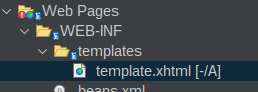
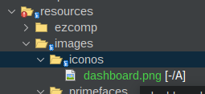
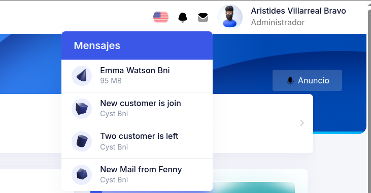
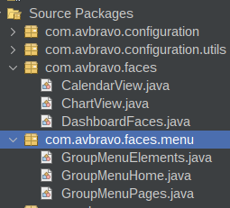
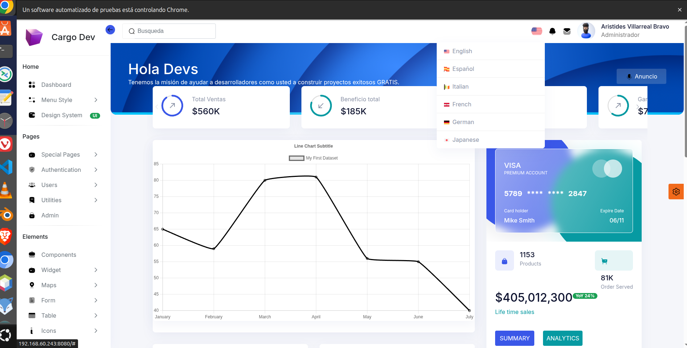

# 04. Template

El template se configura desde la clase principal Java.

* Usaremos una clase llamada **DashboardFaces.java** que contendra los componentes principales.


---

# Crear plantilla

Cree el archivo Web Pages/WEB-INF/templates/template.xhtml




Contenido del archivo
 

```
<?xml version="1.0" encoding="UTF-8"?>
<!DOCTYPE html PUBLIC "-//W3C//DTD XHTML 1.0 Transitional//EN"
    "http://www.w3.org/TR/xhtml1/DTD/xhtml1-transitional.dtd">
<html xmlns="http://www.w3.org/1999/xhtml"
      xmlns:h="jakarta.faces.html"
      xmlns:ui="jakarta.faces.facelets"
      xmlns:f="jakarta.faces.core" xmlns:p="http://primefaces.org/ui"
      xmlns:jmoordbcoreui="http://jmoordbcoreui.com/taglib">
    <h:head>
        <f:facet name="first">
            <meta http-equiv="X-UA-Compatible" content="IE=edge"/>
            <meta http-equiv="Content-Type" content="text/html; charset=UTF-8"/>
            <meta name="viewport" content="width=device-width, initial-scale=1.0, maximum-scale=1.0, user-scalable=0, shrink-to-fit=no"/>
            <meta name="referrer" content="no-referrer"/>
            <meta name="referrer" content="strict-origin-when-cross-origin"/>

        </f:facet>

        <jmoordbcoreui:css/>
        <link
            rel="stylesheet"
            href="https://cdnjs.cloudflare.com/ajax/libs/animate.css/4.1.1/animate.min.css"
            />

        <title>Cargo Dev</title>

        <!-- Aplicar jQuery.noConflict() -->
        <h:outputScript>
            var $j = jQuery.noConflict();
            $j(document).ready(function() {
            console.log("jQuery noConflict está funcionando correctamente.");
            });
        </h:outputScript>
    </h:head>

    <h:body>
        <f:view contentType="text/html">
            <h:form enctype="multipart/form-data" prependId="false">

                <jmoordbcoreui:template templateBean="#{dashboardFaces.template}"/>


            </h:form>
            <jmoordbcoreui:js/>
        </f:view>

    </h:body>
</html>


```


# Explicación de componentes


## NavHeader

Es la barra de encabezado que se muestra en cada formulario

* Mostrar imagenes del directorio resources de su proyecto

```java
  NavHeader navHeader = new NavHeader.Builder()
                    .title("Hola Devs")
                    .message("Tenemos la misión de ayudar a desarrolladores como usted a construir proyectos exitosos GRATIS.")
                    .hrefInfo(new HrefInfo.Builder().href("").text("Anuncio").minText("a").build())
                    .imageInfo(new ImageInfo.Builder().library("jmoordbcoreui").name("images/svg/botones/anuncio.svg").build())
                    .imageInfos(Arrays.asList(
                            new ImageInfo.Builder().library("images").name("iconos/dashboard.png").build(),
                            new ImageInfo.Builder().library("images").name("iconos/dashboard.png").build(),
                            new ImageInfo.Builder().library("images").name("iconos/dashboard.png").build(),
                            new ImageInfo.Builder().library("images").name("iconos/dashboard.png").build(),
                            new ImageInfo.Builder().library("images").name("iconos/dashboard.png").build()
                    )
                    )
                    .build();

```

* Mostrando imagenes de la libreria jmoordbcoreui

```java

 NavHeader navHeader = new NavHeader.Builder()
                    .title("Hola Devs")
                    .message("Tenemos la misión de ayudar a desarrolladores como usted a construir proyectos exitosos GRATIS.")
                    .hrefInfo(new HrefInfo.Builder().href("").text("Anuncio").minText("a").build())
                    .imageInfo(new ImageInfo.Builder().library("jmoordbcoreui").name("images/svg/botones/anuncio.svg").build())
                    .imageInfos(Arrays.asList(
                           new ImageInfo.Builder().library("jmoordbcoreui").name("images/dashboard/top-header.png").build(),
                           new ImageInfo.Builder().library("jmoordbcoreui").name("images/dashboard/top-header1.png").build(),
                           new ImageInfo.Builder().library("jmoordbcoreui").name("images/dashboard/top-header2.png").build(),
                           new ImageInfo.Builder().library("jmoordbcoreui").name("images/dashboard/top-header4.png").build(),
                           new ImageInfo.Builder().library("jmoordbcoreui").name("images/dashboard/top-header5.png").build()
                    )
                    )
                    .build();


```

Genera:


---

## Footer

Crea la barra Footer de la plantilla

Se pueden pasar imagenes ubicadas:

* En el directorio resources de su proyecto



Observe **.imageInfo(new ImageInfo.Builder().library("images").name("iconos/dashboard.png").build())**

```java
 Footer footer = new Footer.Builder()
                    .applicationTitle("Cargo Dev")
                    .by("por")
                    .companyHrefInfo(new HrefInfo.Builder().href("http://avbravo.blogspot.com").text("Avbravo").minText("a").build())
                    .imageInfo(new ImageInfo.Builder().library("images").name("iconos/dashboard.png").build())
                    .privacyPolicy("Política de privacidad")
                    .privacyPolicyURL("../extra/privacy-policy.xhtml")
                    .termsOfUse("Terminos de uso")
                    .termsOfUseURL("../extra/terms-of-service.html")
                    .build();

```


* Imagenes de la libreria jmoordbcoreui
```java
 Footer footer = new Footer.Builder()
                    .applicationTitle("Cargo Dev")
                    .by("por")
                    .companyHrefInfo(new HrefInfo.Builder().href("http://avbravo.blogspot.com").text("Avbravo").minText("a").build())
                    .imageInfo(new ImageInfo.Builder().library("jmoordbcoreui").name("images/svg/wizard.svg").build())
                    .privacyPolicy("Política de privacidad")
                    .privacyPolicyURL("../extra/privacy-policy.xhtml")
                    .termsOfUse("Terminos de uso")
                    .termsOfUseURL("../extra/terms-of-service.html")
                    .build();

```


* Iconos de Primefaces [https://www.primefaces.org/showcase/icons.xhtml?j](https://www.primefaces.org/showcase/icons.xhtml?j)

```java

  Footer  footer = new Footer.Builder()
    .applicationTitle("Cargo Dev")
    .by("por")
    .companyHrefInfo(new HrefInfo.Builder().href("http://avbravo.blogspot.com").text("Avbravo").minText("a").build())
    .imageInfo(new ImageInfo.Builder().library("primefaces").name("pi pi-prime").build())
    .privacyPolicy("Política de privacidad")
    .privacyPolicyURL("../extra/privacy-policy.xhtml")
    .termsOfUse("Terminos de uso")
    .termsOfUseURL("../extra/terms-of-service.html")
    .build();


```


Genera el footer del template


---

## Canva


Canva es el dialogo que se activa en la parte derecha y nos permite seleccionar tema: Auto, Dark, Ligth y cambiar colores.

```java

Canva canva = new Canva.Builder()
                .auto("Auto")
                .color("Color")
                .colorCustomizer("Personlización de color")
                .dark("Oscuro")
                .defaultLabel("Predeterminado")
                .light("Claro")
                .scheme("Esquema")
                .settings("Ajustes")
                .sidebarColor("Color de barra lateral")
                .transparent("Transparente")                   
                .build();

```

Para activarlo de clic en e botón


Se muestra el canva donde puede persnolizar el entorno


---

# Top Header

Crea la sección en la esquina superior derecha del header.



**Atributos**:

* TopHeaderLanguage: Crea una lista para multiples idiomas.

* **TopHeaderNotificacion**: Crea una lista para multiples notificaciones.
* imageLibraryNotificacion("")
* imageNameNotificacion("")
* textNotificacion("")

* **TopHeaderMessage**: Crea una lista para multiples mensajes.
* textMessage("")
* imageLibraryMessage("")
* imageNameMessage("")

Observe los demas atributos para crear la configuración de los botones:

* profileMenu(") : Titulo del menu profile
* profileMenuAction(""). Evento al dar clic 
* privacySettingMenu(""): Titulo del boton Setting.
* privacySettingMenuAction(""). Evento al dar clic 
* logoutMenu(""). Titulo del menu logout.
* logoutMenuAction(""). Evento del boton logout.


```java
public TopHeader createTopHeader() {
        TopHeader topHeader = new TopHeader();
        try {
            TopHeaderLanguage topHeaderLanguageEnglish = new TopHeaderLanguage.Builder()
                    .action("#")
                    .imageLibrary("jmoordbcoreui")
                    .imageName("images/Flag/flag-01.png")
                    .text("English")
                    .build();
            TopHeaderLanguage topHeaderLanguageSpanish = new TopHeaderLanguage.Builder()
                    .action("#")
                    .imageLibrary("jmoordbcoreui")
                    .imageName("images/Flag/flag-03.png")
                    .text("Español")
                    .build();

            TopHeaderLanguage topHeaderLanguageItalian = new TopHeaderLanguage.Builder()
                    .action("#")
                    .imageLibrary("jmoordbcoreui")
                    .imageName("images/Flag/flag-04.png")
                    .text("Italian")
                    .build();

            TopHeaderLanguage topHeaderLanguageFrench = new TopHeaderLanguage.Builder()
                    .action("#")
                    .imageLibrary("jmoordbcoreui")
                    .imageName("images/Flag/flag-02.png")
                    .text("French")
                    .build();
            TopHeaderLanguage topHeaderLanguageGerman = new TopHeaderLanguage.Builder()
                    .action("#")
                    .imageLibrary("jmoordbcoreui")
                    .imageName("images/Flag/flag-05.png")
                    .text("German")
                    .build();
            TopHeaderLanguage topHeaderLanguageJapanese = new TopHeaderLanguage.Builder()
                    .action("#")
                    .imageLibrary("jmoordbcoreui")
                    .imageName("images/Flag/flag-06.png")
                    .text("Japanese")
                    .build();

            /**
             * Notification
             */
            TopHeaderNotificacion topHeaderNotificacionEmma = new TopHeaderNotificacion.Builder()
                    .imageLibrary("jmoordbcoreui")
                    .imageName("images/shapes/01.png")
                    .title("Emma Watson Bni")
                    .subtitle("95 MB")
                    .footer("Just Now")
                    .action("#")
                    .build();
            TopHeaderNotificacion topHeaderNotificacionNewCustomer = new TopHeaderNotificacion.Builder()
                    .imageLibrary("jmoordbcoreui")
                    .imageName("images/shapes/02.png")
                    .title("New customer is join")
                    .subtitle("Cyst Bni")
                    .footer("5 days ago")
                    .action("#")
                    .build();

            TopHeaderNotificacion topHeaderNotificacionTwoCustomer = new TopHeaderNotificacion.Builder()
                    .imageLibrary("jmoordbcoreui")
                    .imageName("images/shapes/03.png")
                    .title("Two customer is left")
                    .subtitle("Cyst Bni")
                    .footer("2 days ago")
                    .action("#")
                    .build();

            TopHeaderNotificacion topHeaderNotificacionNewMail = new TopHeaderNotificacion.Builder()
                    .imageLibrary("jmoordbcoreui")
                    .imageName("images/shapes/04.png")
                    .title("New Mail from Fenny")
                    .subtitle("Cyst Bni")
                    .footer("3 days ago")
                    .action("#")
                    .build();

            /**
             * Messages
             */
            TopHeaderMessage topHeaderMessageEmma = new TopHeaderMessage.Builder()
                    .imageLibrary("jmoordbcoreui")
                    .imageName("images/shapes/01.png")
                    .title("Emma Watson Bni")
                    .subtitle("95 MB")
                    .footer("Just Now")
                    .action("#")
                    .build();
            TopHeaderMessage topHeaderMessageNewCustomer = new TopHeaderMessage.Builder()
                    .imageLibrary("jmoordbcoreui")
                    .imageName("images/shapes/02.png")
                    .title("New customer is join")
                    .subtitle("Cyst Bni")
                    .footer("5 days ago")
                    .action("#")
                    .build();

            TopHeaderMessage topHeaderMessageTwoCustomer = new TopHeaderMessage.Builder()
                    .imageLibrary("jmoordbcoreui")
                    .imageName("images/shapes/03.png")
                    .title("Two customer is left")
                    .subtitle("Cyst Bni")
                    .footer("2 days ago")
                    .action("#")
                    .build();

            TopHeaderMessage topHeaderMessageNewMail = new TopHeaderMessage.Builder()
                    .imageLibrary("jmoordbcoreui")
                    .imageName("images/shapes/04.png")
                    .title("New Mail from Fenny")
                    .subtitle("Cyst Bni")
                    .footer("3 days ago")
                    .action("#")
                    .build();

            /**
             *
             */
            topHeader = new TopHeader.Builder()
                    .nombre("Aristides Villarreal Bravo")
                    .username("avbravo@gmail.com")
                    .perfil("Administrador")
                    .action("dashboard.xhtml")
                    .profileMenu("Perfil")
                    .profileMenuAction("../app/user-profile.xhtml")
                    .privacySettingMenu("Configuración")
                    .privacySettingMenuAction("../extra/terms-of-service.xhtml")
                    .logoutMenu("Logout")
                    .logoutMenuAction("../index.xhtml")
                    .searchText("Busqueda")
                    .searchValue("")
                    .topHeaderLanguageDefault(topHeaderLanguageEnglish)
                    .topHeaderLanguages(
                            List.of(
                                    topHeaderLanguageEnglish, topHeaderLanguageSpanish, topHeaderLanguageItalian, topHeaderLanguageFrench, topHeaderLanguageGerman, topHeaderLanguageJapanese
                            )
                    )
                    .imageLibraryNotificacion("jmoordbcoreui")
                    .imageNameNotificacion("images/svg/botones/notification.svg")
                    .textNotificacion("Notificaciones")
                    .topHeaderNotificacions(
                            List.of(
                                    topHeaderNotificacionEmma, topHeaderNotificacionNewCustomer, topHeaderNotificacionTwoCustomer, topHeaderNotificacionNewMail
                            )
                    )
                    .textMessage("Mensajes")
                     .imageLibraryMessage("jmoordbcoreui")
                    .imageNameMessage("images/svg/botones/email.svg")
                    .topHeaderMessages(
                            List.of(
                                    topHeaderMessageEmma, topHeaderMessageNewCustomer, topHeaderMessageTwoCustomer, topHeaderMessageNewMail
                            )
                    )
                    .build();

        } catch (Exception e) {
        }
        return topHeader;
    }

```


## Menu

* Se recomienda crear en clases separadas los grupos de menus




Edite la clase **DashboardFaces.java** y agregue las clases para crear menus.


* Añada una seccion para las inyecciones de dependencias


```java
  // <editor-fold defaultstate="collapsed" desc="Template">
    Template template;
    MenuBar menuBar = new MenuBar();

    @Inject
    GroupMenuHome groupMenuHome;
    @Inject
    GroupMenuPages groupMenuPages;
    @Inject
    GroupMenuElements groupMenuElements;
// </editor-fold>

```

* Cree un metodo que devuelva la clase MenuBar dentro de la clase DashboardFaces.java
```java
  // <editor-fold defaultstate="collapsed" desc="MenuBar createMenuBar()">
    public MenuBar createMenuBar() {
        menuBar = new MenuBar();
        try {

            menuBar = new MenuBar.Builder()
                    .roles(new ArrayList<>())
                    .action("hola")
                    .boxMenus(
                            List.of(
                                    groupMenuHome.createGroupMenuHome().toBoxMenu(),
                                    groupMenuPages.createGroupMenuPages().toBoxMenu(),
                                    groupMenuElements.createGroupMenuElements().toBoxMenu()
                            )
                    )
                    .build();

        } catch (Exception e) {
            System.out.println("createMenuBar() " + e.getLocalizedMessage());
        }
        return menuBar;
    }


```

En el init agregue la invocación

```java
   public String createTemplate() {
        try {

            template = new Template.Builder()
                    .logoTitle("Cargo Dev")
                    .imageInfoLogoNormal(new ImageInfo.Builder().library("jmoordbcoreui").name("images/avatars/02.png").build())
                    .imageInfoLogoMini(new ImageInfo.Builder().library("jmoordbcoreui").name("images/avatars/02.png").build())
                    .logoMiniImageSize("width:20px;")
                    .footer(createFooter())
                    .navHeader(createNavHeader())
                    .canva(createCanva())
                    .menuBar(createMenuBar())
                    .topHeader(createTopHeader())
                    .build();
        } catch (Exception e) {
        }
        return "";
    }

```

## Para crear menuItems utilice

* MenuItem simple con icono de la libreria jmoordbcoreui

```java
  MenuItem menuItemDashboard = new MenuItem.Builder()
                    .action("../dashboard.xhtml")
                    .text("Dashboard")
                    .minText("d")
                    .imageLibrary("jmoordbcoreui")
                    .imageName("images/svg/dashboard.svg")
                    .roles(new ArrayList<>())
                    .build();

```

* MenuItems con icono ubicado en resources/images de su proyecto
```java
  MenuItem menuItemDashboard = new MenuItem.Builder()
                    .action("../dashboard.xhtml")
                    .text("Dashboard")
                    .minText("d")
                    .imageLibrary("images")
                    .imageName("/gente/persona.png")
                    .roles(new ArrayList<>())
                    .build();

```

* MenuItem con badge etiqueta

```java
 MenuItem menuItemDesignSystem = new MenuItem.Builder()
                    .action("https://templates.iqonic.design/hope-ui/html/dist/")
                    .text("Design System")
                    .minText("UI")
                    .imageLibrary("jmoordbcoreui")
                    .imageName("images/svg/desingsystem.svg")
                    .badgeSpanLabel("UI")
                    .badgeSpanType("bg-success")
                    .roles(new ArrayList<>())
                    .build();
```

* MenuItem con iconos de primefaces

```java
 MenuItem menuItemHorizontal = new MenuItem.Builder()
                    .action("../errors/error404.xhtml")
                    .text("Horizontal")
                    .minText("H")
                    .imageLibrary("primefaces")
                    .imageName("pi pi-check-square")
                    .roles(new ArrayList<>())
                    .build();
```

## Separador
```java
   SeparatorMenu separatorMenu = new SeparatorMenu();
```

## Submenu

Se agregan los MenuItems y/o separadores

```java
   subMenuMenuStyles = new SubMenu.Builder()
                    .action("#horizontal-menu").text("Menu Style").minText("M")
                    .ariaControls("horizontal-menu")
                    .imageLibrary("jmoordbcoreui").imageName("images/svg/menustyle.svg")
                    .boxMenus(
                            List.of(
                                    menuItemHorizontal.toBoxMenu(),
                                      menuItemError404.toBoxMenu()
                            )
                    )
                    .roles(new ArrayList<>())
                    .build();

```


## GroupMenu

Son los grupos generales

```java
 groupMenu = new GroupMenu.Builder()
                    .text("Home")
                    .miniText("h")
                    .action("#")
                    .boxMenus(List.of(
                            menuItemDashboard.toBoxMenu(),
                            createSubMenuyMenuStyles().toBoxMenu(),
                            menuItemDesignSystem.toBoxMenu(),
                            separatorMenu.toBoxMenu()
                    )
                    )
                    .roles(new ArrayList<>())
                    .build();

```


## 
---
# Plantilla Completa




## Clases

### DashboardFaces.java
Codigo Java

```java
import com.avbravo.faces.menu.GroupMenuElements;
import com.avbravo.faces.menu.GroupMenuHome;
import com.avbravo.faces.menu.GroupMenuPages;

import com.avbravo.jmoordbcorecomponent.HrefInfo;
import com.avbravo.jmoordbcorecomponent.ImageInfo;
import com.avbravo.jmoordbcorecomponent.knob.KnobInfo;
import com.avbravo.jmoordbcorecomponent.menu.MenuBar;

import com.avbravo.jmoordbcorecomponent.template.Canva;
import com.avbravo.jmoordbcorecomponent.template.Footer;
import com.avbravo.jmoordbcorecomponent.template.NavHeader;
import com.avbravo.jmoordbcorecomponent.template.Template;
import com.avbravo.jmoordbcorecomponent.template.TopHeader;
import com.avbravo.jmoordbcorecomponent.template.TopHeaderLanguage;
import com.avbravo.jmoordbcorecomponent.template.TopHeaderMessage;
import com.avbravo.jmoordbcorecomponent.template.TopHeaderNotificacion;
import jakarta.annotation.PostConstruct;
import jakarta.annotation.PreDestroy;
import jakarta.inject.Named;
import jakarta.enterprise.context.SessionScoped;
import jakarta.inject.Inject;
import java.io.Serializable;
import java.util.ArrayList;
import java.util.Arrays;
import java.util.List;

/**
 *
 * @author avbravo
 */
@Named
@SessionScoped
public class DashboardFaces implements Serializable {

    private static final long serialVersionUID = 1L;
    List<KnobInfo> knobInfos = new ArrayList<>();
    private KnobInfo knobInfo;

    // <editor-fold defaultstate="collapsed" desc="Template">
    Template template;
    MenuBar menuBar = new MenuBar();
//    StringBuilder leftMenuStringBuilder = new StringBuilder();
    @Inject
    GroupMenuHome groupMenuHome;
    @Inject
    GroupMenuPages groupMenuPages;
    @Inject
    GroupMenuElements groupMenuElements;

// </editor-fold>
    // <editor-fold defaultstate="collapsed" desc="set/get()">
    
// </editor-fold>
    /**
     * Creates a new instance of DashboardFaces
     */
    public DashboardFaces() {
    }

    // <editor-fold defaultstate="collapsed" desc="void init()">
    @PostConstruct
    public void init() {

        knobInfo = new KnobInfo.Builder()
                .percent(90)
                .label("Ventas")
                .counter("$560K")
                .arrow("up")
                .color("primary")
                .id("v01")
                .delay(700)
                .build();

        knobInfos = Arrays.asList(
                new KnobInfo(90, "Total Ventas", "$560K", "up", "primary", "01", 700),
                new KnobInfo(80, "Beneficio total", "$185K", "down", "info", "02", 800),
                new KnobInfo(70, "Costo total", "$375K", "down", "primary", "03", 900),
                new KnobInfo(60, "Ganancia", "$742", "up", "info", "04", 1000),
                new KnobInfo(50, "Ingresos netos", "$150", "up", "primary", "05", 1100),
                new KnobInfo(50, "Hoy", "$4600", "down", "info", "06", 1200),
                new KnobInfo(30, "Miembros", "11.2M", "down", "primary", "07", 1300)
        );

        createTemplate();

    }
    // </editor-fold>

    // <editor-fold defaultstate="collapsed" desc="createTemplate()">
    public String createTemplate() {
        try {

            template = new Template.Builder()
                    .logoTitle("Cargo Dev")
                    .imageInfoLogoNormal(new ImageInfo.Builder().library("jmoordbcoreui").name("images/avatars/02.png").build())
                    .imageInfoLogoMini(new ImageInfo.Builder().library("jmoordbcoreui").name("images/avatars/02.png").build())
                    .logoMiniImageSize("width:20px;")
                    .footer(createFooter())
                    .navHeader(createNavHeader())
                    .canva(createCanva())
                    .menuBar(createMenuBar())
                    .topHeader(createTopHeader())
                    .build();
        } catch (Exception e) {
        }
        return "";
    }
// </editor-fold>

    // <editor-fold defaultstate="collapsed" desc="TopHeader createTopHeader()">
    public TopHeader createTopHeader() {
        TopHeader topHeader = new TopHeader();
        try {
            TopHeaderLanguage topHeaderLanguageEnglish = new TopHeaderLanguage.Builder()
                    .action("#")
                    .imageLibrary("jmoordbcoreui")
                    .imageName("images/Flag/flag-01.png")
                    .text("English")
                    .build();
            TopHeaderLanguage topHeaderLanguageSpanish = new TopHeaderLanguage.Builder()
                    .action("#")
                    .imageLibrary("jmoordbcoreui")
                    .imageName("images/Flag/flag-03.png")
                    .text("Español")
                    .build();

            TopHeaderLanguage topHeaderLanguageItalian = new TopHeaderLanguage.Builder()
                    .action("#")
                    .imageLibrary("jmoordbcoreui")
                    .imageName("images/Flag/flag-04.png")
                    .text("Italian")
                    .build();

            TopHeaderLanguage topHeaderLanguageFrench = new TopHeaderLanguage.Builder()
                    .action("#")
                    .imageLibrary("jmoordbcoreui")
                    .imageName("images/Flag/flag-02.png")
                    .text("French")
                    .build();
            TopHeaderLanguage topHeaderLanguageGerman = new TopHeaderLanguage.Builder()
                    .action("#")
                    .imageLibrary("jmoordbcoreui")
                    .imageName("images/Flag/flag-05.png")
                    .text("German")
                    .build();
            TopHeaderLanguage topHeaderLanguageJapanese = new TopHeaderLanguage.Builder()
                    .action("#")
                    .imageLibrary("jmoordbcoreui")
                    .imageName("images/Flag/flag-06.png")
                    .text("Japanese")
                    .build();

            /**
             * Notification
             */
            TopHeaderNotificacion topHeaderNotificacionEmma = new TopHeaderNotificacion.Builder()
                    .imageLibrary("jmoordbcoreui")
                    .imageName("images/shapes/01.png")
                    .title("Emma Watson Bni")
                    .subtitle("95 MB")
                    .footer("Just Now")
                    .action("#")
                    .build();
            TopHeaderNotificacion topHeaderNotificacionNewCustomer = new TopHeaderNotificacion.Builder()
                    .imageLibrary("jmoordbcoreui")
                    .imageName("images/shapes/02.png")
                    .title("New customer is join")
                    .subtitle("Cyst Bni")
                    .footer("5 days ago")
                    .action("#")
                    .build();

            TopHeaderNotificacion topHeaderNotificacionTwoCustomer = new TopHeaderNotificacion.Builder()
                    .imageLibrary("jmoordbcoreui")
                    .imageName("images/shapes/03.png")
                    .title("Two customer is left")
                    .subtitle("Cyst Bni")
                    .footer("2 days ago")
                    .action("#")
                    .build();

            TopHeaderNotificacion topHeaderNotificacionNewMail = new TopHeaderNotificacion.Builder()
                    .imageLibrary("jmoordbcoreui")
                    .imageName("images/shapes/04.png")
                    .title("New Mail from Fenny")
                    .subtitle("Cyst Bni")
                    .footer("3 days ago")
                    .action("#")
                    .build();

            /**
             * Messages
             */
            TopHeaderMessage topHeaderMessageEmma = new TopHeaderMessage.Builder()
                    .imageLibrary("jmoordbcoreui")
                    .imageName("images/shapes/01.png")
                    .title("Emma Watson Bni")
                    .subtitle("95 MB")
                    .footer("Just Now")
                    .action("#")
                    .build();
            TopHeaderMessage topHeaderMessageNewCustomer = new TopHeaderMessage.Builder()
                    .imageLibrary("jmoordbcoreui")
                    .imageName("images/shapes/02.png")
                    .title("New customer is join")
                    .subtitle("Cyst Bni")
                    .footer("5 days ago")
                    .action("#")
                    .build();

            TopHeaderMessage topHeaderMessageTwoCustomer = new TopHeaderMessage.Builder()
                    .imageLibrary("jmoordbcoreui")
                    .imageName("images/shapes/03.png")
                    .title("Two customer is left")
                    .subtitle("Cyst Bni")
                    .footer("2 days ago")
                    .action("#")
                    .build();

            TopHeaderMessage topHeaderMessageNewMail = new TopHeaderMessage.Builder()
                    .imageLibrary("jmoordbcoreui")
                    .imageName("images/shapes/04.png")
                    .title("New Mail from Fenny")
                    .subtitle("Cyst Bni")
                    .footer("3 days ago")
                    .action("#")
                    .build();

            /**
             *
             */
            topHeader = new TopHeader.Builder()
                    .nombre("Aristides Villarreal Bravo")
                    .username("avbravo@gmail.com")
                    .perfil("Administrador")
                    .action("dashboard.xhtml")
                    .profileMenu("Perfil")
                    .profileMenuAction("../app/user-profile.xhtml")
                    .privacySettingMenu("Configuración")
                    .privacySettingMenuAction("../extra/terms-of-service.xhtml")
                    .logoutMenu("Logout")
                    .logoutMenuAction("../index.xhtml")
                    .searchText("Busqueda")
                    .searchValue("")
                    .topHeaderLanguageDefault(topHeaderLanguageEnglish)
                    .topHeaderLanguages(
                            List.of(
                                    topHeaderLanguageEnglish, topHeaderLanguageSpanish, topHeaderLanguageItalian, topHeaderLanguageFrench, topHeaderLanguageGerman, topHeaderLanguageJapanese
                            )
                    )
                    .imageLibraryNotificacion("jmoordbcoreui")
                    .imageNameNotificacion("images/svg/botones/notification.svg")
                    .textNotificacion("Notificaciones")
                    .topHeaderNotificacions(
                            List.of(
                                    topHeaderNotificacionEmma, topHeaderNotificacionNewCustomer, topHeaderNotificacionTwoCustomer, topHeaderNotificacionNewMail
                            )
                    )
                    .textMessage("Mensajes")
                     .imageLibraryMessage("jmoordbcoreui")
                    .imageNameMessage("images/svg/botones/email.svg")
                    .topHeaderMessages(
                            List.of(
                                    topHeaderMessageEmma, topHeaderMessageNewCustomer, topHeaderMessageTwoCustomer, topHeaderMessageNewMail
                            )
                    )
                    .build();

        } catch (Exception e) {
        }
        return topHeader;
    }
// </editor-fold>

    // <editor-fold defaultstate="collapsed" desc="void preDestroy()">
    @PreDestroy
    public void preDestroy() {

    }

    // </editor-fold>
    // <editor-fold defaultstate="collapsed" desc="Footer createFooter()">
    public Footer createFooter() {
        Footer footer = new Footer();
        try {
            footer = new Footer.Builder()
                    .applicationTitle("Cargo Dev")
                    .by("por")
                    .companyHrefInfo(new HrefInfo.Builder().href("http://avbravo.blogspot.com").text("Avbravo").minText("a").build())
                    .imageInfo(new ImageInfo.Builder().library("jmoordbcoreui").name("images/svg/wizard.svg").build())
                    .privacyPolicy("Política de privacidad")
                    .privacyPolicyURL("../extra/privacy-policy.xhtml")
                    .termsOfUse("Terminos de uso")
                    .termsOfUseURL("../extra/terms-of-service.html")
                    .build();
        } catch (Exception e) {
            System.out.println("createFooter() " + e.getLocalizedMessage());
        }
        return footer;
    }
// </editor-fold>
    // <editor-fold defaultstate="collapsed" desc="Canva createCanva()">

    public Canva createCanva() {
        Canva canva = new Canva();
        try {
            canva = new Canva.Builder()
                    .auto("Auto")
                    .color("Color")
                    .colorCustomizer("Personlización de color")
                    .dark("Oscuro")
                    .defaultLabel("Predeterminado")
                    .light("Claro")
                    .scheme("Esquema")
                    .settings("Ajustes")
                    .sidebarColor("Color de barra lateral")
                    .transparent("Transparente")
                    .build();

        } catch (Exception e) {
            System.out.println("createCanva() " + e.getLocalizedMessage());
        }
        return canva;
    }
    // </editor-fold>

    // <editor-fold defaultstate="collapsed" desc="NavHeader createNavHeader()">
    public NavHeader createNavHeader() {
        NavHeader navHeader = new NavHeader();
        try {
            navHeader = new NavHeader.Builder()
                    .title("Hola Devs")
                    .message("Tenemos la misión de ayudar a desarrolladores como usted a construir proyectos exitosos GRATIS.")
                    .hrefInfo(new HrefInfo.Builder().href("").text("Anuncio").minText("a").build())
                    .imageInfo(new ImageInfo.Builder().library("jmoordbcoreui").name("images/svg/botones/anuncio.svg").build())
                    .imageInfos(Arrays.asList(
                            new ImageInfo.Builder().library("jmoordbcoreui").name("images/dashboard/top-header.png").build(),
                            new ImageInfo.Builder().library("jmoordbcoreui").name("images/dashboard/top-header1.png").build(),
                            new ImageInfo.Builder().library("jmoordbcoreui").name("images/dashboard/top-header2.png").build(),
                            new ImageInfo.Builder().library("jmoordbcoreui").name("images/dashboard/top-header4.png").build(),
                            new ImageInfo.Builder().library("jmoordbcoreui").name("images/dashboard/top-header5.png").build()
                    )
                    )
                    .build();
        } catch (Exception e) {
            System.out.println("createNavHeader() " + e.getLocalizedMessage());
        }
        return navHeader;
    }
// </editor-fold>

    // <editor-fold defaultstate="collapsed" desc="MenuBar createMenuBar()">
    public MenuBar createMenuBar() {
        menuBar = new MenuBar();
        try {

            menuBar = new MenuBar.Builder()
                    .roles(new ArrayList<>())
                    .action("hola")
                    .boxMenus(
                            List.of(
                                    groupMenuHome.createGroupMenuHome().toBoxMenu(),
                                    groupMenuPages.createGroupMenuPages().toBoxMenu(),
                                    groupMenuElements.createGroupMenuElements().toBoxMenu()
                            )
                    )
                    .build();

        } catch (Exception e) {
            System.out.println("createMenuBar() " + e.getLocalizedMessage());
        }
        return menuBar;
    }
// </editor-fold>

}


```

## GroupMenuHome.java

```java
/*
 * Click nbfs://nbhost/SystemFileSystem/Templates/Licenses/license-default.txt to change this license
 * Click nbfs://nbhost/SystemFileSystem/Templates/JSF/JSFManagedBean.java to edit this template
 */
package com.avbravo.faces.menu;

import com.avbravo.jmoordbcorecomponent.ImageInfo;
import com.avbravo.jmoordbcorecomponent.menu.GroupMenu;
import com.avbravo.jmoordbcorecomponent.menu.MenuItem;
import com.avbravo.jmoordbcorecomponent.menu.SeparatorMenu;
import com.avbravo.jmoordbcorecomponent.menu.SubMenu;
import jakarta.inject.Named;
import jakarta.enterprise.context.SessionScoped;
import java.io.Serializable;
import java.util.ArrayList;
import java.util.List;

/**
 *
 * @author avbravo
 */
@Named
@SessionScoped
public class GroupMenuHome implements Serializable {

    /**
     * Creates a new instance of MenuLeft
     */
    public GroupMenuHome() {
    }

    // <editor-fold defaultstate="collapsed" desc="GroupMenu createGroupMenuHome()">
    public GroupMenu createGroupMenuHome() {
        GroupMenu groupMenu = new GroupMenu();
        try {

            MenuItem menuItemDashboard = new MenuItem.Builder()
                    .action("../dashboard.xhtml")
                    .text("Dashboard")
                    .minText("d")
                    .imageLibrary("jmoordbcoreui")
                    .imageName("images/svg/dashboard.svg")
                    .roles(new ArrayList<>())
                    .build();

            /*
            
             */
            MenuItem menuItemDesignSystem = new MenuItem.Builder()
                    .action("https://templates.iqonic.design/hope-ui/html/dist/")
                    .text("Design System")
                    .minText("UI")
                    .imageLibrary("jmoordbcoreui")
                    .imageName("images/svg/desingsystem.svg")
                    .badgeSpanLabel("UI")
                    .badgeSpanType("bg-success")
                    .roles(new ArrayList<>())
                    .build();
            /*
            
             */
            SeparatorMenu separatorMenu = new SeparatorMenu();

            groupMenu = new GroupMenu.Builder()
                    .text("Home")
                    .miniText("h")
                    .action("#")
                    .boxMenus(List.of(
                            menuItemDashboard.toBoxMenu(),
                            createSubMenuyMenuStyles().toBoxMenu(),
                            menuItemDesignSystem.toBoxMenu(),
                            separatorMenu.toBoxMenu()
                    )
                    )
                    .roles(new ArrayList<>())
                    .build();

        } catch (Exception e) {
            System.out.println("Error() " + e.getLocalizedMessage());
        }
        return groupMenu;
    }
// </editor-fold>

// <editor-fold defaultstate="collapsed" desc="SubMenu createSubMenuyMenuStyles()">
    public SubMenu createSubMenuyMenuStyles() {
        SubMenu subMenuMenuStyles = new SubMenu();
        try {
            /*
            SubMenu MenuStyles
             */
            MenuItem menuItemHorizontal = new MenuItem.Builder()
                    .action("../errors/error404.xhtml")
                    .text("Horizontal")
                    .minText("H")
                    .imageLibrary("primefaces")
                    .imageName("pi pi-check-square")
                    .roles(new ArrayList<>())
                    .build();
           

            MenuItem menuItemError404 = new MenuItem.Builder()
                    .action("../errors/error404.xhtml").text("Error 404").minText("404")
                    .imageLibrary(ImageInfo.imageInfoMenuItem().getLibrary())
                    .imageName(ImageInfo.imageInfoMenuItem().getName())
                    .roles(new ArrayList<>())
                    .build();

            subMenuMenuStyles = new SubMenu.Builder()
                    .action("#horizontal-menu").text("Menu Style").minText("M")
                    .ariaControls("horizontal-menu")
                    .imageLibrary("jmoordbcoreui").imageName("images/svg/menustyle.svg")
                    .boxMenus(
                            List.of(
                                    menuItemHorizontal.toBoxMenu(),
                                      menuItemError404.toBoxMenu()
                            )
                    )
                    .roles(new ArrayList<>())
                    .build();

        } catch (Exception e) {
            System.out.println("Error() " + e.getLocalizedMessage());
        }
        return subMenuMenuStyles;
    }
// </editor-fold>

}


```

## GroupMenuPages.java

```java

/*
 * Click nbfs://nbhost/SystemFileSystem/Templates/Licenses/license-default.txt to change this license
 * Click nbfs://nbhost/SystemFileSystem/Templates/JSF/JSFManagedBean.java to edit this template
 */
package com.avbravo.faces.menu;

import com.avbravo.jmoordbcorecomponent.HrefInfo;
import com.avbravo.jmoordbcorecomponent.ImageInfo;
import com.avbravo.jmoordbcorecomponent.menu.GroupMenu;
import com.avbravo.jmoordbcorecomponent.menu.MenuItem;
import com.avbravo.jmoordbcorecomponent.menu.SeparatorMenu;
import com.avbravo.jmoordbcorecomponent.menu.SubMenu;
import jakarta.inject.Named;
import jakarta.enterprise.context.SessionScoped;
import java.io.Serializable;
import java.util.ArrayList;
import java.util.List;

/**
 *
 * @author avbravo
 */
@Named
@SessionScoped
public class GroupMenuPages implements Serializable {

    /**
     * Creates a new instance of MenuLeft
     */
    public GroupMenuPages() {
    }

    // <editor-fold defaultstate="collapsed" desc="GroupMenu createGroupMenuPages()">
    public GroupMenu createGroupMenuPages() {
        GroupMenu groupMenu = new GroupMenu();
        try {
            SeparatorMenu separatorMenu = new SeparatorMenu();

            MenuItem menuItemAdmin = new MenuItem.Builder()
                    .action("../admin.xhtml").text("Admin").minText("A")
                    .imageLibrary("jmoordbcoreui").imageName("images/svg/admin.svg")
                    .roles(new ArrayList<>())
                    .build();

            groupMenu = new GroupMenu.Builder()
                    .text("Pages")
                    .miniText("p")
                    .action("#")
                    .boxMenus(List.of(
                            createSubMenuSpecialPages().toBoxMenu(),
                            createSubMenuAuthentication().toBoxMenu(),
                            createSubMenuUsers().toBoxMenu(),
                            createSubMenuUtilities().toBoxMenu(),
                            menuItemAdmin.toBoxMenu(),
                            separatorMenu.toBoxMenu()
                    )
                    )
                    .roles(new ArrayList<>())
                    .build();

        } catch (Exception e) {
            System.out.println("Error() " + e.getLocalizedMessage());
        }
        return groupMenu;
    }
// </editor-fold>

    // <editor-fold defaultstate="collapsed" desc="SubMenu createSubMenuSpecialPages()">
    public SubMenu createSubMenuSpecialPages() {
        SubMenu subMenuSpecialPages = new SubMenu();
        try {
            /*
         Special Pages
             */
            MenuItem menuItemBilling = new MenuItem.Builder()
                    .action("../special-pages/billing.xhtml").text("Billing").minText("B")
                    .imageLibrary(ImageInfo.imageInfoMenuItem().getLibrary())
                    .imageName(ImageInfo.imageInfoMenuItem().getName())
                    .roles(new ArrayList<>())
                    .build();
            MenuItem menuItemCalender = new MenuItem.Builder()
                    .action("../special-pages/calender.xhtml").text("Calender").minText("C")
                    .imageLibrary(ImageInfo.imageInfoMenuItem().getLibrary())
                    .imageName(ImageInfo.imageInfoMenuItem().getName())
                    .roles(new ArrayList<>())
                    .build();
            MenuItem menuItemkanban = new MenuItem.Builder()
                    .action("../special-pages/kanban.xhtml").text("kanban").minText("K")
                    .imageLibrary(ImageInfo.imageInfoMenuItem().getLibrary())
                    .imageName(ImageInfo.imageInfoMenuItem().getName())
                    .roles(new ArrayList<>())
                    .build();
            MenuItem menuItemPricing = new MenuItem.Builder()
                    .action("../special-pages/pricing.xhtml").text("Pricing").minText("P")
                    .imageLibrary(ImageInfo.imageInfoMenuItem().getLibrary())
                    .imageName(ImageInfo.imageInfoMenuItem().getName())
                    .roles(new ArrayList<>())
                    .build();
            MenuItem menuItemTimeline = new MenuItem.Builder()
                    .action("../special-pages/timeline.xhtml").text("Timeline").minText("T")
                    .imageLibrary(ImageInfo.imageInfoMenuItem().getLibrary())
                    .imageName(ImageInfo.imageInfoMenuItem().getName())
                    .roles(new ArrayList<>())
                    .build();

            /**
             * SubMenu
             */
            subMenuSpecialPages = new SubMenu.Builder()
                    .action("#sidebar-special").text("Special Pages").minText("S")
                    .imageLibrary("jmoordbcoreui").imageName("images/svg/specialpages.svg")
                    .boxMenus(
                            List.of(
                                    menuItemBilling.toBoxMenu(), menuItemCalender.toBoxMenu(), menuItemkanban.toBoxMenu(), menuItemPricing.toBoxMenu(), menuItemTimeline.toBoxMenu()
                            )
                    )
                    .ariaControls("sidebar-special")
                    .roles(new ArrayList<>())
                    .build();
        } catch (Exception e) {
            System.out.println("createSubMenuSpecialPages() " + e.getLocalizedMessage());
        }
        return subMenuSpecialPages;
    }

    // </editor-fold>
    // <editor-fold defaultstate="collapsed" desc="SubMenu createSubMenuAuthentication()">
    public SubMenu createSubMenuAuthentication() {
        SubMenu subMenuAuthentication = new SubMenu();
        try {

            /*
    Authentication
             */
            MenuItem menuItemLogin = new MenuItem.Builder()
                    .action("../index.xhtml").text("Login").minText("L")
                    .imageLibrary(ImageInfo.imageInfoMenuItem().getLibrary())
                    .imageName(ImageInfo.imageInfoMenuItem().getName())
                    .roles(new ArrayList<>())
                    .build();
            MenuItem menuItemRegister = new MenuItem.Builder()
                    .action("../auth/sign-up.xhtml").text("Register").minText("R")
                    .imageLibrary(ImageInfo.imageInfoMenuItem().getLibrary())
                    .imageName(ImageInfo.imageInfoMenuItem().getName())
                    .roles(new ArrayList<>())
                    .build();
            MenuItem menuItemConfirmMail = new MenuItem.Builder()
                    .action("../confirmemail.xhtml").text("Confirm Mail").minText("C")
                    .imageLibrary(ImageInfo.imageInfoMenuItem().getLibrary())
                    .imageName(ImageInfo.imageInfoMenuItem().getName())
                    .roles(new ArrayList<>())
                    .build();
            MenuItem menuItemLockScreen = new MenuItem.Builder()
                    .action("../auth/lock-screen.xhtml").text("Lock Screen").minText("L")
                    .imageLibrary(ImageInfo.imageInfoMenuItem().getLibrary())
                    .imageName(ImageInfo.imageInfoMenuItem().getName())
                    .roles(new ArrayList<>())
                    .build();
            MenuItem menuItemTimeline = new MenuItem.Builder()
                    .action("recoverypassword.xhtml").text("Recover password").minText("R")
                    .imageLibrary(ImageInfo.imageInfoMenuItem().getLibrary())
                    .imageName(ImageInfo.imageInfoMenuItem().getName())
                    .roles(new ArrayList<>())
                    .build();

            /**
             * SubMenu
             */
            subMenuAuthentication = new SubMenu.Builder()
                    .action("#sidebar-auth").text("Authentication").minText("A")
                    .imageLibrary("jmoordbcoreui").imageName("images/svg/authentication.svg")
                    .boxMenus(
                            List.of(
                                    menuItemLogin.toBoxMenu(), menuItemRegister.toBoxMenu(), menuItemConfirmMail.toBoxMenu(), menuItemLockScreen.toBoxMenu(), menuItemTimeline.toBoxMenu()
                            )
                    )
                    .ariaControls("sidebar-auth")
                    .roles(new ArrayList<>())
                    .build();
        } catch (Exception e) {
            System.out.println("createSubMenuSpecialPages() " + e.getLocalizedMessage());
        }
        return subMenuAuthentication;
    }

    // </editor-fold>
    // <editor-fold defaultstate="collapsed" desc="SubMenu createSubMenuUsers()">
    public SubMenu createSubMenuUsers() {
        SubMenu subMenuUsers = new SubMenu();
        try {

            /*
  Users
             */
            MenuItem menuItemUserProfile = new MenuItem.Builder()
                    .action("../app/user-add.xhtml").text("User Profile").minText("U")
                    .imageLibrary(ImageInfo.imageInfoMenuItem().getLibrary())
                    .imageName(ImageInfo.imageInfoMenuItem().getName())
                    .roles(new ArrayList<>())
                    .build();

            MenuItem menuItemAddUser = new MenuItem.Builder()
                    .action("../app/user-profile.xhtml").text("Add User").minText("A")
                    .imageLibrary(ImageInfo.imageInfoMenuItem().getLibrary())
                    .imageName(ImageInfo.imageInfoMenuItem().getName())
                    .roles(new ArrayList<>())
                    .build();
            MenuItem menuItemUserList = new MenuItem.Builder()
                    .action("../app/user-list.xhtml").text("User List").minText("U")
                    .imageLibrary(ImageInfo.imageInfoMenuItem().getLibrary())
                    .imageName(ImageInfo.imageInfoMenuItem().getName())
                    .roles(new ArrayList<>())
                    .build();

            /**
             * SubMenu
             */
            subMenuUsers = new SubMenu.Builder()
                    .action("#sidebar-user").text("Users").minText("U")
                    .imageLibrary("jmoordbcoreui").imageName("images/svg/user.svg")
                    .boxMenus(List.of(
                            menuItemUserProfile.toBoxMenu(), menuItemAddUser.toBoxMenu(), menuItemUserList.toBoxMenu()
                    )
                    )
                    .ariaControls("sidebar-user")
                    .roles(new ArrayList<>())
                    .build();
        } catch (Exception e) {
            System.out.println("createSubMenuSpecialPages() " + e.getLocalizedMessage());
        }
        return subMenuUsers;
    }

    // </editor-fold>
    // <editor-fold defaultstate="collapsed" desc="SubMenu createSubMenuUtilities()">
    public SubMenu createSubMenuUtilities() {
        SubMenu subMenuUtilities = new SubMenu();
        try {

            /*
Utilities
             */
            MenuItem menuItemError404 = new MenuItem.Builder()
                    .action("../errors/error404.xhtml").text("Error 404").minText("404")
                          .imageLibrary(ImageInfo.imageInfoMenuItem().getLibrary())
                    .imageName(ImageInfo.imageInfoMenuItem().getName())
                    .roles(new ArrayList<>())
                    .build();

            MenuItem menuItemError500 = new MenuItem.Builder()
                    .action("../errors/error500.xhtml").text("Error 500").minText("500")
                         .imageLibrary(ImageInfo.imageInfoMenuItem().getLibrary())
                    .imageName(ImageInfo.imageInfoMenuItem().getName())
                    .roles(new ArrayList<>())
                    .build();
            MenuItem menuItemMaintenance = new MenuItem.Builder()
                    .action("../errors/maintenance.xhtml").text("Maintenance").minText("M")
                          .imageLibrary(ImageInfo.imageInfoMenuItem().getLibrary())
                    .imageName(ImageInfo.imageInfoMenuItem().getName())
                    .roles(new ArrayList<>())
                    .build();

            /**
             * SubMenu
             */
            subMenuUtilities = new SubMenu.Builder()
                    .action("#utilities-error").text("Utilities").minText("U")
                    .imageLibrary("jmoordbcoreui").imageName("images/svg/utilities.svg")
                    .boxMenus(
                            List.of(
                                    menuItemError404.toBoxMenu(), menuItemError500.toBoxMenu(), menuItemMaintenance.toBoxMenu()
                            )
                    )
                    .ariaControls("utilities-error")
                    .roles(new ArrayList<>())
                    .build();
        } catch (Exception e) {
            System.out.println("subMenuUtilities() " + e.getLocalizedMessage());
        }
        return subMenuUtilities;
    }
    // </editor-fold>

}


```


## GroupMenuElements.java


```java
/*
 * Click nbfs://nbhost/SystemFileSystem/Templates/Licenses/license-default.txt to change this license
 * Click nbfs://nbhost/SystemFileSystem/Templates/JSF/JSFManagedBean.java to edit this template
 */
package com.avbravo.faces.menu;

import com.avbravo.jmoordbcorecomponent.HrefInfo;
import com.avbravo.jmoordbcorecomponent.ImageInfo;
import com.avbravo.jmoordbcorecomponent.menu.GroupMenu;
import com.avbravo.jmoordbcorecomponent.menu.MenuItem;
import com.avbravo.jmoordbcorecomponent.menu.SeparatorMenu;
import com.avbravo.jmoordbcorecomponent.menu.SubMenu;
import jakarta.inject.Named;
import jakarta.enterprise.context.SessionScoped;
import java.io.Serializable;
import java.util.ArrayList;
import java.util.List;

/**
 *
 * @author avbravo
 */
@Named
@SessionScoped
public class GroupMenuElements implements Serializable {

    /**
     * Creates a new instance of MenuLeft
     */
    public GroupMenuElements() {
    }

    // <editor-fold defaultstate="collapsed" desc="GroupMenu createGroupMenuElements()">
    public GroupMenu createGroupMenuElements() {
        GroupMenu groupMenu = new GroupMenu();
        try {
            SeparatorMenu separatorMenu = new SeparatorMenu();

            MenuItem menuItemComponents = new MenuItem.Builder()
                    .action("https://templates.iqonic.design/hope-ui/html/dist/#accordion")
                    .text("Components")
                    .minText("C")
                    .imageLibrary("jmoordbcoreui").imageName("images/svg/components.svg")
                    .roles(new ArrayList<>())
                    .build();

            groupMenu = new GroupMenu.Builder()
                    .text("Elements")
                    .miniText("e")
                    .action("#")
                    .boxMenus(
                            List.of(
                                    menuItemComponents.toBoxMenu(),
                                    createSubMenuWidget().toBoxMenu(),
                                    createSubMenuMaps().toBoxMenu(),
                                    createSubMenuForm().toBoxMenu(),
                                    createSubMenuTable().toBoxMenu(),
                                    createSubMenuIcons().toBoxMenu()
                            )
                    )
                    .roles(new ArrayList<>())
                    .build();

        } catch (Exception e) {
            System.out.println("Error() " + e.getLocalizedMessage());
        }
        return groupMenu;
    }
// </editor-fold>

    // <editor-fold defaultstate="collapsed" desc="SubMenu createSubMenuWidget()">
    public SubMenu createSubMenuWidget() {
        SubMenu subMenuWidget = new SubMenu();
        try {

            /*
         Special Pages
             */
            MenuItem menuItemWidgetBasic = new MenuItem.Builder()
                    .action("../widget/widgetbasic.xhtml")
                    .text("Widget Basic")
                    .minText("w")
                    .imageLibrary(ImageInfo.imageInfoMenuItem().getLibrary())
                    .imageName(ImageInfo.imageInfoMenuItem().getName())
                    .roles(new ArrayList<>())
                    .build();
            MenuItem menuItemWidgetChart = new MenuItem.Builder()
                    .action("../widget/widgetchart.xhtml")
                    .text("Widget Chart")
                    .minText("c")
                    .imageLibrary(ImageInfo.imageInfoMenuItem().getLibrary())
                    .imageName(ImageInfo.imageInfoMenuItem().getName())
                    .roles(new ArrayList<>())
                    .build();
            MenuItem menuItemWidgetCard = new MenuItem.Builder()
                    .action("../widget/widgetcard.xhtml")
                    .text("Widget Card")
                    .minText("d")
                    .imageLibrary(ImageInfo.imageInfoMenuItem().getLibrary())
                    .imageName(ImageInfo.imageInfoMenuItem().getName())
                    .roles(new ArrayList<>())
                    .build();

            /**
             * SubMenu
             */
            subMenuWidget = new SubMenu.Builder()
                    .action("#sidebar-widget").text("Widget").minText("W")
                    .ariaControls("sidebar-widget")
                    .imageLibrary("jmoordbcoreui").imageName("images/svg/specialpages.svg")
                    .boxMenus(
                            List.of(
                                    menuItemWidgetBasic.toBoxMenu(), menuItemWidgetChart.toBoxMenu(), menuItemWidgetCard.toBoxMenu()
                            )
                    )
                    .roles(new ArrayList<>())
                    .build();
        } catch (Exception e) {
            System.out.println("createSubMenuSpecialPages() " + e.getLocalizedMessage());
        }
        return subMenuWidget;
    }

    // </editor-fold>
    // <editor-fold defaultstate="collapsed" desc="SubMenu createSubMenuMaps()">
    public SubMenu createSubMenuMaps() {
        SubMenu subMenuMaps = new SubMenu();
        try {

            /*
         Maps
             */
            MenuItem menuItemGoogle = new MenuItem.Builder()
                    .action("../maps/google.xhtml").text("Google").minText("G")
                    .imageLibrary(ImageInfo.imageInfoMenuItem().getLibrary())
                    .imageName(ImageInfo.imageInfoMenuItem().getName())
                    .roles(new ArrayList<>())
                    .build();
            MenuItem menuItemVector = new MenuItem.Builder()
                    .action("../maps/vector.xhtml").text("Vector").minText("V")
                    .imageLibrary(ImageInfo.imageInfoMenuItem().getLibrary())
                    .imageName(ImageInfo.imageInfoMenuItem().getName())
                    .roles(new ArrayList<>())
                    .build();

            /**
             * SubMenu
             */
            subMenuMaps = new SubMenu.Builder()
                    .action("#sidebar-maps").text("Maps").minText("m")
                    .ariaControls("sidebar-maps")
                    .imageLibrary("jmoordbcoreui").imageName("images/svg/map.svg")
                    .boxMenus(
                            List.of(
                                    menuItemGoogle.toBoxMenu(), menuItemVector.toBoxMenu()
                            )
                    )
                    .roles(new ArrayList<>())
                    .build();
        } catch (Exception e) {
            System.out.println("createSubMenuMaps() " + e.getLocalizedMessage());
        }
        return subMenuMaps;
    }

    // </editor-fold>
    // <editor-fold defaultstate="collapsed" desc="SubMenu createSubMenuForm()">
    public SubMenu createSubMenuForm() {
        SubMenu subMenuForm = new SubMenu();
        try {

            /*
    Form
             */
            MenuItem menuItemElements = new MenuItem.Builder()
                    .action("../form/form-element.xhtml").text("Elements").minText("E")
                    .imageLibrary(ImageInfo.imageInfoMenuItem().getLibrary())
                    .imageName(ImageInfo.imageInfoMenuItem().getName())
                    .roles(new ArrayList<>())
                    .build();
            MenuItem menuItemWizard = new MenuItem.Builder()
                    .action("../form/form-wizard.xhtml").text("Wizard").minText("W")
                    .imageLibrary("jmoordbcoreui").imageName("images/svg/wizard.svg")
                    .roles(new ArrayList<>())
                    .build();
            MenuItem menuItemValidation = new MenuItem.Builder()
                    .action("../form/form-validation.xhtml").text("Validation").minText("V")
                    .imageLibrary("primefaces").imageName("pi pi-check-square")
                    .roles(new ArrayList<>())
                    .build();

            /**
             * SubMenu
             */
            subMenuForm = new SubMenu.Builder()
                    .action("#sidebar-form").text("Form").minText("m")
                    .ariaControls("sidebar-form")
                    .imageLibrary("jmoordbcoreui").imageName("images/svg/form.svg")
                    .boxMenus(
                            List.of(
                                    menuItemElements.toBoxMenu(), menuItemWizard.toBoxMenu(), menuItemValidation.toBoxMenu()
                            )
                    )
                    .roles(new ArrayList<>())
                    .build();
        } catch (Exception e) {
            System.out.println("createSubMenuForm() " + e.getLocalizedMessage());
        }
        return subMenuForm;
    }

    // </editor-fold>
    // <editor-fold defaultstate="collapsed" desc="SubMenu createSubMenuTable()">
    public SubMenu createSubMenuTable() {
        SubMenu subMenu = new SubMenu();
        try {
            /*

             */ MenuItem menuItemBootstrapTable = new MenuItem.Builder()
                    .action("../table/bootstrap-table.xhtml").text("Bootstrap Table").minText("B")
                    .imageLibrary(ImageInfo.imageInfoMenuItem().getLibrary())
                    .imageName(ImageInfo.imageInfoMenuItem().getName())
                    .roles(new ArrayList<>())
                    .build();
            MenuItem menuItemDatatable = new MenuItem.Builder()
                    .action("../table/table-data.xhtml").text("Datatable").minText("D")
                    .imageLibrary(ImageInfo.imageInfoMenuItem().getLibrary())
                    .imageName(ImageInfo.imageInfoMenuItem().getName())
                    .roles(new ArrayList<>())
                    .build();

            /**
             * SubMenu
             */
            subMenu = new SubMenu.Builder()
                    .action("#sidebar-table").text("Table").minText("T")
                    .ariaControls("sidebar-table")
                    .imageLibrary("jmoordbcoreui").imageName("images/svg/table.svg")
                    .boxMenus(
                            List.of(
                                    menuItemBootstrapTable.toBoxMenu(), menuItemDatatable.toBoxMenu()
                            )
                    )
                    .roles(new ArrayList<>())
                    .build();
        } catch (Exception e) {
            System.out.println("createSubMenuTable() " + e.getLocalizedMessage());
        }
        return subMenu;
    }

    // </editor-fold>
    // <editor-fold defaultstate="collapsed" desc="SubMenu createSubMenuIcons()">
    public SubMenu createSubMenuIcons() {
        SubMenu subMenu = new SubMenu();
        try {

            /*

             */
            MenuItem menuItemSolid = new MenuItem.Builder()
                    .action("../icons/solid.xhtml").text("Solid").minText("S")
                    .imageLibrary(ImageInfo.imageInfoMenuItem().getLibrary())
                    .imageName(ImageInfo.imageInfoMenuItem().getName())
                    .roles(new ArrayList<>())
                    .build();
            MenuItem menuItemOutlined = new MenuItem.Builder()
                    .action("../icons/outline.xhtml").text("Outlined").minText("O")
                    .imageLibrary(ImageInfo.imageInfoMenuItem().getLibrary())
                    .imageName(ImageInfo.imageInfoMenuItem().getName())
                    .roles(new ArrayList<>())
                    .build();
            MenuItem menuItemDualTone = new MenuItem.Builder()
                    .action("../icons/dual-tone.xhtml").text("Dual Tone").minText("D")
                    .imageLibrary(ImageInfo.imageInfoMenuItem().getLibrary())
                    .imageName(ImageInfo.imageInfoMenuItem().getName())
                    .roles(new ArrayList<>())
                    .build();

            /**
             * SubMenu
             */
            subMenu = new SubMenu.Builder()
                    .action("#sidebar-icons").text("Icons").minText("I")
                    .ariaControls("sidebar-icons")
                    .imageLibrary("jmoordbcoreui").imageName("images/svg/icons.svg")
                    .boxMenus(
                            List.of(
                                    menuItemSolid.toBoxMenu(), menuItemOutlined.toBoxMenu(), menuItemDualTone.toBoxMenu()
                            )
                    )
                    .roles(new ArrayList<>())
                    .build();
        } catch (Exception e) {
            System.out.println("createSubMenuTable() " + e.getLocalizedMessage());
        }
        return subMenu;
    }

    // </editor-fold>
}

```