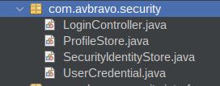

# 05. Login

Para crear los componentes para el login realizaremos los siguientes pasos:

1. Configurar el archivo index.html
2. Crear la carpeta .security
3. Crear la carpeta .security.interfaces
3. Crear las clases LoginContoller.java, ProfileStore.java, SecurityIndentityStore.java, UserCredentials.java
4. Crear la interface LoginInterface.java


```java

public interface LoginInterface {
    public String login();
    public String logout();
    public String next();
    public String reset();
    
}

``





* Login


```
<jmoordbcoreui:login controller="#{loginController}" 
                             title="Cargo Dev"
                             loginAction="login"
                             olvidoPasswordAction="forgotPassword"
                             registrarseAction="registrarse"
                             design="profile"
                             profileSelected="selectedOption"
                             usernameField = "username"
                             passwordField = "password"
                             rememberMeField="rememberMe"
                             signOtherAccountsRendered="false"

                             />


```

* Recovery password


```
 <jmoordbcoreui:resetpassword 
                           controller="#{loginController}" 
                             resetAction="reset"
                             emailField="emailRecovery"                         
                                                          
                             />
```


* Confirmemail


```
   <jmoordbcoreui:confirmemail 
                    controller="#{loginController}" 
                    emailField="emailRecovery"     
                    />

```


Pasos:

1. Modifique el archivo index.xhtml para agregar el componente login. Recuerde haber creado la clase 


```html  

 <jmoordbcoreui:login controller="#{loginController}" 
                                     loginAction="login"
                                     title="Cargo Dev"
                                     olvidoPasswordAction="forgotPassword"
                                     registrarseAction="registrarse"
                                     design="profile"
                                     profileSelected="selectedOption"
                                     usernameField = "username"
                                     passwordField = "password"
                                     rememberMeField="rememberMe"
                                     signOtherAccountsRendered="false"

                                     />

```

Resultado index.xhtml


```html  
<?xml version='1.0' encoding='UTF-8' ?>
<!DOCTYPE html PUBLIC "-//W3C//DTD XHTML 1.0 Transitional//EN" "http://www.w3.org/TR/xhtml1/DTD/xhtml1-transitional.dtd">
<html xmlns="http://www.w3.org/1999/xhtml"
      xmlns:h="jakarta.faces.html"
      xmlns:p="primefaces"
      xmlns:f="jakarta.faces.core"
      xmlns:jmoordbcoreui="http://jmoordbcoreui.com/taglib"
      >
    <h:head>
        <f:facet name="first">
            <meta http-equiv="X-UA-Compatible" content="IE=edge"/>
            <meta http-equiv="Content-Type" content="text/html; charset=UTF-8"/>
            <meta name="viewport" content="width=device-width, initial-scale=1.0, maximum-scale=1.0, user-scalable=0, shrink-to-fit=no"/>
            <meta name="referrer" content="no-referrer"/>
            <meta name="referrer" content="strict-origin-when-cross-origin"/>
        </f:facet>
        <jmoordbcoreui:css/>
        <title>Cargo Dev</title>
          <!-- Aplicar jQuery.noConflict() -->
<!--        <h:outputScript>
            var $j = jQuery.noConflict();
            $j(document).ready(function() {
            console.log("jQuery noConflict está funcionando correctamente.");
            });
        </h:outputScript>-->
    </h:head>
    <h:body>     
        <f:view contentType="text/html">
            <h:form enctype="multipart/form-data" prependId="false">

                <jmoordbcoreui:login controller="#{loginController}" 
                                     title="Cargo Dev"
                                     loginAction="login"
                                     olvidoPasswordAction="forgotPassword"
                                     registrarseAction="registrarse"
                                     design="profile"
                                     profileSelected="selectedOption"
                                     usernameField = "username"
                                     passwordField = "password"
                                     rememberMeField="rememberMe"
                                     signOtherAccountsRendered="false"

                                     />


            </h:form>
        </f:view>
    </h:body>
</html>
```