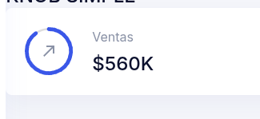
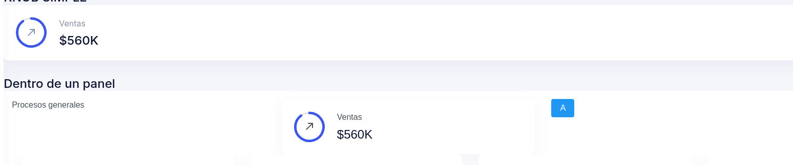
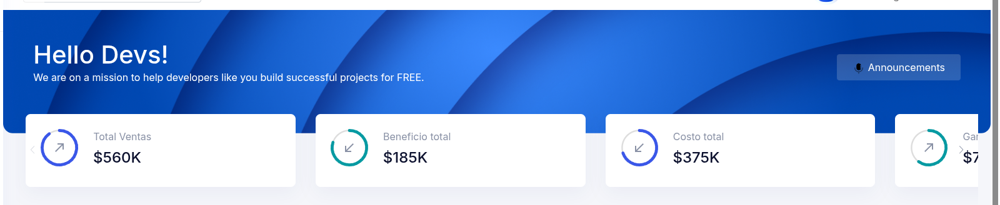

# 06. knob


## <jmoordbcoreui:knob/>

Componente para generar knob. Se cuenta con dos componentes

* knob: Es un knob sencillo
* KnobPanel: Panel de knobs que puedes utilizar.

Se utiliza la clase Knob.java, disponible en la libreria **jmoordbcoreuiutils**.


##  Definición de componente:

* percent: valor del componente entre **0 y 100**

* label: Etiqueta que se muestra fuera del knob

* counter: Valor del contador a mostrar fuerda del knob

* arrow: Flecha que se mostrara valores permitido **up,down**.

* color: Color **primary,info**

* circleid: Id para el circulo no se debe repetir.

* delay: Tiempo de retardo el mostrarse.

* up : Reservado svg para mostrar fecha hacia arriba.

* down: Reservado svg para mostrar fecha hacia abajo.


**Composite**

```html
<composite:interface >
    <composite:attribute name="percent" default=""/> 
    <composite:attribute name="label" default=""/> 
    <composite:attribute name="counter" default=""/> 
    <!--arrow: up, down-->
    <composite:attribute name="arrow" default="up"/> 
    <!--color = primary, info, -->
    <composite:attribute name="color" default="primary"/> 
    <composite:attribute name="circleid" default="01" required="true"/> 
    <composite:attribute name="delay" default="700"/> 
    <composite:attribute name="up" default="M5,17.59L15.59,7H9V5H19V15H17V8.41L6.41,19L5,17.59Z"/> 
    <composite:attribute name="down" default="M19,6.41L17.59,5L7,15.59V9H5V19H15V17H8.41L19,6.41Z"/> 


</composite:interface>

```

**Implementation**

```
     <composite:implementation>
        <li class="swiper-slide card card-slide" data-aos="fade-up" data-aos-delay="#{cc.attrs.delay}">
            <div class="card-body">
                <div class="progress-widget"> 
                    <div id="circle-progress-#{cc.attrs.circleid}" 
                         class="text-center circle-progress-01 circle-progress circle-progress-#{cc.attrs.color}"
                         data-min-value="0" data-max-value="100" data-value="#{cc.attrs.percent}"
                         data-type="percent"
                         title="#{cc.attrs.percent}">
                        <svg class="card-slie-arrow icon-24" width="24" viewBox="0 0 24 24">
                            <path fill="currentColor" d="#{cc.attrs[cc.attrs.arrow]}" />
                        </svg> 
                    </div>
                    <div class="progress-detail">
                        <p  class="mb-2">#{cc.attrs.label}</p>
                        <h4 class="counter">#{cc.attrs.counter}</h4>
                    </div>
                </div>
            </div>
        </li>
    </composite:implementation>

```


**Descripción:**


Se usa para dibujar un knob.

## Ejemplos

### Ejemplo simple

* En la clas DashboardFaces agregue un objeto de tipo knob y cree una lista llamada knobs.  
* En el método init() inicialice el objeto knob

```java

import com.avbravo.jmoordbcoreuiutils.data.Knob;

@Named
@SessionScoped
public class DashboardFaces implements Serializable {
 private KnobInfo knobInfo;
//set/get

// <editor-fold defaultstate="collapsed" desc="void init()">
    @PostConstruct
    public void init() {

         knobInfo = new KnobInfo.Builder()
                .percent(90)
                .label("Ventas")
                .counter("$560K")
                .arrow("up")
                .color("primary")
                .id("v01")
                .delay(700)
                .build();
}

}

```

## En la pagina xhtml

* Agregue el composite jmoordbcoreui
* Agregue el componente <jmoordbocoreui:knob/>


```html
<html xmlns="http://www.w3.org/1999/xhtml"
      xmlns:h="jakarta.faces.html"          
      xmlns:composite="jakarta.faces.composite"
      xmlns:jmoordbocoreui="http://jmoordbcoreui.com/taglib"
      xmlns:ui="jakarta.faces.facelets"
      xmlns:p="http://primefaces.org/ui">

 <jmoordbocoreui:knob 
            arrow="#{dashboardFaces.knobInfo.arrow}" 
            color="#{dashboardFaces.knobInfo.color}" 
            circleid="#{dashboardFaces.knobInfo.id}"
            percent="#{dashboardFaces.knobInfo.percent}"
            label="#{dashboardFaces.knobInfo.label}" 
            counter="#{dashboardFaces.knobInfo.counter}"
            delay="#{dashboardFaces.knobInfo.delay}"
            />

```

Genera la siguiente salida




### Ejemplo agregar dentro de un <p:panelGrid>

```
 <p:panelGrid columns="3">
    <p:outputLabel value="Procesos generales"></p:outputLabel>
    <jmoordbocoreui:knob 
        arrow="#{dashboardFaces.knobInfo.arrow}" 
        color="#{dashboardFaces.knobInfo.color}" 
        circleid="#{dashboardFaces.knobInfo.id}"
        percent="#{dashboardFaces.knobInfo.percent}"
        label="#{dashboardFaces.knobInfo.label}" 
        counter="#{dashboardFaces.knobInfo.counter}"
        delay="#{dashboardFaces.knobInfo.delay}"

        />
    <p:commandButton value='A'/>
</p:panelGrid>

```

Genera




# Panel de Knob <jmoordbcoreui:knobPanel/>

El componente **<jmoordbcoreui:knobPanel/>** nos permite generar un panel con desplazamiento para multiples knob.


Pasos:

* Añada a la clase DasboardFaces.java **List<Knob> knobs = new ArrayList<>();** e inicialicelo en el método **init()**.


```java
@Named
@SessionScoped
public class DashboardFaces implements Serializable {

    private static final long serialVersionUID = 1L;
     List<KnobInfo> knobInfos = new ArrayList<>();
  //set/get
   


   @PostConstruct
    public void init() {

   knobInfos = Arrays.asList(
                new KnobInfo(90, "Total Ventas", "$560K", "up", "primary", "01", 700),
                new KnobInfo(80, "Beneficio total", "$185K", "down", "info", "02", 800),
                new KnobInfo(70, "Costo total", "$375K", "down", "primary", "03", 900),
                new KnobInfo(60, "Ganancia", "$742", "up", "info", "04", 1000),
                new KnobInfo(50, "Ingresos netos", "$150", "up", "primary", "05", 1100),
                new KnobInfo(50, "Hoy", "$4600", "down", "info", "06", 1200),
                new KnobInfo(30, "Miembros", "11.2M", "down", "primary", "07", 1300)
        );
    }
    // <editor-fold defaultstate="collapsed" desc="void preDestroy()">
    @PreDestroy
    public void preDestroy() {

    }

    // </editor-fold>
}


```

En la pagina xhtml

```

     <jmoordbocoreui:knobPanel knobs="#{dashboardFaces.knobInfos}"/>

```

Genera el resultado:


