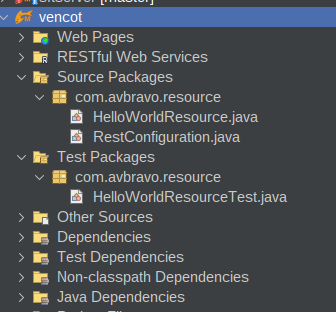

# Guia Backedn

[https://github.com/avbravo/vencot](https://github.com/avbravo/vencot)


## Proyecto vencot

Ven(tas) Cot(izacion). Es el acronimo para el sistema de gestión de ventas y cotizaciones.

Implementa la arquitectura microservicios dentro de la misma aplicación. [(backend)+(frontend)].


Realice los siguientes pasos

# Backend

## Crear proyecto

Lo haremos mediante Payara Starter.

Ingrese a  [https://start.payara.fish/](https://start.payara.fish/) y especifique:

* Project Description

```
Build: Maven
Group ID: com.avbravo
Artifact ID: vencot
Version: 0.1-SNAPSHOT

```

* Jakarta EE

```
Jakarta EE version: Jakarta EE 10.
Jakarta EE Profile: Platform

```

* Payara Platform

```
Platform: Payara Micro

```

* Project Configuration

```
Package: com.avbravo

(*) Include Tests 

Java Version: Java SE 21


```

* MicroProfile

```
(*) Full MP
(*) MicroProfile Config
(*) MicroProfile Open API
(*) MicroProfile Fault Tolerance
(*) MicroProfile Metrics

```

* Deployment Options

```
(*) Docker

```

* ER Diagram Designer

```
( ) ---

```

* Security Configuration

```
(*) None

```

Descargue el archivo vencot.zip , descomprimalo y abralo en su IDE preferido.




