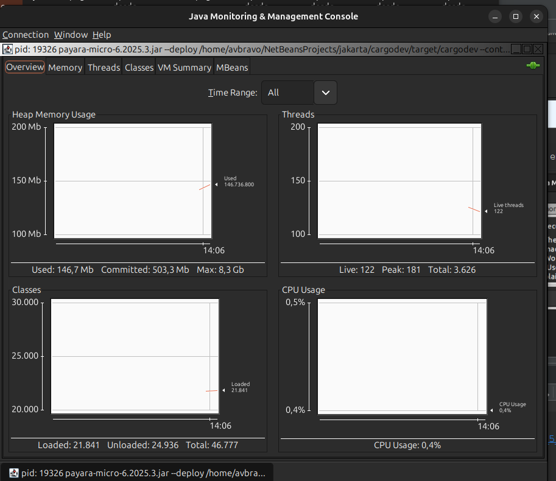
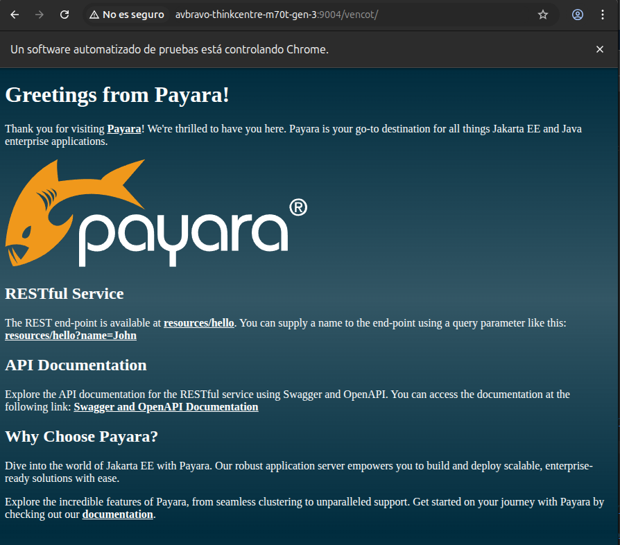

# 02. Construir y Ejecutar


## 01.2 Construir y Ejecutar el proyecto

Ingrese al directorio de su proyecto desde la consola.


Para ejecutar el proyecto debe dar permisos de ejecución mediante

```shell
chmod 775 mvnw mvnw.cmd 
```

Lea el archivo README.md donde se indican las instrucciones para contruir y ejecutar el proyecto.

* Ejecutando la aplicación

```sheel
mvn clean package payara-micro:dev
```


* Detener la ejecución

```sheel
mvn payara-micro:stop
```

---
# Jconsole

Nos ayuda a monitorear las aplicaciones ejecute

```shell

jconsole

```


Seleccione el proceso de clic en **Connect**

En la siguiente pantalla de clic en **Insecure connection**


Se muestra un panel de visualización con diversas opciones.




---

## Docker


* Docker
Crear la imagen de Docker

```
mvn docker:build
```

* Ejecutar la imagen de Docker

```
docker run -p 8080:8080 cargodev:${project.version}
```

## 01.3 Probar el proyecto

Ingrese al url [http://localhost:9004/vencot](http://localhost:9004/vencot)




Pruebe los endpoints:

* [http://localhost:9004/vencot/resources/hello](http://localhost:9004/vencot/resources/hello)

* [http://localhost:9004/vencot/resources/hello?name=John](http://localhost:9004/vencot/resources/hello?name=John)

