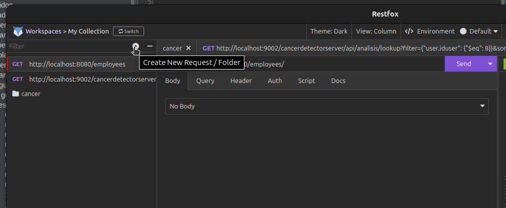
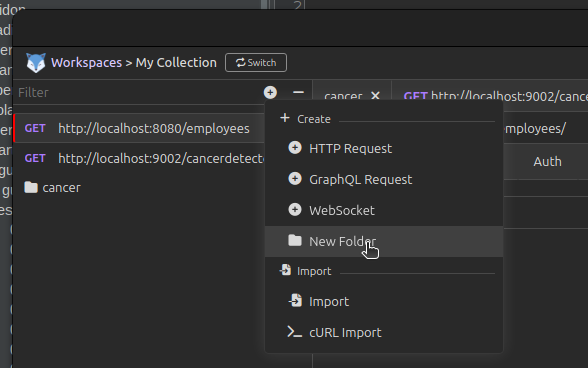
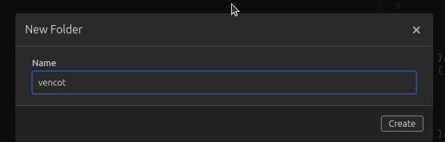
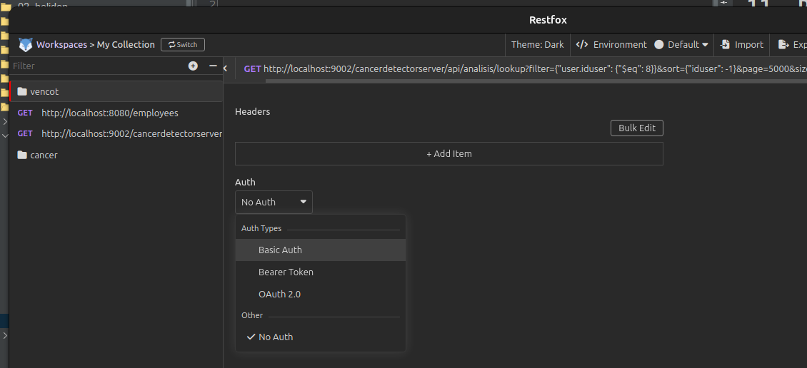
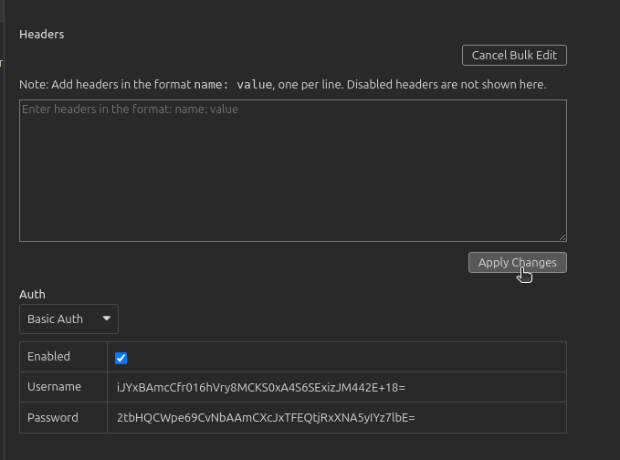
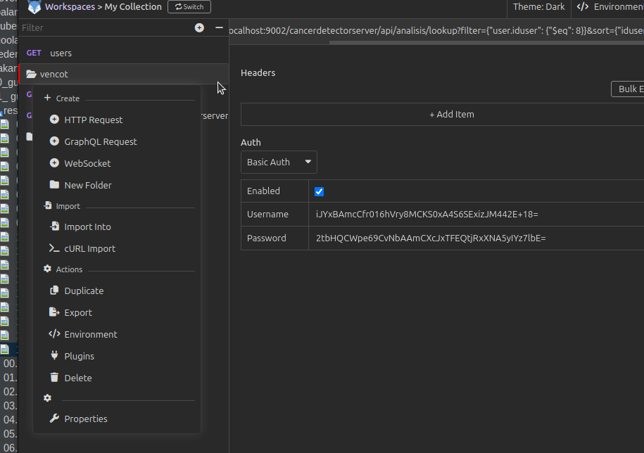
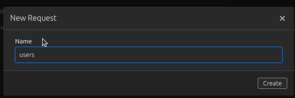
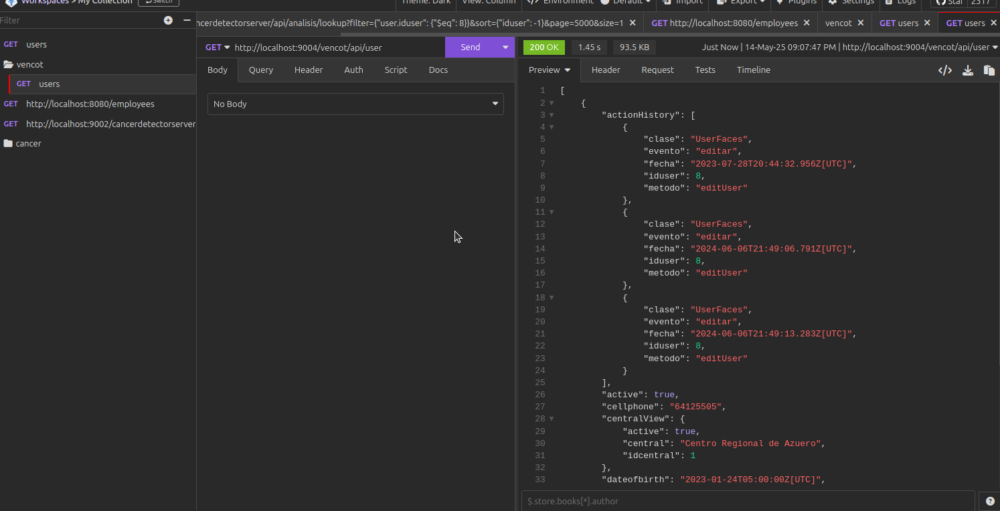

# 11. Probar Microservicio.md

Utilice PostMan o RestFox o Curl.

Recuerde que las credenciales estan almacenadas en el archivo microprofile-config.properties.


## RestFox

* Cree una carpeta 




* Seleccione folder



* Indique el nombre vencot




* Seleccione ** Basic auth**




* ingrese las credenciales


De clic en **Build Edit**


* Luego de clic en **Apply Changes**




## HTTP Request

* De clic en el botón **...** al lado del nombre de la carpeta y seleccione **HTTP Request**




* Indique el nombre **users**




* Ingrese el URL para la consulta 


```
http://localhost:9004/vencot/api/user

```

Y presione el botón **SEND**




