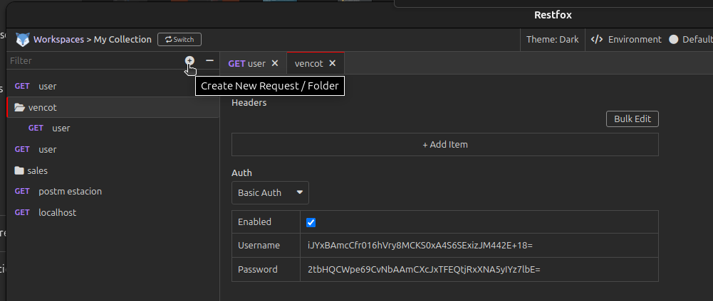
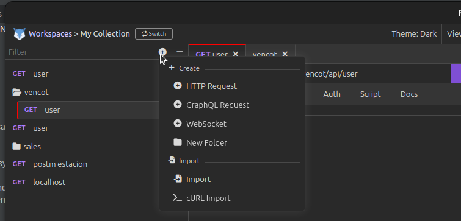
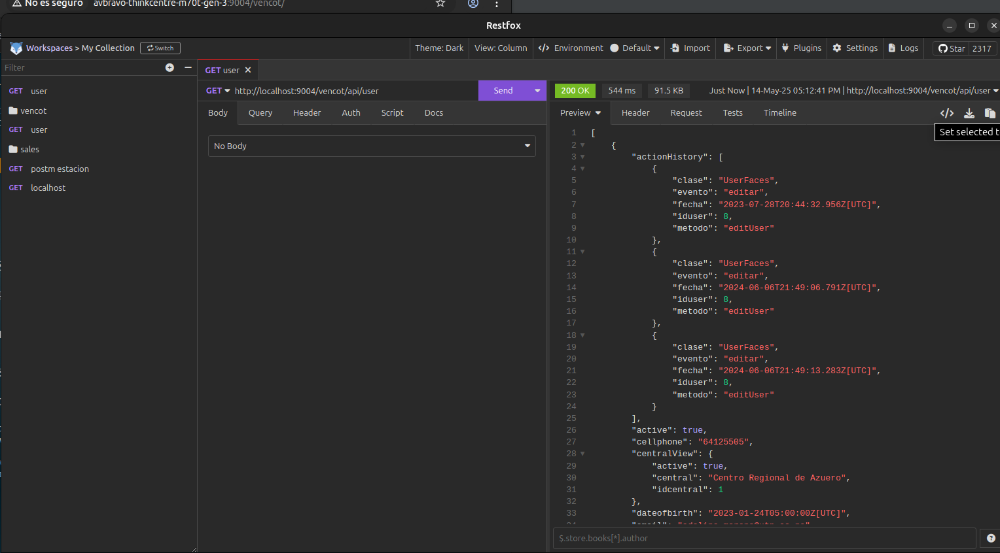

# 11. Probar Microservicio.md

Utilice PostMan o RestFox o Curl.

Recuerde que las credenciales estan almacenadas en el archivo microprofile-config.properties.

## RestFox

* Cree una carpeta e ingrese las credenciales

* Luego cree un nuevo HTTP Request

* Ingrese el URL para la consulta 

