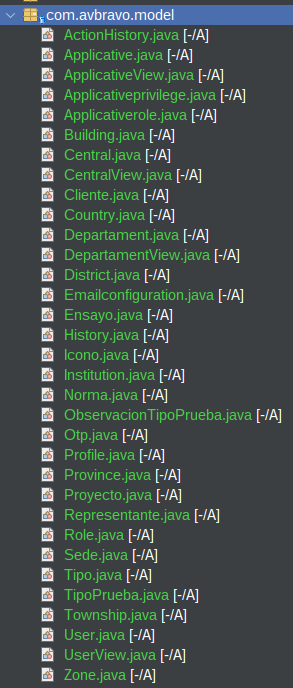
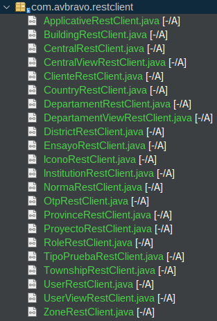

# 01. Microprofile Rest Client

Configuraremos el proyecto para que interactue con los microservicios.


## Archivo pom.xml

* Agregue la propiedad

```xml
<jmoordb-core-annotations.version>2.0.2</jmoordb-core-annotations.version>


```

* Agregar propiedad

```xml
<dependency>
    <groupId>com.github.avbravo</groupId>
    <artifactId>jmoordb-core-annotations</artifactId>
    <version>${jmoordb-core-annotations.version}</version>
</dependency>
```

## Crear la carpeta Model

* Copiar las entidades




## Crear la carpeta RestClient

* Copiar las clases




## Edite el archivo microprofile-config.properties

Agregue las clases

```
#--------------------------------------------------------------
# Microprofile RestClient
#-------------------------------------------------------------
com.avbravo.restclient.ApplicativeRestClient/mp-rest/url=http://localhost:9004/vencont/api/
com.avbravo.restclient.BuildingRestClient/mp-rest/url=http://localhost:9004/vencont/api/
com.avbravo.restclient.CentralRestClient/mp-rest/url=http://localhost:9004/vencont/api/
com.avbravo.restclient.CentralViewRestClient/mp-rest/url=http://localhost:9004/vencont/api/
com.avbravo.restclient.ClienteRestClient/mp-rest/url=http://localhost:9004/vencont/api/
com.avbravo.restclient.CountryRestClient/mp-rest/url=http://localhost:9004/vencont/api/
com.avbravo.restclient.DepartamentRestClient/mp-rest/url=http://localhost:9004/vencont/api/
com.avbravo.restclient.DepartamentViewRestClient/mp-rest/url=http://localhost:9004/vencont/api/
com.avbravo.restclient.DistrictRestClient/mp-rest/url=http://localhost:9004/vencont/api/
com.avbravo.restclient.EnsayoRestClient/mp-rest/url=http://localhost:9004/vencont/api/
com.avbravo.restclient.IconoRestClient/mp-rest/url=http://localhost:9004/vencont/api/
com.avbravo.restclient.InstitutionRestClient/mp-rest/url=http://localhost:9004/vencont/api/
com.avbravo.restclient.NormaRestClient/mp-rest/url=http://localhost:9004/vencont/api/
com.avbravo.restclient.OtpRestClient/mp-rest/url=http://localhost:9004/vencont/api/
com.avbravo.restclient.ProyectoRestClient/mp-rest/url=http://localhost:9004/vencont/api/
com.avbravo.restclient.ProvinceRestClient/mp-rest/url=http://localhost:9004/vencont/api/
com.avbravo.restclient.RoleRestClient/mp-rest/url=http://localhost:9004/vencont/api/
com.avbravo.restclient.TownshipRestClient/mp-rest/url=http://localhost:9004/vencont/api/
com.avbravo.restclient.TipoPruebaRestClient/mp-rest/url=http://localhost:9004/vencont/api/
com.avbravo.restclient.UserRestClient/mp-rest/url=http://localhost:9004/vencont/api/
com.avbravo.restclient.UserViewRestClient/mp-rest/url=http://localhost:9004/vencont/api/
com.avbravo.restclient.ZoneRestClient/mp-rest/url=http://localhost:9004/vencont/api/

```

## Services

* Crear el paquete .services y copiar las clases

