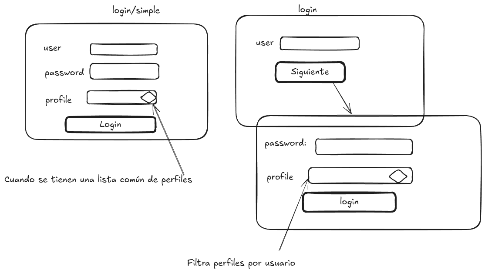
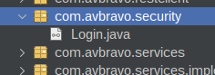
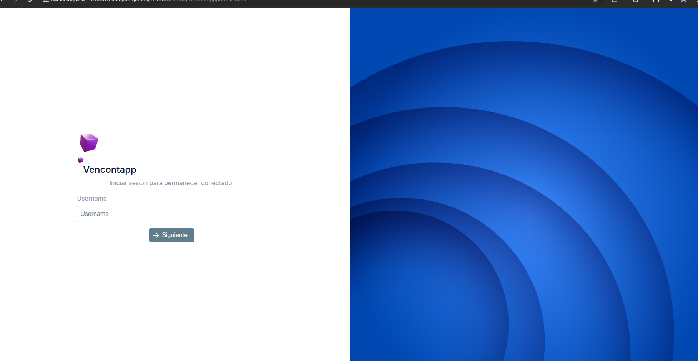

# 06. Autentificacion Usuarios

Para autenficación de usuarios, trabajaremos con la clase **LoginController.java**, la pagina **index.xhtml**, modificaremos el 
archivo **web.xml**, para especificar los roles de usuarios permitidos.


# Diseño

Para el login tenemos dos modos de trabajarlo



Componentes:

* login


## Login.java

Defina la interface Login.java en el paquete security



 Utilice las anotaciones **@LoginSecurity**,**@SecurityIdentity**,**@SessionExpired**

```java
import com.jmoordbcorecomponent.security.LoginSecurity;
import com.jmoordbcorecomponent.security.SecurityIdentity;
import com.jmoordbcorecomponent.security.SessionExpired;

/**
 *
 * @author avbravo
 */
@LoginSecurity
@SecurityIdentity
@SessionExpired
public interface Login {
    
}


```

En la pagina index puede crear el login de dos maneras


```
<?xml version='1.0' encoding='UTF-8' ?>
<!DOCTYPE html PUBLIC "-//W3C//DTD XHTML 1.0 Transitional//EN" "http://www.w3.org/TR/xhtml1/DTD/xhtml1-transitional.dtd">
<html xmlns="http://www.w3.org/1999/xhtml"
      xmlns:h="jakarta.faces.html"
      xmlns:p="primefaces"
      xmlns:f="jakarta.faces.core"
      xmlns:jmoordbcoreui="http://jmoordbcoreui.com/taglib"

      xmlns:yoss="jakarta.faces.composite/yoss">
    <h:head>
        <f:facet name="first">
            <meta http-equiv="X-UA-Compatible" content="IE=edge"/>
            <meta http-equiv="Content-Type" content="text/html; charset=UTF-8"/>
            <meta name="viewport" content="width=device-width, initial-scale=1.0, maximum-scale=1.0, user-scalable=0, shrink-to-fit=no"/>
            <meta name="referrer" content="no-referrer"/>
            <meta name="referrer" content="strict-origin-when-cross-origin"/>
            <f:view locale="#{jmoordbLanguajes.locale !=null?jmoordbLanguajes.locale:'es'}">
            </f:view>
            <f:loadBundle basename="com.properties.messages" var="msg" />
            <f:loadBundle basename="com.properties.configuration" var="conf" />
            <f:loadBundle basename="com.jmoordbcore.properties.core" var="core" />
        </f:facet>
        <jmoordbcoreui:css/>
        <!--<title>Cargo Dev</title>-->
        <title>#{conf['application.title']}</title>
        <!-- Aplicar jQuery.noConflict() -->
        <!--        <h:outputScript>
                    var $j = jQuery.noConflict();
                    $j(document).ready(function() {
                    console.log("jQuery noConflict está funcionando correctamente.");
                    });
                </h:outputScript>-->

        <script type="text/javascript">
            // Código JavaScript para manejar la expiración de la sesión
            const sessionTimeout = #{facesContext.externalContext.sessionMaxInactiveInterval} * 1000; // Minutos
            const warningTime = 5 * 60 * 1000; // 1 minutos antes de expirar

            let timeoutWarning;

            function startSessionTimer() {
                timeoutWarning = setTimeout(() => {
                    PF('sessionWarningDialog').show();
                }, sessionTimeout - warningTime);
                setTimeout(() => {
                    window.location.href = "#{request.contextPath}/errors/sessionexpired.xhtml";
                }, sessionTimeout);
            }

            function resetSessionTimer() {
                clearTimeout(timeoutWarning);
                startSessionTimer();
            }
            function showSessionWarning() {
                // Usar PrimeFaces dialog o implementación similar
                if (typeof PF !== 'undefined') {
                    PF('sessionWarningDialog').show();
                } else {
                    // Implementación básica si no usas PrimeFaces
                    alert('Tu sesión expirará en ' + warningTime + ' segundos. Realiza alguna acción para mantenerla activa.');
                }
            }

            window.onload = startSessionTimer;
            document.addEventListener("mousemove", resetSessionTimer);
            document.addEventListener("keypress", resetSessionTimer);
        </script>
    </h:head>
    <h:body>     
        <f:view contentType="text/html">

            <h:form id="formLogin" enctype="multipart/form-data" prependId="false">


<!--                <jmoordbcoreui:login 
                            controller="#{loginFaces}" 
                            userLogged ="#{loginFaces.userLogged}"
                            title="#{conf['application.title']}"
                            loginAction="login"
                            olvidoPasswordAction="recoverypassword.xhtml"
                            registrarseAction="registrarse"
                            design="profile"
                            profileLabel="#{core['login.profile']}"
                            profileSelected="selectedOption"
                            usernameField = "username"
                            usernameLabel="#{core['login.username']}"
                            passwordField = "password"
                            passwordLabel="#{core['login.password']}"
                            rememberMeField="rememberMe"
                            rememberLabel="#{core['login.remeber']}"
                            forgotPasswordLabel="#{core['login.forgotpassword']}"
                            signOtherAccountsRendered="false"

     
                
                <jmoordbcoreui:login />

               
            </h:form>
        </f:view>

    </h:body>
</html>


```

Otra manera más sencilla

```
<?xml version='1.0' encoding='UTF-8' ?>
<!DOCTYPE html PUBLIC "-//W3C//DTD XHTML 1.0 Transitional//EN" "http://www.w3.org/TR/xhtml1/DTD/xhtml1-transitional.dtd">
<html xmlns="http://www.w3.org/1999/xhtml"
      xmlns:h="jakarta.faces.html"
      xmlns:p="primefaces"
      xmlns:f="jakarta.faces.core"
      xmlns:jmoordbcoreui="http://jmoordbcoreui.com/taglib"

      xmlns:yoss="jakarta.faces.composite/yoss">
    <h:head>
        <f:facet name="first">
            <meta http-equiv="X-UA-Compatible" content="IE=edge"/>
            <meta http-equiv="Content-Type" content="text/html; charset=UTF-8"/>
            <meta name="viewport" content="width=device-width, initial-scale=1.0, maximum-scale=1.0, user-scalable=0, shrink-to-fit=no"/>
            <meta name="referrer" content="no-referrer"/>
            <meta name="referrer" content="strict-origin-when-cross-origin"/>
            <f:view locale="#{jmoordbLanguajes.locale !=null?jmoordbLanguajes.locale:'es'}">
            </f:view>
            <f:loadBundle basename="com.properties.messages" var="msg" />
            <f:loadBundle basename="com.properties.configuration" var="conf" />
            <f:loadBundle basename="com.jmoordbcore.properties.core" var="core" />
        </f:facet>
        <jmoordbcoreui:css/>
        <!--<title>Cargo Dev</title>-->
        <title>#{conf['application.title']}</title>
        <!-- Aplicar jQuery.noConflict() -->
        <!--        <h:outputScript>
                    var $j = jQuery.noConflict();
                    $j(document).ready(function() {
                    console.log("jQuery noConflict está funcionando correctamente.");
                    });
                </h:outputScript>-->

        <script type="text/javascript">
            // Código JavaScript para manejar la expiración de la sesión
            const sessionTimeout = #{facesContext.externalContext.sessionMaxInactiveInterval} * 1000; // Minutos
            const warningTime = 5 * 60 * 1000; // 1 minutos antes de expirar

            let timeoutWarning;

            function startSessionTimer() {
                timeoutWarning = setTimeout(() => {
                    PF('sessionWarningDialog').show();
                }, sessionTimeout - warningTime);
                setTimeout(() => {
                    window.location.href = "#{request.contextPath}/errors/sessionexpired.xhtml";
                }, sessionTimeout);
            }

            function resetSessionTimer() {
                clearTimeout(timeoutWarning);
                startSessionTimer();
            }
            function showSessionWarning() {
                // Usar PrimeFaces dialog o implementación similar
                if (typeof PF !== 'undefined') {
                    PF('sessionWarningDialog').show();
                } else {
                    // Implementación básica si no usas PrimeFaces
                    alert('Tu sesión expirará en ' + warningTime + ' segundos. Realiza alguna acción para mantenerla activa.');
                }
            }

            window.onload = startSessionTimer;
            document.addEventListener("mousemove", resetSessionTimer);
            document.addEventListener("keypress", resetSessionTimer);
        </script>
    </h:head>
    <h:body>     
        <f:view contentType="text/html">

            <h:form id="formLogin" enctype="multipart/form-data" prependId="false">

                
                <jmoordbcoreui:login />

               
            </h:form>
        </f:view>

    </h:body>
</html>


```

Genera login




