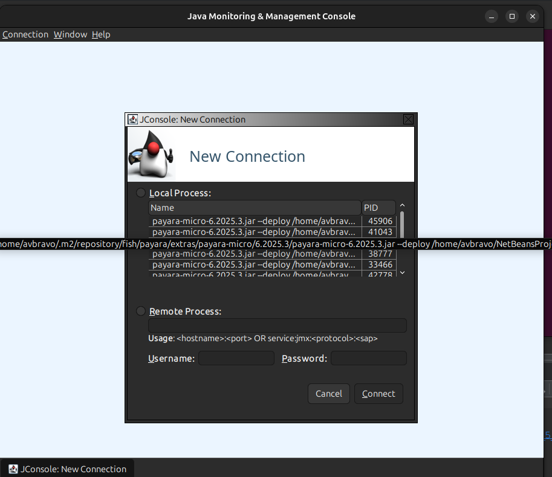

# 03. Jconsole

Nos ayuda a monitorear las aplicaciones ejecute

```shell

jconsole

```



Seleccione el proceso de clic en **Connect**

En la siguiente pantalla de clic en **Insecure connection**


Se muestra un panel de visualización con diversas opciones.
ò
