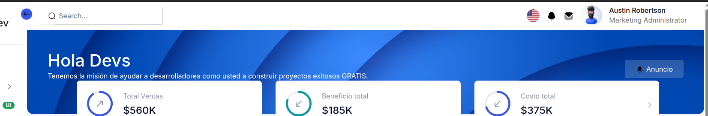
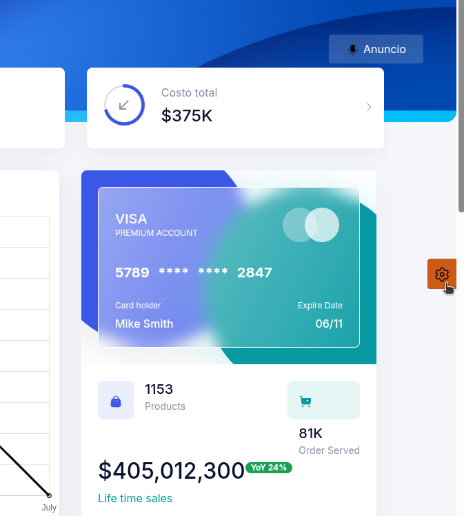
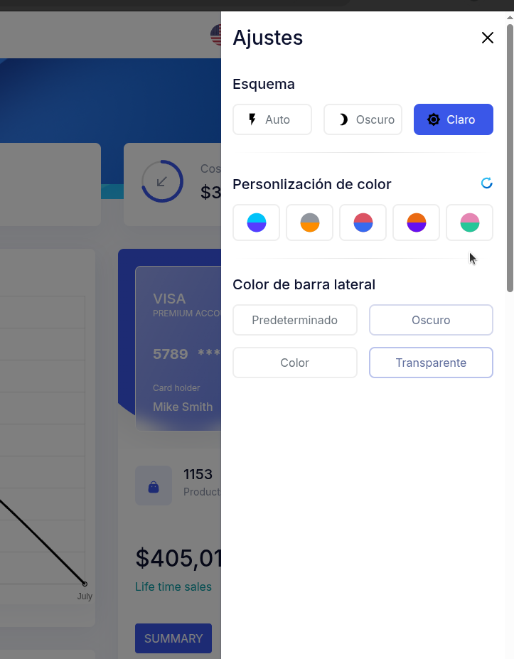

# 04. Template

El template se configura desde la clase principal Java.


## NavHeader

Es la barra de encabezado que se muestra en cada formulario

* Mostrar imagenes del directorio resources de su proyecto

```java
  NavHeader navHeader = new NavHeader.Builder()
                    .title("Hola Devs")
                    .message("Tenemos la misión de ayudar a desarrolladores como usted a construir proyectos exitosos GRATIS.")
                    .hrefInfo(new HrefInfo.Builder().href("").text("Anuncio").minText("a").build())
                    .imageInfo(new ImageInfo.Builder().library("jmoordbcoreui").name("images/svg/botones/anuncio.svg").build())
                    .imageInfos(Arrays.asList(
                            new ImageInfo.Builder().library("images").name("iconos/dashboard.png").build(),
                            new ImageInfo.Builder().library("images").name("iconos/dashboard.png").build(),
                            new ImageInfo.Builder().library("images").name("iconos/dashboard.png").build(),
                            new ImageInfo.Builder().library("images").name("iconos/dashboard.png").build(),
                            new ImageInfo.Builder().library("images").name("iconos/dashboard.png").build()
                    )
                    )
                    .build();

```

* Mostrando imagenes de la libreria jmoordbcoreui

```java

 NavHeader navHeader = new NavHeader.Builder()
                    .title("Hola Devs")
                    .message("Tenemos la misión de ayudar a desarrolladores como usted a construir proyectos exitosos GRATIS.")
                    .hrefInfo(new HrefInfo.Builder().href("").text("Anuncio").minText("a").build())
                    .imageInfo(new ImageInfo.Builder().library("jmoordbcoreui").name("images/svg/botones/anuncio.svg").build())
                    .imageInfos(Arrays.asList(
                           new ImageInfo.Builder().library("jmoordbcoreui").name("images/dashboard/top-header.png").build(),
                           new ImageInfo.Builder().library("jmoordbcoreui").name("images/dashboard/top-header1.png").build(),
                           new ImageInfo.Builder().library("jmoordbcoreui").name("images/dashboard/top-header2.png").build(),
                           new ImageInfo.Builder().library("jmoordbcoreui").name("images/dashboard/top-header4.png").build(),
                           new ImageInfo.Builder().library("jmoordbcoreui").name("images/dashboard/top-header5.png").build()
                    )
                    )
                    .build();


```

Genera:




---

## Footer

Crea la barra Footer de la plantilla

Se pueden pasar imagenes ubicadas:

* En el directorio resources de su proyecto


Observe **.imageInfo(new ImageInfo.Builder().library("images").name("iconos/dashboard.png").build())**

```java
 Footer footer = new Footer.Builder()
                    .applicationTitle("Cargo Dev")
                    .by("por")
                    .companyHrefInfo(new HrefInfo.Builder().href("http://avbravo.blogspot.com").text("Avbravo").minText("a").build())
                    .imageInfo(new ImageInfo.Builder().library("images").name("iconos/dashboard.png").build())
                    .privacyPolicy("Política de privacidad")
                    .privacyPolicyURL("../extra/privacy-policy.xhtml")
                    .termsOfUse("Terminos de uso")
                    .termsOfUseURL("../extra/terms-of-service.html")
                    .build();

```


* Imagenes de la libreria jmoordbcoreui
```java
 Footer footer = new Footer.Builder()
                    .applicationTitle("Cargo Dev")
                    .by("por")
                    .companyHrefInfo(new HrefInfo.Builder().href("http://avbravo.blogspot.com").text("Avbravo").minText("a").build())
                    .imageInfo(new ImageInfo.Builder().library("jmoordbcoreui").name("images/svg/wizard.svg").build())
                    .privacyPolicy("Política de privacidad")
                    .privacyPolicyURL("../extra/privacy-policy.xhtml")
                    .termsOfUse("Terminos de uso")
                    .termsOfUseURL("../extra/terms-of-service.html")
                    .build();

```


* Iconos de Primefaces [https://www.primefaces.org/showcase/icons.xhtml?j](https://www.primefaces.org/showcase/icons.xhtml?j)

```java

  Footer  footer = new Footer.Builder()
    .applicationTitle("Cargo Dev")
    .by("por")
    .companyHrefInfo(new HrefInfo.Builder().href("http://avbravo.blogspot.com").text("Avbravo").minText("a").build())
    .imageInfo(new ImageInfo.Builder().library("primefaces").name("pi pi-prime").build())
    .privacyPolicy("Política de privacidad")
    .privacyPolicyURL("../extra/privacy-policy.xhtml")
    .termsOfUse("Terminos de uso")
    .termsOfUseURL("../extra/terms-of-service.html")
    .build();


```


Genera el footer del template


---

## Canva


Canva es el dialogo que se activa en la parte derecha y nos permite seleccionar tema: Auto, Dark, Ligth y cambiar colores.

```java

Canva canva = new Canva.Builder()
                .auto("Auto")
                .color("Color")
                .colorCustomizer("Personlización de color")
                .dark("Oscuro")
                .defaultLabel("Predeterminado")
                .light("Claro")
                .scheme("Esquema")
                .settings("Ajustes")
                .sidebarColor("Color de barra lateral")
                .transparent("Transparente")                   
                .build();

```

Para activarlo de clic en e botón



Se muestra el canva donde puede persnolizar el entorno




---

# Menu Programatic

Esta sección muestra como crear menus desde codigo Java


