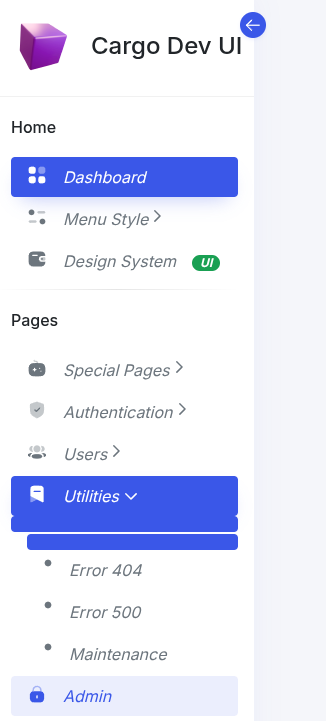

# 06 Menu


Para un submenu simple utilice


```
 <yoss:submenuli  normalLabel="Maintenance" collapsedLabel="M" href="../dashboard/errors/maintenance.xhtml"/>                                                            

```
Reemplaza a

```
 <li class="nav-item">
    <a class="nav-link " href="../dashboard/errors/error404.html">
        <i class="icon">
            <svg class="icon-10" xmlns="http://www.w3.org/2000/svg" width="10" viewBox="0 0 24 24" fill="currentColor">
                <g>
                    <circle cx="12" cy="12" r="8" fill="currentColor"></circle>
                </g>
            </svg>
        </i>
        <span class="item-name">Error 404</span>
    </a>
</li>
```


## Para pasar un SVG

* typeIcon = svg
* svgDPath1 valor para d en el path 1
* svgDPath2 valor para d en el path 2

```
  <yoss:submenuli  normalLabel="Admin" collapsedLabel="A" href="../dashboard/admin.xhtml"
             typeIcon="svg"
            svgDPath1="M7.7688 8.71387H16.2312C18.5886 8.71387 20.5 10.5831 20.5 12.8885V17.8254C20.5 20.1308 18.5886 22 16.2312 22H7.7688C5.41136 22 3.5 20.1308 3.5 17.8254V12.8885C3.5 10.5831 5.41136 8.71387 7.7688 8.71387ZM11.9949 17.3295C12.4928 17.3295 12.8891 16.9419 12.8891 16.455V14.2489C12.8891 13.772 12.4928 13.3844 11.9949 13.3844C11.5072 13.3844 11.1109 13.772 11.1109 14.2489V16.455C11.1109 16.9419 11.5072 17.3295 11.9949 17.3295Z"
            svgDPath2="M17.523 7.39595V8.86667C17.1673 8.7673 16.7913 8.71761 16.4052 8.71761H15.7447V7.39595C15.7447 5.37868 14.0681 3.73903 12.0053 3.73903C9.94257 3.73903 8.26594 5.36874 8.25578 7.37608V8.71761H7.60545C7.20916 8.71761 6.83319 8.7673 6.47754 8.87661V7.39595C6.4877 4.41476 8.95692 2 11.985 2C15.0537 2 17.523 4.41476 17.523 7.39595Z"

             />

```     

Reemplaza a esto

```
 <li class="nav-item">
    <a class="nav-link "  href="../dashboard/admin.html">
        <i class="icon">
            <svg class="icon-20" width="20" viewBox="0 0 24 24" fill="none" xmlns="http://www.w3.org/2000/svg">
                <path fill-rule="evenodd" clip-rule="evenodd" d="M7.7688 8.71387H16.2312C18.5886 8.71387 20.5 10.5831 20.5 12.8885V17.8254C20.5 20.1308 18.5886 22 16.2312 22H7.7688C5.41136 22 3.5 20.1308 3.5 17.8254V12.8885C3.5 10.5831 5.41136 8.71387 7.7688 8.71387ZM11.9949 17.3295C12.4928 17.3295 12.8891 16.9419 12.8891 16.455V14.2489C12.8891 13.772 12.4928 13.3844 11.9949 13.3844C11.5072 13.3844 11.1109 13.772 11.1109 14.2489V16.455C11.1109 16.9419 11.5072 17.3295 11.9949 17.3295Z" fill="currentColor"></path>
                <path opacity="0.4" d="M17.523 7.39595V8.86667C17.1673 8.7673 16.7913 8.71761 16.4052 8.71761H15.7447V7.39595C15.7447 5.37868 14.0681 3.73903 12.0053 3.73903C9.94257 3.73903 8.26594 5.36874 8.25578 7.37608V8.71761H7.60545C7.20916 8.71761 6.83319 8.7673 6.47754 8.87661V7.39595C6.4877 4.41476 8.95692 2 11.985 2C15.0537 2 17.523 4.41476 17.523 7.39595Z" fill="currentColor"></path>
            </svg>
        </i>
        <span class="item-name">Admin</span>
    </a>
</li>
```

