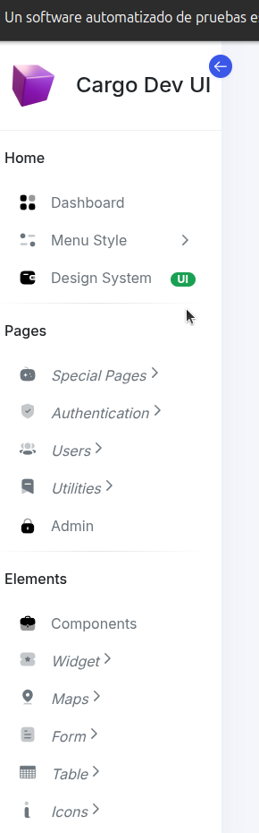
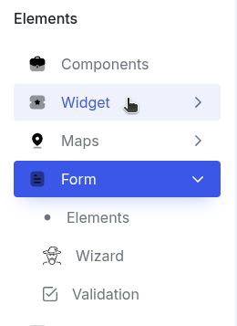

# 06. MenuJakartaFaces


## Menu

* Definición de componente:

**Descripción:**

Los menu son elementos que no tienen submenu y tienen un evento asociado a el.

Pueden contener un badge adicional al elemento.


Si deseamos pasar un svg y agregar un icono como el siguiente:




Definición de elementos

* Dashboard
* Design System (con iconos)
* Admin
* Components


Los archivos svg estan almacenados en la libreria jmoordbcoreui paquete META-INF/resources/jmoordbcoreui.images.svg

Se accesan mediante 

```
   <h:graphicImage library="jmoordbcoreui" name="images/svg/dashboard.svg" />

```


---

# Linea separadora de menu **<jmoordbocoreui:separadorMenu/>**

Para crear una linea separadora de menu use:

```
<jmoordbocoreui:separadorMenu/>

```


---

## Menu Grupo **<jmoordbcoreui:groupMenu>**


**Descripción:**

Generalmente se usa para agrupar o separar elementos creando un texto de división.

Por ejemplo: **Home, Pages, Elements**

**Definición de componente:**

* text 
* miniText
* actionEvent


Si deseamos un separador use **  <jmoordbocoreui:separadorMenu/>**


Ejemnplo de uso:

```xml

<jmoordbcoreui:menuGroup text="Home" miniText="-" >

  <jmoordbocoreui:separadorMenu/>
 <jmoordbocoreui:groupMenu text="Pages" miniText="-" actionEvent="#" />

  <jmoordbocoreui:separadorMenu/>
<jmoordbcoreui:menuGroup text="Elements" miniText="-" actionEvent="#"/> 

```


---


## Submenu


Un submenu posee elementos dentro de el.

Tales como: **Menu Style, Special Pages, Autentication, User, Utilities, Widget, Maps, Form, Table, Icon**


```
<jmoordbocoreui:submenu value="Icons"
            min-value="I"
            href="#sidebar-icons" 
            aria-controls="sidebar-icons"
            imageLibrary="jmoordbcoreui"
            imageName="images/svg/icons.svg" 
            />

```

---

## Menuitem

Crea elementos de menu en la barra principal o dentro de un submenu

Se puede indicar las imagenes o iconos de primefaces

```
<jmoordbocoreui:menuitem  value="menuitem-1" min-value="B" href="../special-pages/billing.xhtml"
                                      />
<jmoordbocoreui:menuitem  value="menuitem-2" min-value="B" href="../special-pages/billing.xhtml"
                                      imageLibrary="jmoordbcoreui" 
                                      imageName="images/svg/botones/menuitem.svg"
                                      />
<jmoordbocoreui:menuitem  value="menuitem-3" min-value="B" href="../special-pages/billing.xhtml"
                                      imageLibrary="primefaces" 
                                      imageName="pi pi-crown"
                                      />  

```





## Ejemplo completo del menu


```html
<!DOCTYPE html PUBLIC "-//W3C//DTD XHTML 1.0 Transitional//EN" "http://www.w3.org/TR/xhtml1/DTD/xhtml1-transitional.dtd">
<html xmlns="http://www.w3.org/1999/xhtml"
      xmlns:h="jakarta.faces.html"          
      xmlns:composite="jakarta.faces.composite"
      xmlns:ui="jakarta.faces.facelets"
      xmlns:p="http://primefaces.org/ui"
      xmlns:c="http://xmlns.jcp.org/jsp/jstl/core"
      xmlns:jsf="http://xmlns.jcp.org/jsf"
      xmlns:jmoordbocoreui="http://jmoordbcoreui.com/taglib"
      xmlns:yoss="jakarta.faces.composite/yoss"
      >
    <composite:interface >
        <composite:attribute name="canva" type="java.lang.Object"/>
    </composite:interface>
    <composite:implementation>

        <div class="sidebar-body pt-0 data-scrollbar">
            <div class="sidebar-list">
                <!-- Sidebar Menu Start -->
                <ul class="navbar-nav iq-main-menu" id="sidebar-menu">


                    <jmoordbocoreui:groupMenu text="Home" miniText="-" actionEvent="#" />
                    <jmoordbocoreui:menuitem  value="Dashboard" 
                                          min-value="D" 
                                          href="../dashboard.xhtml"
                                          badgespanLabel=""
                                          badgespanType=""
                                          imageLibrary="jmoordbcoreui"
                                          imageName="images/svg/dashboard.svg" 
                                          />                                                            


                    <li class="nav-item">
                        <jmoordbocoreui:submenu value="Menu Style" 
                                                min-value="M"
                                                href="#horizontal-menu" 
                                                aria-controls="horizontal-menu"
                                                imageLibrary="jmoordbcoreui"
                                                imageName="images/svg/menustyle.svg" 
                                                />

                        <ul class="sub-nav collapse" id="horizontal-menu" data-bs-parent="#sidebar-menu">
                            <jmoordbocoreui:menuitem value="Horizontal" min-value="H" href="index-horizontal.xhtml"  />
                            <jmoordbocoreui:menuitem  value="Dual Horizontal" min-value="D" href="index-dual-horizontal.xhtml"/>
                            <jmoordbocoreui:menuitem value="Dual Compact" min-value="D" href="index-dual-compact.xhtml"  />
                            <jmoordbocoreui:menuitem  value="Boxed Horizontal" min-value="B" href="index-boxed.xhtml"/>
                            <jmoordbocoreui:menuitem  value="Boxed Fancy" min-value="B" href="../dashboard/index-boxed-fanc.xhtml"/>

                        </ul>
                    </li>

             
                    
                    <jmoordbocoreui:menuitem  value="Design System" 
                                          min-value="UI"
                                          href="https://templates.iqonic.design/hope-ui/html/dist/"
                                          badgespanLabel="UI"
                                          badgespanType="bg-success"
                                          imageLibrary="jmoordbcoreui"
                                          imageName="images/svg/desingsystem.svg"
                                          />                                                            


                    <jmoordbocoreui:separatorMenu/>
                    <jmoordbocoreui:groupMenu text="Pages" miniText="-" actionEvent="#"/>


                    <li class="nav-item">
                        <jmoordbocoreui:submenu value="Special Pages" 
                                                min-value="S"
                                                href="#sidebar-special" 
                                                aria-controls="sidebar-special"
                                                imageLibrary="jmoordbcoreui"
                                                imageName="images/svg/specialpages.svg" 
                                                />


                        <ul class="sub-nav collapse" id="sidebar-special" data-bs-parent="#sidebar-menu">
                            <jmoordbocoreui:menuitem  value="Billing" min-value="B" href="../special-pages/billing.xhtml"/>
                            <jmoordbocoreui:menuitem  value="Calender" min-value="C" href="../special-pages/calender.xhtml"/>
                            <jmoordbocoreui:menuitem  value="kanban" min-value="K" href="../special-pages/kanban.xhtml"/>
                            <jmoordbocoreui:menuitem  value="Pricing" min-value="P" href="../special-pages/pricing.xhtml"/>
                            <jmoordbocoreui:menuitem  value="RTL Support" min-value="R" href="../special-pages/rtl-support.xhtml"/>
                            <jmoordbocoreui:menuitem  value="Timeline" min-value="T" href="../special-pages/timeline.xhtml"/>


                        </ul>
                    </li>
                    <li class="nav-item">

                        <jmoordbocoreui:submenu value="Authentication" 
                                                min-value="A"
                                                href="#sidebar-auth" 
                                                aria-controls="sidebar-user"
                                                imageLibrary="jmoordbcoreui"
                                                imageName="images/svg/authentication.svg" 
                                                />

                        <ul class="sub-nav collapse" id="sidebar-auth" data-bs-parent="#sidebar-menu">

                            <jmoordbocoreui:menuitem  value="Login" min-value="L" href="index.xhtml"/>
                            <jmoordbocoreui:menuitem  value="Register" min-value="R" href="../dashboard/auth/sign-up.xhtml"/>
                            <jmoordbocoreui:menuitem  value="Confirm Mail" min-value="R" href="confirmemail.xhtml"/>
                            <jmoordbocoreui:menuitem  value="Lock Screen" min-value="L" href="../dashboard/auth/lock-screen.xhtml"/>
                            <jmoordbocoreui:menuitem  value="Recover password" min-value="R" href="recoverypassword.xhtml"/>

                        </ul>
                    </li>
                    <li class="nav-item">
                        <jmoordbocoreui:submenu value="Users" 
                                                min-value="A"
                                                href="#sidebar-user" 
                                                aria-controls="sidebar-user"
                                                imageLibrary="jmoordbcoreui"
                                                imageName="images/svg/user.svg" 
                                                />

                        <ul class="sub-nav collapse" id="sidebar-user" data-bs-parent="#sidebar-menu">                                                          
                            <jmoordbocoreui:menuitem  value="User Profile" min-value="U" href="../dashboard/app/user-add.xhtml"/>
                            <jmoordbocoreui:menuitem  value="Add User" min-value="A" href="../dashboard/app/user-profile.xhtml"/>
                            <jmoordbocoreui:menuitem  value="User List" min-value="U" href="../dashboard/app/user-list.xhtml"/>                                                            
                        </ul>
                    </li>
                    <li class="nav-item">
                        <jmoordbocoreui:submenu value="Utilities" 
                                                min-value="U"
                                                href="#utilities-error" 
                                                aria-controls="utilities-error"
                                                imageLibrary="jmoordbcoreui"
                                                imageName="images/svg/utilities.svg" 
                                                />
                        <ul class="sub-nav collapse" id="utilities-error" data-bs-parent="#sidebar-menu">
                            <jmoordbocoreui:menuitem  value="Error 404" min-value="404" href="../dashboard/errors/error404.xhtml"/>                                                            
                            <jmoordbocoreui:menuitem  value="Error 500" min-value="500" href="../dashboard/errors/error500.xhtml"/>                                                            
                            <jmoordbocoreui:menuitem  value="Maintenance" min-value="M" href="../dashboard/errors/maintenance.xhtml"/>                                                            

                        </ul>
                    </li>

                    <jmoordbocoreui:menuitem value="Admin"
                                         min-value="A" 
                                         href="../dashboard/admin.xhtml"
                                         imageLibrary="jmoordbcoreui"
                                         imageName="images/svg/admin.svg"                                    
                                         />                                                            


                    <jmoordbocoreui:separatorMenu/>

                    <jmoordbocoreui:separatorMenu/>
                    <jmoordbocoreui:groupMenu text="Elements" miniText="-" actionEvent="#" />

                    <jmoordbocoreui:menuitem  value="Components" 
                                          min-value="C"
                                          href="https://templates.iqonic.design/hope-ui/html/dist/#accordion"
                                          imageLibrary="jmoordbcoreui"
                                          imageName="images/svg/components.svg"                                    
                                          />           


                    <li class="nav-item">
                        <jmoordbocoreui:submenu value="Widget" 
                                                min-value="W"
                                                href="#sidebar-widget" 
                                                aria-controls="sidebar-widget"
                                                imageLibrary="jmoordbcoreui"
                                                imageName="images/svg/widget.svg" 
                                                />


                        <ul class="sub-nav collapse" id="sidebar-widget" data-bs-parent="#sidebar-menu">

                            <jmoordbocoreui:menuitem  value="Widget Basic" min-value="W" href="../dashboard/widget/widgetbasic.xhtml"/>                                                            
                            <jmoordbocoreui:menuitem  value="Widget Chart" min-value="W" href="../dashboard/widget/widgetchart.xhtml"/>                                                            
                            <jmoordbocoreui:menuitem  value="Widget Card" min-value="W" href="../dashboard/widget/widgetcard.xhtml"/>                                                                                                

                        </ul>
                    </li>
                    <li class="nav-item">
                        <jmoordbocoreui:submenu value="Maps" 
                                                min-value="M"
                                                href="#sidebar-maps" 
                                                aria-controls="sidebar-maps"
                                                imageLibrary="jmoordbcoreui"
                                                imageName="images/svg/map.svg" 
                                                />


                        <ul class="sub-nav collapse" id="sidebar-maps" data-bs-parent="#sidebar-menu">
                            <jmoordbocoreui:menuitem  value="Google" min-value="G" href="../dashboard/maps/google.xhtml"/>                                                                                                
                            <jmoordbocoreui:menuitem  value="Vector" min-value="V" href="../dashboard/maps/vector.xhtml"/>                                                                                                                                    

                        </ul>
                    </li>
                    <li class="nav-item">
                        <jmoordbocoreui:submenu value="Form" 
                                                min-value="M"
                                                href="#sidebar-form" 
                                                aria-controls="sidebar-form"
                                                imageLibrary="jmoordbcoreui"
                                                imageName="images/svg/form.svg" 
                                                />

                        <ul class="sub-nav collapse" id="sidebar-form" data-bs-parent="#sidebar-menu">

                            <jmoordbocoreui:menuitem  value="Elements" min-value="E" href="../dashboard/form/form-element.xhtml"/> 

                            <jmoordbocoreui:menuitem  value="Wizard" min-value="W" href="../dashboard/form/form-wizard.xhtml"
                                                      imageLibrary="jmoordbcoreui"
                                                      imageName="images/svg/wizard.svg"
                                                      />                                                                                                

                            <jmoordbocoreui:menuitem  value="Validation" min-value="V" href="../dashboard/form/form-validation.xhtml"
                                                      imageLibrary="primefaces"
                                                      imageName="pi pi-check-square"
                                                      />                                                                                                

                        </ul>
                    </li>
                    <li class="nav-item">
                        <jmoordbocoreui:submenu value="Table" 
                                                min-value="T"
                                                href="#sidebar-table" 
                                                aria-controls="sidebar-table"
                                                imageLibrary="jmoordbcoreui"
                                                imageName="images/svg/table.svg" 
                                                />

                        <ul class="sub-nav collapse" id="sidebar-table" data-bs-parent="#sidebar-menu">

                            <jmoordbocoreui:menuitem  value="Bootstrap Table" min-value="B" href="../dashboard/table/bootstrap-table.xhtml"/>                                                                                                
                            <jmoordbocoreui:menuitem  value="Datatable" min-value="D" href="../dashboard/table/table-data.xhtml"/>                                                                                                

                        </ul>
                    </li>
                    <li class="nav-item mb-5">
                        <jmoordbocoreui:submenu value="Icons"
                                                min-value="I"
                                                href="#sidebar-icons" 
                                                aria-controls="sidebar-icons"
                                                imageLibrary="jmoordbcoreui"
                                                imageName="images/svg/icons.svg" 
                                                />


                        <ul class="sub-nav collapse" id="sidebar-icons" data-bs-parent="#sidebar-menu">

                            <jmoordbocoreui:menuitem  value="Solid" min-value="S" href="../dashboard/icons/solid.xhtml"/>                                                                                                                                    
                            <jmoordbocoreui:menuitem  value="Outlined" min-value="O" href="../dashboard/icons/outline.xhtml"/>                                                                                                                                    
                            <jmoordbocoreui:menuitem  value="Dual Tone" min-value="D" href="../dashboard/icons/dual-tone.xhtml"/>                                                                                                                                    


                        </ul>
                    </li>
                </ul>
                <!-- Sidebar Menu End -->    
            </div>
        </div>
    </composite:implementation>


</html>


``