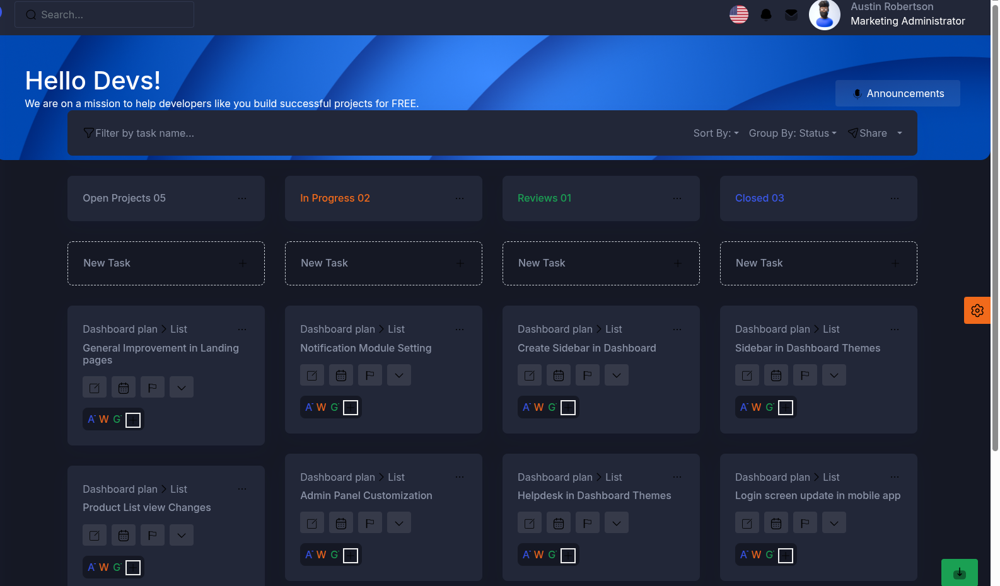

# 09. Kanban



Usted puede hacer drag and drop de las tarjetas.

Pasos: 

* Cree la pagina kanban.xtml

* Agregue **<jmoordbcoreui:jskanban/>**

```
<html xmlns="http://www.w3.org/1999/xhtml"
      xmlns:ui="jakarta.faces.facelets"
      xmlns:h="jakarta.faces.html"
      xmlns:jmoordbcoreui="http://jmoordbcoreui.com/taglib">
    <ui:composition template="/WEB-INF/templates/template.xhtml">
        <ui:define name="title">Cargo Administration</ui:define>
        <ui:define name="content">


  <jmoordbcoreui:jskanban/>
        </ui:define>
    </ui:composition>
</html>
```

## Agregue las clases que definen el diseño y la barra superior del kanban


```
            <div class="conatiner-fluid content-inner mt-n5 py-0">
                <div class="row">
                    <div class="col-md-12">
                        <div class="card">
                            <div class="card-body">
                                <div class="d-flex align-items-center justify-content-between flex-wrap">
                                    <p class="mb-md-0 mb-2 d-flex align-items-center">
                                        <h:graphicImage library="jmoordbcoreui" name="images/svg/botones/filter.svg" />
                                        Filter by task name...
                                    </p>
                                    <div class="d-flex align-items-center flex-wrap">
                                        <div class="dropdown me-3">
                                            <span class="dropdown-toggle align-items-center d-flex" id="dropdownMenuButton04" role="button" data-bs-toggle="dropdown" aria-expanded="false">
                                                Sort By:
                                            </span>
                                            <div class="dropdown-menu dropdown-menu-end" aria-labelledby="dropdownMenuButton04" style="">
                                                <a class="dropdown-item" href="#">Status</a>
                                                <a class="dropdown-item" href="#">Task Name</a>
                                                <a class="dropdown-item" href="#">Priority</a> 
                                                <a class="dropdown-item" href="#">Assignee</a>
                                                <a class="dropdown-item" href="#">Due date</a>
                                                <a class="dropdown-item" href="#">Start date</a>
                                                <a class="dropdown-item" href="#">Time tracked</a> 
                                            </div>
                                        </div>
                                        <div class="dropdown me-3">
                                            <span class="dropdown-toggle align-items-center d-flex" id="dropdownMenuButton05" role="button" data-bs-toggle="dropdown" aria-expanded="false">
                                                Group By: Status 
                                            </span>
                                            <div class="dropdown-menu dropdown-menu-end" aria-labelledby="dropdownMenuButton05" style="">
                                                <a class="dropdown-item" href="#">
                                                    <h:graphicImage library="jmoordbcoreui" name="images/svg/botones/chequeado.svg" />
                                                    Status
                                                </a>
                                                <a class="dropdown-item" href="#">
                                                    <h:graphicImage library="jmoordbcoreui" name="images/svg/botones/asignado.svg" />
                                                    Assignee
                                                </a>
                                                <a class="dropdown-item" href="#">
                                                    <h:graphicImage library="jmoordbcoreui" name="images/svg/botones/prioridad.svg" />
                                                    Priority
                                                </a> 
                                                <a class="dropdown-item" href="#">
                                                    <h:graphicImage library="jmoordbcoreui" name="images/svg/botones/tag.svg" />
                                                    Tags
                                                </a> 
                                                <a class="dropdown-item" href="#">
                                                    <h:graphicImage library="jmoordbcoreui" name="images/svg/botones/date.svg" />
                                                    Due Date
                                                </a> 
                                                <a class="dropdown-item" href="#">
                                                    <h:graphicImage library="jmoordbcoreui" name="images/svg/botones/none.svg" />
                                                    None
                                                </a>  
                                            </div>
                                        </div>
                                        <a href="#" class="text-body me-3 align-items-center d-flex">
                                            <h:graphicImage library="jmoordbcoreui" name="images/svg/botones/share.svg" />
                                            Share
                                        </a>
                                        <div class="dropdown">
                                            <span class="dropdown-toggle align-items-center d-flex" id="dropdownMenuButton06" role="button" data-bs-toggle="dropdown" aria-expanded="false"></span>
                                            <div class="dropdown-menu dropdown-menu-end" aria-labelledby="dropdownMenuButton06" style="">
                                                <a class="dropdown-item" href="#">
                                                    <h:graphicImage library="jmoordbcoreui" name="images/svg/botones/duplicate.svg" />
                                                    Duplicate
                                                </a>
                                                <a class="dropdown-item" href="#">
                                                    <h:graphicImage library="jmoordbcoreui" name="images/svg/botones/rename.svg" />
                                                    Rename
                                                </a>
                                                <a class="dropdown-item" href="#">
                                                    <h:graphicImage library="jmoordbcoreui" name="images/svg/botones/delete.svg" />
                                                    Delete
                                                </a>
                                            </div>
                                        </div>
                                    </div>
                                </div>
                            </div>
                        </div>
                    </div>


<!-- Aqui se colocara el contenido que dibuja las columnas -->
    </div>
            </div>
            <jmoordbcoreui:jskanban/>
        </ui:define>
    </ui:composition>
</html>


```
El resultado seria el header del kanban


## Agregar la columna Open Project

* Importante que este definada como **<div class="group" id="group1">**. Es importante el nombre para que funcione arrastrar y soltar.

```

<div class="col-lg-3">
    <div class="card-transparent mb-0 desk-info">
        <div class="card-body p-0">
            <div class="row">
                <div class="col-lg-12">
                    <div class="card">
                        <div class="card-body">                           
                            <div class="d-flex align-items-center justify-content-between">
                                <h6 class="text-pink mb-0">Open Projects 05</h6>
                                <div class="dropdown">
                                    <span class="d-flex align-items-center h5 mb-0" id="dropdownMenuButton07" role="button" data-bs-toggle="dropdown" aria-expanded="false">
                                        <h:graphicImage library="jmoordbcoreui" name="images/svg/botones/expansivepoint.svg" />

                                    </span>
                                    <div class="dropdown-menu dropdown-menu-end" aria-labelledby="dropdownMenuButton07" style="">
                                        <a class="dropdown-item" href="#">
                                            <h:graphicImage library="jmoordbcoreui" name="images/svg/botones/duplicate.svg" />
                                            Duplicate
                                        </a>
                                        <a class="dropdown-item" href="#">
                                            <h:graphicImage library="jmoordbcoreui" name="images/svg/botones/rename.svg" />
                                            Rename
                                        </a>
                                        <a class="dropdown-item" href="#">
                                            <h:graphicImage library="jmoordbcoreui" name="images/svg/botones/delete.svg" />
                                            Delete
                                        </a>
                                    </div>
                                </div>
                            </div>
                        </div>
                    </div>
                </div>
                <div class="col-lg-12">
                    <div class="card bg-transparent shadow-none">
                        <div class="iq-dashed-border">
                            <div class="d-flex align-items-center justify-content-between">
                                <h6 class="text-body mb-0">New Task</h6>
                                <h:graphicImage library="jmoordbcoreui" name="images/svg/botones/newtask.svg" />                                                 
                            </div>
                        </div>
                    </div>
                </div>
                <div class="group1-wrap">
                    <div class="group" id="group1">
                        <div class="col-lg-12 group__item">
                            <div class="card">
                                <div class="card-body">
                                    <div class="d-grid grid-flow-col align-items-center justify-content-between mb-2">
                                        <div class="d-flex align-items-center">
                                            <p class="mb-0">Dashboard plan</p>
                                               <h:graphicImage library="jmoordbcoreui" name="images/svg/botones/expansivearrow.svg" />                                                               
                                            <p class="mb-0">List</p>
                                        </div>
                                        <div class="dropdown">
                                            <span class="h5" id="dropdownMenuButton11" role="button" data-bs-toggle="dropdown" aria-expanded="false">
                                                <h:graphicImage library="jmoordbcoreui" name="images/svg/botones/expansivepoint.svg" />

                                            </span>
                                            <div class="dropdown-menu dropdown-menu-end" aria-labelledby="dropdownMenuButton11" style="">
                                                <a class="dropdown-item" href="#">
                                                    <h:graphicImage library="jmoordbcoreui" name="images/svg/botones/duplicate.svg" />
                                                    Duplicate
                                                </a>
                                                <a class="dropdown-item" href="#">
                                                   <h:graphicImage library="jmoordbcoreui" name="images/svg/botones/rename.svg" />
                                                    Rename
                                                </a>
                                                <a class="dropdown-item" href="#">
                                                    <h:graphicImage library="jmoordbcoreui" name="images/svg/botones/delete.svg" />
                                                    Delete
                                                </a> 
                                            </div>
                                        </div>
                                    </div>
                                    <h6 class="mb-3">Create Sidebar in Dashboard</h6>
                                    <div class="d-flex align-items-center mb-3">
                                        <div class="btn btn-icon btn-soft-light me-2">
                                            <div class="btn-inner">
                                                 <h:graphicImage library="jmoordbcoreui" name="images/svg/botones/edit.svg" />                                                                    
                                            </div>
                                        </div>
                                        <div class="btn btn-icon btn-soft-light me-2">
                                            <div class="btn-inner">
                                               <h:graphicImage library="jmoordbcoreui" name="images/svg/botones/date.svg" /> 
                                            </div>
                                        </div>
                                        <div class="btn btn-icon btn-soft-light me-2">
                                            <div class="btn-inner">
                                                <h:graphicImage library="jmoordbcoreui" name="images/svg/botones/flag.svg" />                                                                   
                                            </div>
                                        </div>
                                        <div class="btn btn-icon btn-soft-light me-2">
                                            <div class="btn-inner">
                                                <h:graphicImage library="jmoordbcoreui" name="images/svg/botones/down.svg" /> 
                                            </div>
                                        </div>
                                    </div>
                                    <div class="iq-media-group-1">
                                        <a href="#" class="iq-media-1">
                                            <div class="icon iq-icon-box-2 text-primary">AT</div>
                                        </a>
                                        <a href="#" class="iq-media-1">
                                            <div class="icon iq-icon-box-2 text-warning">WT</div>
                                        </a>
                                        <a href="#" class="iq-media-1">
                                            <div class="icon iq-icon-box-2 text-success">GT</div>
                                        </a>
                                        <a href="#" class="iq-media-1">
                                            <div class="icon iq-icon-box-2 text-danger">
                                                  <h:graphicImage library="jmoordbcoreui" name="images/svg/botones/plus.svg" /> 
                                            </div>
                                        </a>
                                    </div>
                                </div>
                                <span class="remove"></span>
                            </div>
                        </div>
                        <div class="col-lg-12 group__item">
                            <div class="card">
                                <div class="card-body">
                                    <div class="d-grid grid-flow-col align-items-center justify-content-between mb-2">
                                        <div class="d-flex align-items-center">
                                            <p class="mb-0">Dashboard plan</p>
                                     <h:graphicImage library="jmoordbcoreui" name="images/svg/botones/expansivearrow.svg" />
                                            <p class="mb-0">List</p>
                                        </div>
                                        <div class="dropdown">
                                            <span class="h5" id="dropdownMenuButton12" role="button" data-bs-toggle="dropdown" aria-expanded="false">
                                                <h:graphicImage library="jmoordbcoreui" name="images/svg/botones/expansivepoint.svg" />
                                            </span>
                                            <div class="dropdown-menu dropdown-menu-end" aria-labelledby="dropdownMenuButton12" style="">
                                                <a class="dropdown-item" href="#">
                                                    <h:graphicImage library="jmoordbcoreui" name="images/svg/botones/duplicate.svg" />
                                                    Duplicate
                                                </a>
                                                <a class="dropdown-item" href="#">
                                                   <h:graphicImage library="jmoordbcoreui" name="images/svg/botones/rename.svg" />
                                                    Rename
                                                </a>
                                                <a class="dropdown-item" href="#">
                                                    <h:graphicImage library="jmoordbcoreui" name="images/svg/botones/delete.svg" />
                                                    Delete
                                                </a> 
                                            </div>
                                        </div>
                                    </div>
                                    <h6 class="mb-3">General Improvement in Landing pages</h6>
                                    <div class="d-flex align-items-center mb-3">
                                        <div class="btn btn-icon btn-soft-light me-2">
                                            <div class="btn-inner">
                                              <h:graphicImage library="jmoordbcoreui" name="images/svg/botones/edit.svg" />
                                            </div>
                                        </div>
                                        <div class="btn btn-icon btn-soft-light me-2">
                                            <div class="btn-inner">
                                               <h:graphicImage library="jmoordbcoreui" name="images/svg/botones/date.svg" /> 
                                            </div>
                                        </div>
                                        <div class="btn btn-icon btn-soft-light me-2">
                                            <div class="btn-inner">
                                               <h:graphicImage library="jmoordbcoreui" name="images/svg/botones/flag.svg" /> 
                                            </div>
                                        </div>
                                        <div class="btn btn-icon btn-soft-light me-2">
                                            <div class="btn-inner">
                                                <h:graphicImage library="jmoordbcoreui" name="images/svg/botones/down.svg" />
                                            </div>
                                        </div>
                                    </div>
                                    <div class="iq-media-group-1">
                                        <a href="#" class="iq-media-1">
                                            <div class="icon iq-icon-box-2 text-primary">AT</div>
                                        </a>
                                        <a href="#" class="iq-media-1">
                                            <div class="icon iq-icon-box-2 text-warning">WT</div>
                                        </a>
                                        <a href="#" class="iq-media-1">
                                            <div class="icon iq-icon-box-2 text-success">GT</div>
                                        </a>   
                                        <a href="#" class="iq-media-1">
                                            <div class="icon iq-icon-box-2 text-danger">
                                             <h:graphicImage library="jmoordbcoreui" name="images/svg/botones/plus.svg" />
                                            </div>
                                        </a>                                      
                                    </div>
                                </div>
                                <span class="remove"></span>
                            </div>
                        </div>
                        <div class="col-lg-12 group__item">
                            <div class="card">
                                <div class="card-body">
                                    <div class="d-grid grid-flow-col align-items-center justify-content-between mb-2">
                                        <div class="d-flex align-items-center">
                                            <p class="mb-0">Dashboard plan</p>
                                     <h:graphicImage library="jmoordbcoreui" name="images/svg/botones/expansivearrow.svg" />
                                            <p class="mb-0">List</p>
                                        </div>
                                        <div class="dropdown">
                                            <span class="h5" id="dropdownMenuButton13" role="button" data-bs-toggle="dropdown" aria-expanded="false">
                                                <h:graphicImage library="jmoordbcoreui" name="images/svg/botones/expansivepoint.svg" />
                                            </span>
                                            <div class="dropdown-menu dropdown-menu-end" aria-labelledby="dropdownMenuButton13" style="">
                                                <a class="dropdown-item" href="#">
                                                    <h:graphicImage library="jmoordbcoreui" name="images/svg/botones/duplicate.svg" />
                                                    Duplicate
                                                </a>
                                                <a class="dropdown-item" href="#">
                                                   <h:graphicImage library="jmoordbcoreui" name="images/svg/botones/rename.svg" />
                                                    Rename
                                                </a>
                                                <a class="dropdown-item" href="#">
                                                    <h:graphicImage library="jmoordbcoreui" name="images/svg/botones/delete.svg" />
                                                    Delete
                                                </a> 
                                            </div>
                                        </div>
                                    </div>
                                    <h6 class="mb-3">Product List view Changes</h6>
                                    <div class="d-flex align-items-center mb-3">
                                        <div class="btn btn-icon btn-soft-light me-2">
                                            <div class="btn-inner">
                                                <h:graphicImage library="jmoordbcoreui" name="images/svg/botones/edit.svg" />
                                            </div>
                                        </div>
                                        <div class="btn btn-icon btn-soft-light me-2">
                                            <div class="btn-inner">
                                                <h:graphicImage library="jmoordbcoreui" name="images/svg/botones/date.svg" /> 
                                            </div>
                                        </div>
                                        <div class="btn btn-icon btn-soft-light me-2">
                                            <div class="btn-inner">
                                               <h:graphicImage library="jmoordbcoreui" name="images/svg/botones/flag.svg" /> 
                                            </div>
                                        </div>
                                        <div class="btn btn-icon btn-soft-light me-2">
                                            <div class="btn-inner">
                                                <h:graphicImage library="jmoordbcoreui" name="images/svg/botones/down.svg" />
                                            </div>
                                        </div>
                                    </div>
                                    <div class="iq-media-group-1">
                                        <a href="#" class="iq-media-1">
                                            <div class="icon iq-icon-box-2 text-primary">AT</div>
                                        </a>
                                        <a href="#" class="iq-media-1">
                                            <div class="icon iq-icon-box-2 text-warning">WT</div>
                                        </a>
                                        <a href="#" class="iq-media-1">
                                            <div class="icon iq-icon-box-2 text-success">GT</div>
                                        </a> 
                                        <a href="#" class="iq-media-1">
                                            <div class="icon iq-icon-box-2 text-danger">
                                            <h:graphicImage library="jmoordbcoreui" name="images/svg/botones/plus.svg" />
                                            </div>
                                        </a>                                          
                                    </div>
                                </div>
                                <span class="remove"></span>
                            </div>
                        </div>
                        <div class="col-lg-12 group__item">
                            <div class="card">
                                <div class="card-body">
                                    <div class="d-grid grid-flow-col align-items-center justify-content-between mb-2">
                                        <div class="d-flex align-items-center">
                                            <p class="mb-0">Dashboard plan</p>
                                      <h:graphicImage library="jmoordbcoreui" name="images/svg/botones/expansivearrow.svg" />
                                            <p class="mb-0">List</p>
                                        </div>
                                        <div class="dropdown">
                                            <span class="h5" id="dropdownMenuButton14" role="button" data-bs-toggle="dropdown" aria-expanded="false">
                                                <h:graphicImage library="jmoordbcoreui" name="images/svg/botones/expansivepoint.svg" />
                                            </span>
                                            <div class="dropdown-menu dropdown-menu-end" aria-labelledby="dropdownMenuButton14" style="">
                                                <a class="dropdown-item" href="#">
                                                    <h:graphicImage library="jmoordbcoreui" name="images/svg/botones/duplicate.svg" />
                                                    Duplicate
                                                </a>
                                                <a class="dropdown-item" href="#">
                                                    <h:graphicImage library="jmoordbcoreui" name="images/svg/botones/rename.svg" />
                                                    Rename
                                                </a>
                                                <a class="dropdown-item" href="#">
                                                    <h:graphicImage library="jmoordbcoreui" name="images/svg/botones/delete.svg" />
                                                    Delete
                                                </a> 
                                            </div>
                                        </div>
                                    </div>
                                    <h6 class="mb-3">Add Multiple theme options</h6>
                                    <div class="d-flex align-items-center mb-3">
                                        <div class="btn btn-icon btn-soft-light me-2">
                                            <div class="btn-inner">
                                                <h:graphicImage library="jmoordbcoreui" name="images/svg/botones/edit.svg" />
                                            </div>
                                        </div>
                                        <div class="btn btn-icon btn-soft-light me-2">
                                            <div class="btn-inner">
                                               <h:graphicImage library="jmoordbcoreui" name="images/svg/botones/date.svg" /> 
                                            </div>
                                        </div>
                                        <div class="btn btn-icon btn-soft-light me-2">
                                            <div class="btn-inner">
                                               <h:graphicImage library="jmoordbcoreui" name="images/svg/botones/flag.svg" /> 
                                            </div>
                                        </div>
                                        <div class="btn btn-icon btn-soft-light me-2">
                                            <div class="btn-inner">
                                              <h:graphicImage library="jmoordbcoreui" name="images/svg/botones/down.svg" />
                                            </div>
                                        </div>
                                    </div>
                                    <div class="iq-media-group-1">
                                        <a href="#" class="iq-media-1">
                                            <div class="icon iq-icon-box-2 text-primary">AT</div>
                                        </a>
                                        <a href="#" class="iq-media-1">
                                            <div class="icon iq-icon-box-2 text-warning">WT</div>
                                        </a>
                                        <a href="#" class="iq-media-1">
                                            <div class="icon iq-icon-box-2 text-success">GT</div>
                                        </a>
                                        <a href="#" class="iq-media-1">
                                            <div class="icon iq-icon-box-2 text-danger">
                                            <h:graphicImage library="jmoordbcoreui" name="images/svg/botones/plus.svg" />
                                            </div>
                                        </a>    
                                    </div>
                                </div>
                                <span class="remove"></span>
                            </div>
                        </div>
                    </div>
                </div>                        
            </div>
        </div>
    </div>
</div>

```

## Agregar columna In Progress

* Importante que este definada como **<div class="group" id="group2">**

```

<div class="col-lg-3">
    <div class="card-transparent mb-0 desk-info">
        <div class="card-body p-0">
            <div class="row">
                <div class="col-lg-12">
                    <div class="card">
                        <div class="card-body">                           
                            <div class="d-flex align-items-center justify-content-between">
                                <h6 class="text-warning mb-0">In Progress  02</h6>
                                <div class="dropdown">
                                    <span class="d-flex align-items-center h5 mb-0" id="dropdownMenuButton08" role="button" data-bs-toggle="dropdown" aria-expanded="false">
                                        <h:graphicImage library="jmoordbcoreui" name="images/svg/botones/expansivepoint.svg" />
                                    </span>
                                    <div class="dropdown-menu dropdown-menu-end" aria-labelledby="dropdownMenuButton08" style="">
                                        <a class="dropdown-item" href="#">
                                            <h:graphicImage library="jmoordbcoreui" name="images/svg/botones/duplicate.svg" />
                                            Duplicate
                                        </a>
                                        <a class="dropdown-item" href="#">
                                            <h:graphicImage library="jmoordbcoreui" name="images/svg/botones/rename.svg" />
                                            Rename
                                        </a>
                                        <a class="dropdown-item" href="#">
                                            <h:graphicImage library="jmoordbcoreui" name="images/svg/botones/delete.svg" />
                                            Delete
                                        </a> 
                                    </div>
                                </div>
                            </div>
                        </div>
                    </div>
                </div>
                <div class="col-lg-12">
                    <div class="card bg-transparent shadow-none">
                        <div class="iq-dashed-border">
                            <div class="d-flex align-items-center justify-content-between">
                                <h6 class="text-body mb-0">New Task</h6>
                               <h:graphicImage library="jmoordbcoreui" name="images/svg/botones/newtask.svg" />
                            </div>
                        </div>
                    </div>
                </div>
                <div class="group2-wrap">
                    <div class="group" id="group2">
                        <div class="col-lg-12 group__item">
                            <div class="card">
                                <div class="card-body">
                                    <div class="d-grid grid-flow-col align-items-center justify-content-between mb-2">
                                        <div class="d-flex align-items-center">
                                            <p class="mb-0">Dashboard plan</p>
                                         <h:graphicImage library="jmoordbcoreui" name="images/svg/botones/expansivearrow.svg" />
                                            <p class="mb-0">List</p>
                                        </div>
                                        <div class="dropdown">
                                            <span class="h5" id="dropdownMenuButton15" role="button" data-bs-toggle="dropdown" aria-expanded="false">
                                                <h:graphicImage library="jmoordbcoreui" name="images/svg/botones/expansivepoint.svg" />
                                            </span>
                                            <div class="dropdown-menu dropdown-menu-end" aria-labelledby="dropdownMenuButton15" style="">
                                                <a class="dropdown-item" href="#">
                                                    <h:graphicImage library="jmoordbcoreui" name="images/svg/botones/duplicate.svg" />
                                                    Duplicate
                                                </a>
                                                <a class="dropdown-item" href="#">
                                                    <h:graphicImage library="jmoordbcoreui" name="images/svg/botones/rename.svg" />
                                                    Rename
                                                </a>
                                                <a class="dropdown-item" href="#">
                                                    <h:graphicImage library="jmoordbcoreui" name="images/svg/botones/delete.svg" />
                                                    Delete
                                                </a> 
                                            </div>
                                        </div>
                                    </div>
                                    <h6 class="mb-3">Notification Module Setting</h6>
                                    <div class="d-flex align-items-center mb-3">
                                        <div class="btn btn-icon btn-soft-light me-2">
                                            <div class="btn-inner">
                                               <h:graphicImage library="jmoordbcoreui" name="images/svg/botones/edit.svg" />
                                            </div>
                                        </div>
                                        <div class="btn btn-icon btn-soft-light me-2">
                                            <div class="btn-inner">
                                              <h:graphicImage library="jmoordbcoreui" name="images/svg/botones/date.svg" /> 
                                            </div>
                                        </div>
                                        <div class="btn btn-icon btn-soft-light me-2">
                                            <div class="btn-inner">
                                              <h:graphicImage library="jmoordbcoreui" name="images/svg/botones/flag.svg" /> 
                                            </div>
                                        </div>
                                        <div class="btn btn-icon btn-soft-light me-2">
                                            <div class="btn-inner">
                                               <h:graphicImage library="jmoordbcoreui" name="images/svg/botones/down.svg" />
                                            </div>
                                        </div>
                                    </div>
                                    <div class="iq-media-group-1">
                                        <a href="#" class="iq-media-1">
                                            <div class="icon iq-icon-box-2 text-primary">AT</div>
                                        </a>
                                        <a href="#" class="iq-media-1">
                                            <div class="icon iq-icon-box-2 text-warning">WT</div>
                                        </a>
                                        <a href="#" class="iq-media-1">
                                            <div class="icon iq-icon-box-2 text-success">GT</div>
                                        </a>
                                        <a href="#" class="iq-media-1">
                                            <div class="icon iq-icon-box-2 text-danger">
                                         <h:graphicImage library="jmoordbcoreui" name="images/svg/botones/plus.svg" />
                                            </div>
                                        </a>    
                                    </div>
                                </div>
                            </div>
                            <span class="remove"></span>
                        </div>
                        <div class="col-lg-12 group__item">
                            <div class="card">
                                <div class="card-body">
                                    <div class="d-grid grid-flow-col align-items-center justify-content-between mb-2">
                                        <div class="d-flex align-items-center">
                                            <p class="mb-0">Dashboard plan</p>
                                          <h:graphicImage library="jmoordbcoreui" name="images/svg/botones/expansivearrow.svg" />
                                            <p class="mb-0">List</p>
                                        </div>
                                        <div class="dropdown">
                                            <span class="h5" id="dropdownMenuButton16" role="button" data-bs-toggle="dropdown" aria-expanded="false">
                                                <h:graphicImage library="jmoordbcoreui" name="images/svg/botones/expansivepoint.svg" />
                                            </span>
                                            <div class="dropdown-menu dropdown-menu-end" aria-labelledby="dropdownMenuButton16" style="">
                                                <a class="dropdown-item" href="#">
                                                    <h:graphicImage library="jmoordbcoreui" name="images/svg/botones/duplicate.svg" />
                                                    Duplicate
                                                </a>
                                                <a class="dropdown-item" href="#">
                                                    <h:graphicImage library="jmoordbcoreui" name="images/svg/botones/rename.svg" />
                                                    Rename
                                                </a>
                                                <a class="dropdown-item" href="#">
                                                    <h:graphicImage library="jmoordbcoreui" name="images/svg/botones/delete.svg" />
                                                    Delete
                                                </a> 
                                            </div>
                                        </div>
                                    </div>
                                    <h6 class="mb-3">Admin Panel Customization</h6>
                                    <div class="d-flex align-items-center mb-3">
                                        <div class="btn btn-icon btn-soft-light me-2">
                                            <div class="btn-inner">
                                                <h:graphicImage library="jmoordbcoreui" name="images/svg/botones/edit.svg" />
                                            </div>
                                        </div>
                                        <div class="btn btn-icon btn-soft-light me-2">
                                            <div class="btn-inner">
                                               <h:graphicImage library="jmoordbcoreui" name="images/svg/botones/date.svg" /> 
                                            </div>
                                        </div>
                                        <div class="btn btn-icon btn-soft-light me-2">
                                            <div class="btn-inner">
                                               <h:graphicImage library="jmoordbcoreui" name="images/svg/botones/flag.svg" /> 
                                            </div>
                                        </div>
                                        <div class="btn btn-icon btn-soft-light me-2">
                                            <div class="btn-inner">
                                                <h:graphicImage library="jmoordbcoreui" name="images/svg/botones/down.svg" />
                                            </div>
                                        </div>
                                    </div>
                                    <div class="iq-media-group-1">
                                        <a href="#" class="iq-media-1">
                                            <div class="icon iq-icon-box-2 text-primary">AT</div>
                                        </a>
                                        <a href="#" class="iq-media-1">
                                            <div class="icon iq-icon-box-2 text-warning">WT</div>
                                        </a>
                                        <a href="#" class="iq-media-1">
                                            <div class="icon iq-icon-box-2 text-success">GT</div>
                                        </a>
                                        <a href="#" class="iq-media-1">
                                            <div class="icon iq-icon-box-2 text-danger">
                                            <h:graphicImage library="jmoordbcoreui" name="images/svg/botones/plus.svg" />
                                            </div>
                                        </a> 
                                    </div>
                                </div>
                            </div>
                            <span class="remove"></span>
                        </div>
                    </div>
                </div>
            </div>
        </div>
    </div>
    </div>


```

## Agregar columna Reviews

* Importante que este definada como **<div class="group" id="group3">**

```

<div class="col-lg-3">
    <div class="card-transparent mb-0 desk-info">
        <div class="card-body p-0">
            <div class="row">
                <div class="col-lg-12">
                    <div class="card">
                        <div class="card-body">
                            <div class="d-flex align-items-center justify-content-between">
                                <h6 class="text-success mb-0">Reviews 01</h6>
                                <div class="dropdown">
                                    <span class="d-flex align-items-center h5 mb-0" id="dropdownMenuButton09" role="button" data-bs-toggle="dropdown" aria-expanded="false">
                                        <h:graphicImage library="jmoordbcoreui" name="images/svg/botones/expansivepoint.svg" />
                                    </span>
                                    <div class="dropdown-menu dropdown-menu-end" aria-labelledby="dropdownMenuButton09" style="">
                                        <a class="dropdown-item" href="#">
                                            <h:graphicImage library="jmoordbcoreui" name="images/svg/botones/duplicate.svg" />
                                            Duplicate
                                        </a>
                                        <a class="dropdown-item" href="#">
                                           <h:graphicImage library="jmoordbcoreui" name="images/svg/botones/rename.svg" />
                                            Rename
                                        </a>
                                        <a class="dropdown-item" href="#">
                                            <h:graphicImage library="jmoordbcoreui" name="images/svg/botones/delete.svg" />
                                            Delete
                                        </a> 
                                    </div>
                                </div>
                            </div>
                        </div>
                    </div>
                </div>
                <div class="col-lg-12">
                    <div class="card bg-transparent shadow-none">
                        <div class="iq-dashed-border">
                            <div class="d-flex align-items-center justify-content-between">
                                <h6 class="text-body mb-0">New Task</h6>
                               <h:graphicImage library="jmoordbcoreui" name="images/svg/botones/newtask.svg" />
                            </div>
                        </div>
                    </div>
                </div>
                <div class="group3-wrap">
                    <div class="group" id="group3">
                        <div class="col-lg-12 group__item">
                            <div class="card">
                                <div class="card-body">
                                    <div class="d-grid grid-flow-col align-items-center justify-content-between mb-2">
                                        <div class="d-flex align-items-center">
                                            <p class="mb-0">Dashboard plan</p>
                                           <h:graphicImage library="jmoordbcoreui" name="images/svg/botones/expansivearrow.svg" />
                                            <p class="mb-0">List</p>
                                        </div>
                                        <div class="dropdown">
                                            <span class="h5" id="dropdownMenuButton17" role="button" data-bs-toggle="dropdown" aria-expanded="false">
                                                <h:graphicImage library="jmoordbcoreui" name="images/svg/botones/expansivepoint.svg" />
                                            </span>
                                            <div class="dropdown-menu dropdown-menu-end" aria-labelledby="dropdownMenuButton17" style="">
                                                <a class="dropdown-item" href="#">
                                                    <h:graphicImage library="jmoordbcoreui" name="images/svg/botones/duplicate.svg" />
                                                    Duplicate
                                                </a>
                                                <a class="dropdown-item" href="#">
                                                    <h:graphicImage library="jmoordbcoreui" name="images/svg/botones/rename.svg" />
                                                    Rename
                                                </a>
                                                <a class="dropdown-item" href="#">
                                                    <h:graphicImage library="jmoordbcoreui" name="images/svg/botones/delete.svg" />
                                                    Delete
                                                </a> 
                                            </div>
                                        </div>
                                    </div>
                                    <h6 class="mb-3">Sidebar in Dashboard Themes</h6>
                                    <div class="d-flex align-items-center mb-3">
                                        <div class="btn btn-icon btn-soft-light me-2">
                                            <div class="btn-inner">
                                                <h:graphicImage library="jmoordbcoreui" name="images/svg/botones/edit.svg" />
                                            </div>
                                        </div>
                                        <div class="btn btn-icon btn-soft-light me-2">
                                            <div class="btn-inner">
                                               <h:graphicImage library="jmoordbcoreui" name="images/svg/botones/date.svg" /> 
                                            </div>
                                        </div>
                                        <div class="btn btn-icon btn-soft-light me-2">
                                            <div class="btn-inner">
                                              <h:graphicImage library="jmoordbcoreui" name="images/svg/botones/flag.svg" /> 
                                            </div>
                                        </div>
                                        <div class="btn btn-icon btn-soft-light me-2">
                                            <div class="btn-inner">
                                               <h:graphicImage library="jmoordbcoreui" name="images/svg/botones/down.svg" />
                                            </div>
                                        </div>
                                    </div>
                                    <div class="iq-media-group-1">
                                        <a href="#" class="iq-media-1">
                                            <div class="icon iq-icon-box-2 text-primary">AT</div>
                                        </a>
                                        <a href="#" class="iq-media-1">
                                            <div class="icon iq-icon-box-2 text-warning">WT</div>
                                        </a>
                                        <a href="#" class="iq-media-1">
                                            <div class="icon iq-icon-box-2 text-success">GT</div>
                                        </a>
                                        <a href="#" class="iq-media-1">
                                            <div class="icon iq-icon-box-2 text-danger">
                                           <h:graphicImage library="jmoordbcoreui" name="images/svg/botones/plus.svg" />
                                            </div>
                                        </a>   
                                    </div>
                                </div>
                                <span class="remove"></span>
                            </div>
                        </div>
                    </div>
                </div>                        
            </div>
        </div>
    </div>
</div>


```


## Agregar columna Closed

* Importante que este definada como **<div class="group" id="group4">**

```

     <div class="col-lg-3">
                        <div class="card-transparent mb-0 desk-info">
                            <div class="card-body p-0">
                                <div class="row">
                                    <div class="col-lg-12">
                                        <div class="card">
                                            <div class="card-body">
                                                <div class="d-flex align-items-center justify-content-between">
                                                    <h6 class="text-primary mb-0">Closed 03</h6>
                                                    <div class="dropdown">
                                                        <span class="d-flex align-items-center h5 mb-0" id="dropdownMenuButton10" role="button" data-bs-toggle="dropdown" aria-expanded="false">
                                                            <h:graphicImage library="jmoordbcoreui" name="images/svg/botones/expansivepoint.svg" />
                                                        </span>
                                                        <div class="dropdown-menu dropdown-menu-end" aria-labelledby="dropdownMenuButton10" style="">
                                                            <a class="dropdown-item" href="#">
                                                                <h:graphicImage library="jmoordbcoreui" name="images/svg/botones/duplicate.svg" />
                                                                Duplicate
                                                            </a>
                                                            <a class="dropdown-item" href="#">
                                                              <h:graphicImage library="jmoordbcoreui" name="images/svg/botones/rename.svg" />
                                                                Rename
                                                            </a>
                                                            <a class="dropdown-item" href="#">
                                                                <h:graphicImage library="jmoordbcoreui" name="images/svg/botones/delete.svg" />
                                                                Delete
                                                            </a> 
                                                        </div>
                                                    </div>
                                                </div>
                                            </div>
                                        </div>
                                    </div>
                                    <div class="col-lg-12">
                                        <div class="card bg-transparent shadow-none">
                                            <div class="iq-dashed-border">
                                                <div class="d-flex align-items-center justify-content-between">
                                                    <h6 class="text-body mb-0">New Task</h6>
                                                    <h:graphicImage library="jmoordbcoreui" name="images/svg/botones/newtask.svg" />
                                                </div>
                                            </div>
                                        </div>
                                    </div>
                                    <div class="group4-wrap">
                                        <div class="group" id="group4">
                                            <div class="col-lg-12 group__item">
                                                <div class="card">
                                                    <div class="card-body">
                                                        <div class="d-grid grid-flow-col align-items-center justify-content-between mb-2">
                                                            <div class="d-flex align-items-center">
                                                                <p class="mb-0">Dashboard plan</p>
                                                              <h:graphicImage library="jmoordbcoreui" name="images/svg/botones/expansivearrow.svg" />
                                                                <p class="mb-0">List</p>
                                                            </div>
                                                            <div class="dropdown">
                                                                <span class="h5" id="dropdownMenuButton18" role="button" data-bs-toggle="dropdown" aria-expanded="false">
                                                                    <h:graphicImage library="jmoordbcoreui" name="images/svg/botones/expansivepoint.svg" />
                                                                </span>
                                                                <div class="dropdown-menu dropdown-menu-end" aria-labelledby="dropdownMenuButton18" style="">
                                                                    <a class="dropdown-item" href="#">
                                                                        <h:graphicImage library="jmoordbcoreui" name="images/svg/botones/duplicate.svg" />
                                                                        Duplicate
                                                                    </a>
                                                                    <a class="dropdown-item" href="#">
                                                                        <h:graphicImage library="jmoordbcoreui" name="images/svg/botones/rename.svg" />
                                                                        Rename
                                                                    </a>
                                                                    <a class="dropdown-item" href="#">
                                                                        <h:graphicImage library="jmoordbcoreui" name="images/svg/botones/delete.svg" />
                                                                        Delete
                                                                    </a> 
                                                                </div>
                                                            </div>
                                                        </div>
                                                        <h6 class="mb-3">Login screen update in mobile app</h6>
                                                        <div class="d-flex align-items-center mb-3">
                                                            <div class="btn btn-icon btn-soft-light me-2">
                                                                <div class="btn-inner">
                                                                   <h:graphicImage library="jmoordbcoreui" name="images/svg/botones/edit.svg" />
                                                                </div>
                                                            </div>
                                                            <div class="btn btn-icon btn-soft-light me-2">
                                                                <div class="btn-inner">
                                                                   <h:graphicImage library="jmoordbcoreui" name="images/svg/botones/date.svg" /> 
                                                                </div>
                                                            </div>
                                                            <div class="btn btn-icon btn-soft-light me-2">
                                                                <div class="btn-inner">
                                                                    <h:graphicImage library="jmoordbcoreui" name="images/svg/botones/flag.svg" /> 
                                                                </div>
                                                            </div>
                                                            <div class="btn btn-icon btn-soft-light me-2">
                                                                <div class="btn-inner">
                                                                    <h:graphicImage library="jmoordbcoreui" name="images/svg/botones/down.svg" />
                                                                </div>
                                                            </div>
                                                        </div>
                                                        <div class="iq-media-group-1">
                                                            <a href="#" class="iq-media-1">
                                                                <div class="icon iq-icon-box-2 text-primary">AT</div>
                                                            </a>
                                                            <a href="#" class="iq-media-1">
                                                                <div class="icon iq-icon-box-2 text-warning">WT</div>
                                                            </a>
                                                            <a href="#" class="iq-media-1">
                                                                <div class="icon iq-icon-box-2 text-success">GT</div>
                                                            </a>
                                                            <a href="#" class="iq-media-1">
                                                                <div class="icon iq-icon-box-2 text-danger">
                                                               <h:graphicImage library="jmoordbcoreui" name="images/svg/botones/plus.svg" />
                                                                </div>
                                                            </a> 
                                                        </div>
                                                    </div>
                                                </div>
                                                <span class="remove"></span>
                                            </div>
                                            <div class="col-lg-12 group__item">
                                                <div class="card" data-toggle="modal" data-target="#add-tasker-modal">
                                                    <div class="card-body">
                                                        <div class="d-grid grid-flow-col align-items-center justify-content-between mb-2">
                                                            <div class="d-flex align-items-center">
                                                                <p class="mb-0">Dashboard plan</p>
                                                           <h:graphicImage library="jmoordbcoreui" name="images/svg/botones/expansivearrow.svg" />
                                                                <p class="mb-0">List</p>
                                                            </div>
                                                            <div class="dropdown">
                                                                <span class="h5" id="dropdownMenuButton19" role="button" data-bs-toggle="dropdown" aria-expanded="false">
                                                                    <h:graphicImage library="jmoordbcoreui" name="images/svg/botones/expansivepoint.svg" />
                                                                </span>
                                                                <div class="dropdown-menu dropdown-menu-end" aria-labelledby="dropdownMenuButton19" style="">
                                                                    <a class="dropdown-item" href="#">
                                                                        <h:graphicImage library="jmoordbcoreui" name="images/svg/botones/duplicate.svg" />
                                                                        Duplicate
                                                                    </a>
                                                                    <a class="dropdown-item" href="#">
                                                                        <h:graphicImage library="jmoordbcoreui" name="images/svg/botones/rename.svg" />
                                                                        Rename
                                                                    </a>
                                                                    <a class="dropdown-item" href="#">
                                                                        <h:graphicImage library="jmoordbcoreui" name="images/svg/botones/delete.svg" />
                                                                        Delete
                                                                    </a> 
                                                                </div>
                                                            </div>
                                                        </div>
                                                        <h6 class="mb-3">Helpdesk in Dashboard Themes</h6>
                                                        <div class="d-flex align-items-center mb-3">
                                                            <div class="btn btn-icon btn-soft-light me-2">
                                                                <div class="btn-inner">
                                                                    <h:graphicImage library="jmoordbcoreui" name="images/svg/botones/edit.svg" />
                                                                </div>
                                                            </div>
                                                            <div class="btn btn-icon btn-soft-light me-2">
                                                                <div class="btn-inner">
                                                                      <h:graphicImage library="jmoordbcoreui" name="images/svg/botones/date.svg" />                                                                    
                                                                </div>
                                                            </div>
                                                            <div class="btn btn-icon btn-soft-light me-2">
                                                                <div class="btn-inner">
                                                                   <h:graphicImage library="jmoordbcoreui" name="images/svg/botones/flag.svg" /> 
                                                                </div>
                                                            </div>
                                                            <div class="btn btn-icon btn-soft-light me-2">
                                                                <div class="btn-inner">
                                                                   <h:graphicImage library="jmoordbcoreui" name="images/svg/botones/down.svg" />
                                                                </div>
                                                            </div>
                                                        </div>
                                                        <div class="iq-media-group-1">
                                                            <a href="#" class="iq-media-1">
                                                                <div class="icon iq-icon-box-2 text-primary">AT</div>
                                                            </a>
                                                            <a href="#" class="iq-media-1">
                                                                <div class="icon iq-icon-box-2 text-warning">WT</div>
                                                            </a>
                                                            <a href="#" class="iq-media-1">
                                                                <div class="icon iq-icon-box-2 text-success">GT</div>
                                                            </a>
                                                            <a href="#" class="iq-media-1">
                                                              
                                                                     
                                                                <div class="icon iq-icon-box-2 text-danger">
                                                                           <h:graphicImage library="jmoordbcoreui" name="images/svg/botones/plus.svg" />
                                                                </div>
                                                            </a>   
                                                        </div>
                                                    </div>
                                                </div>
                                                <span class="remove"></span>
                                            </div>
                                        </div>
                                    </div>
                                </div>
                            </div>
                        </div>
                    </div>


```