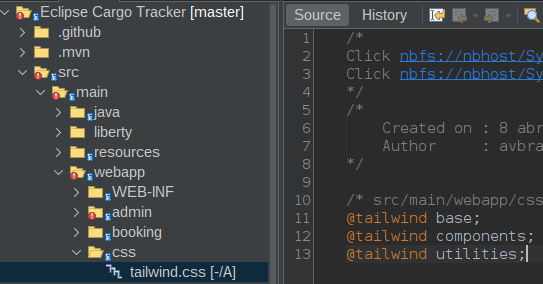

# 00. Introducción

[tailwindcss](https://tailwindcss.com/)ò

WebJar

Agregar al archivo pom.xml

```java
<!-- https://mvnrepository.com/artifact/org.webjars.npm/tailwindcss -->
<dependency>
    <groupId>org.webjars.npm</groupId>
    <artifactId>tailwindcss</artifactId>
    <version>4.1.1</version>
</dependency>

```

Cree la carpeta src/main/webapp/css

Cree el archivo twailwind.css



Agregue el siguiente contenido

```css

@tailwind base;
@tailwind components;
@tailwind utilities;

```

