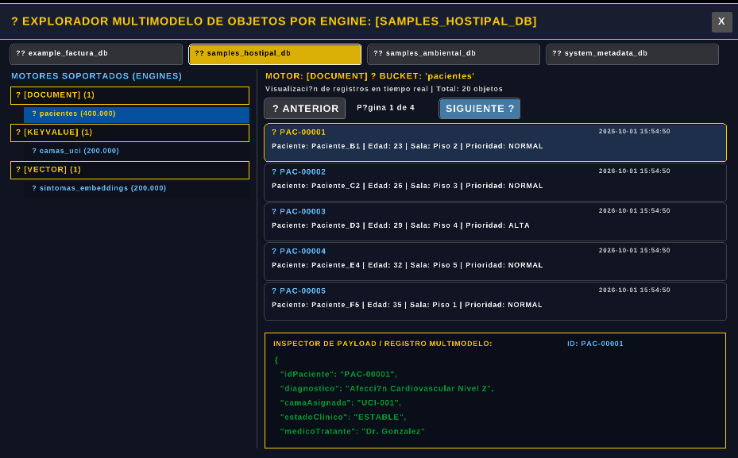

# PENDIENTE

En JettraStorePolice3D en el panel que muestra los engine de la base de datos seleccionada. añadir un panel
que permita mostrar los registros, insertar, editar , eliminar, ver las versiones de documentos
contar con un panel de restaurar versiones.

en ese panel añadir las opciones

