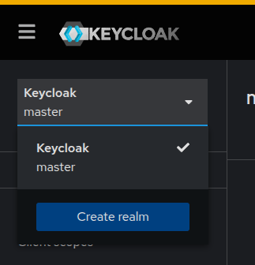
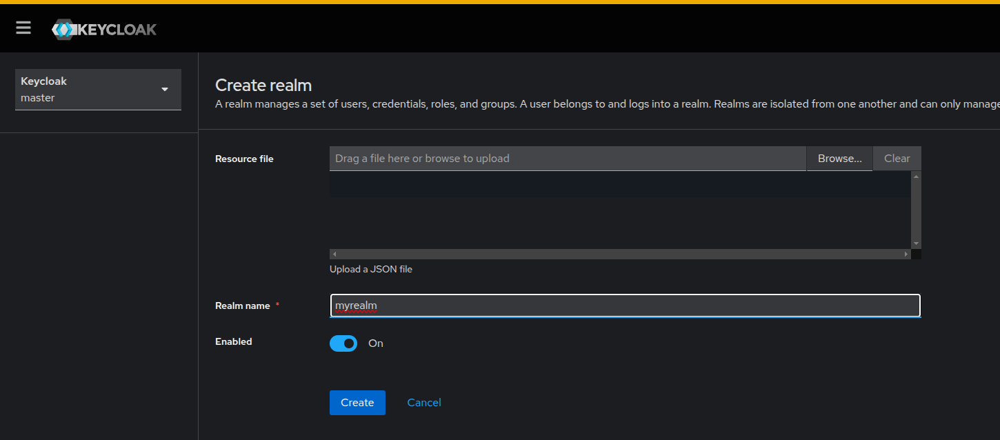

## KeyLoak

[keycloak](https://www.keycloak.org/)

[Get started with Keycloak on Docker](https://www.keycloak.org/getting-started/getting-started-docker)

```
Gestión de identidad y acceso de código abierto
Autentique sus aplicaciones y proteja sus servicios con el mínimo esfuerzo.
Olvídese del almacenamiento y la autenticación de usuarios.

Keycloak proporciona federación de usuarios, autenticación sólida, gestión de usuarios, autorización detallada y mucho más.
```


## Instalar Keycloak

Mediante docker. Especifique el puerto, en el ejemplo se usa el usuario admin, y password admin, y la versión de keyloak = 26.1.4

```
docker run -p 8080:8080 -e KC_BOOTSTRAP_ADMIN_USERNAME=admin -e KC_BOOTSTRAP_ADMIN_PASSWORD=admin quay.io/keycloak/keycloak:26.1.4 start-dev

```


### Modos de ejecución

* Desarrollador


```shell
   start-dev
```

* Building an optimized server runtime:
```shell
      build <OPTIONS>
```

  Start the server in production mode:
```shell
     start <OPTIONS>
```


### Consola de Administracion

Ingrese a [http://localhost:8080/admin](http://localhost:8080/admin)


Se muestra el dashboad


Un dominio en Keycloak es equivalente a un inquilino. Cada dominio permite al administrador crear grupos aislados de aplicaciones y usuarios. Inicialmente, Keycloak incluye un único dominio, llamado maestro. Úselo solo para administrar Keycloak, no para administrar aplicaciones.

Siga estos pasos para crear el primer dominio:

Abra la Consola de administración de Keycloak.

Haga clic en Keycloak junto al dominio maestro y luego en Crear dominio.




Introduzca myrealm en el campo Nombre del dominio.

Haga clic en Crear.




Se muestra el realname creado

