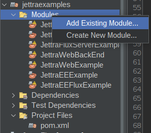
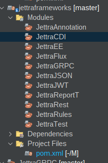
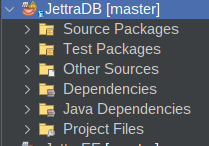
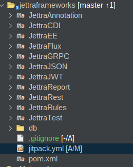
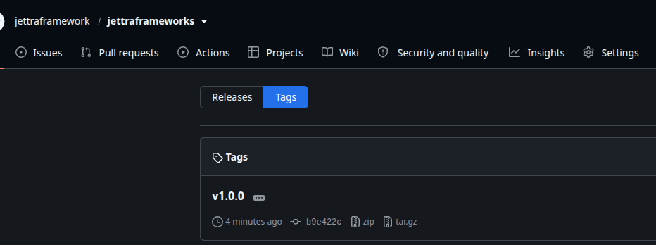
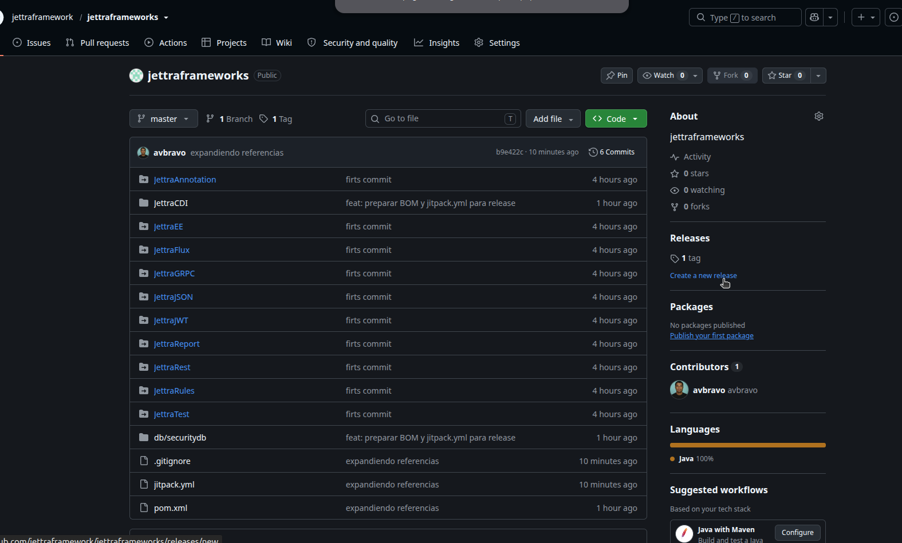
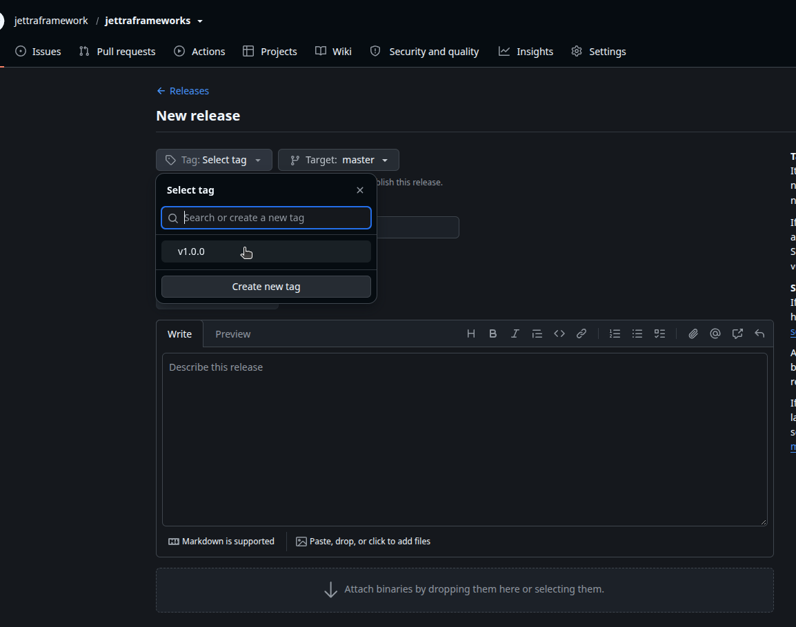
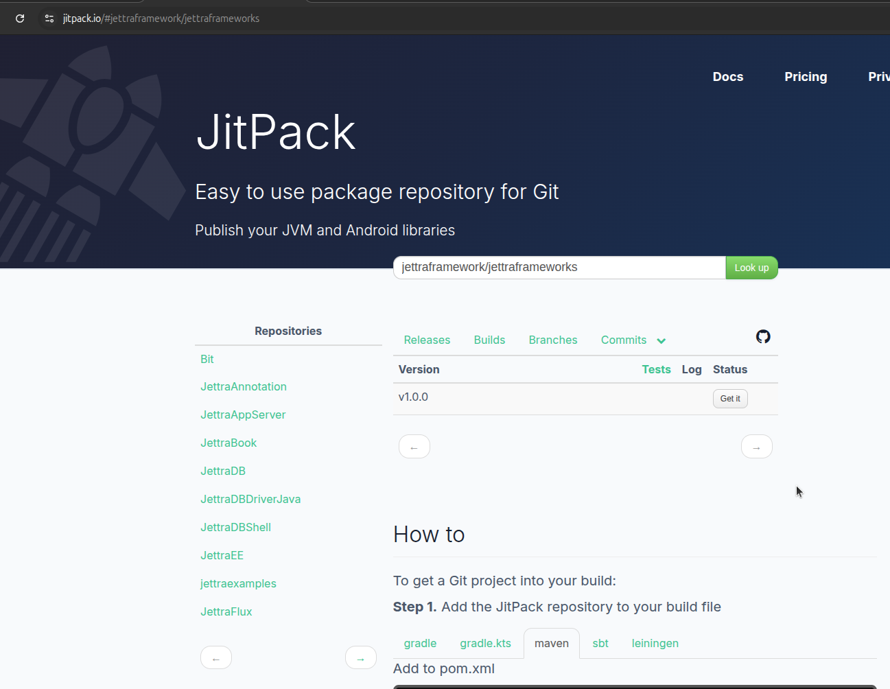
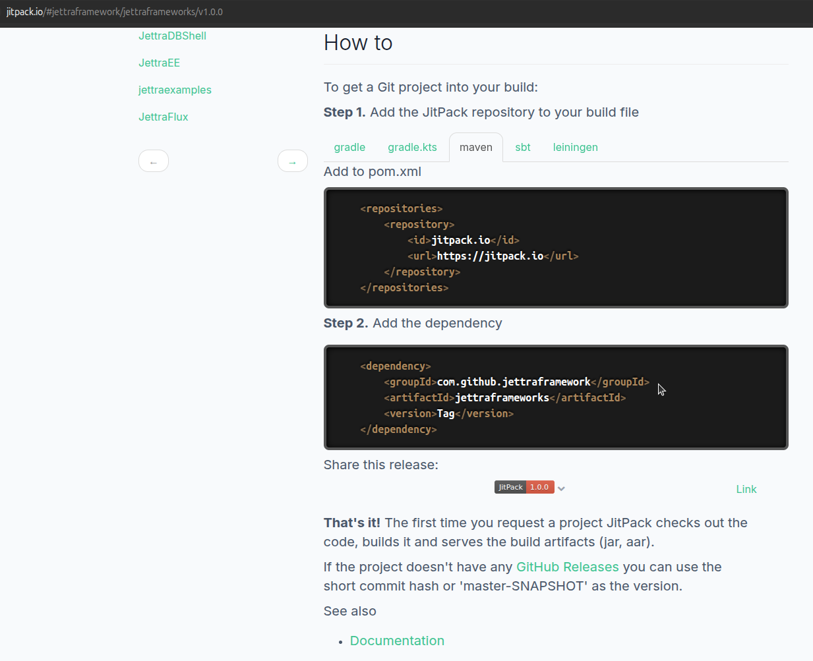

# Monorepo (Recomendado si consolidarás el código
Para estructurar un proyecto Maven multimódulo donde los submódulos provienen de otros repositorios o proyectos independientes y subirlos a GitHub, existen dos enfoques principales según cómo desees gestionar el código:

Monorepo (Copiar/Mover el código directamente): Un solo repositorio en GitHub que contiene el POM padre y las carpetas de todos los módulos. Es el más simple de mantener si vas a evolucionar todos los proyectos juntos.

Git Submodules (Mantener repositorios independientes): El proyecto padre tiene su propio repositorio y enlaza a los repositorios de cada submódulo mediante punteros a commits específicos.

Opción 1: Enfoque Monorepo (Recomendado si consolidarás el código)
1. Estructura de directorios
Crea una carpeta raíz y coloca los proyectos dentro

```
mi-proyecto-padre/
├── pom.xml               <-- POM agregador (packaging pom)
├── modulo-auth/          <-- Proyecto 1 (tiene su propio pom.xml)
│   ├── pom.xml
│   └── src/
└── modulo-servicios/     <-- Proyecto 2 (tiene su propio pom.xml)
    ├── pom.xml
    └── src/

```

Configurar el pom.xml padre
En la raíz (mi-proyecto-padre/pom.xml), define el empaquetado como pom y lista los módulos:


```
<project xmlns="http://maven.apache.org/POM/4.0.0"
         xmlns:xsi="http://www.w3.org/2001/XMLSchema-instance"
         xsi:schemaLocation="http://maven.apache.org/POM/4.0.0 
                             http://maven.apache.org/xsd/maven-4.0.0.xsd">
    <modelVersion>4.0.0</modelVersion>

    <groupId>com.tuempresa</groupId>
    <artifactId>mi-proyecto-padre</artifactId>
    <version>1.0.0-SNAPSHOT</version>
    <packaging>pom</packaging>

    <modules>
        <module>modulo-auth</module>
        <module>modulo-servicios</module>
    </modules>

    <properties>
        <maven.compiler.release>21</maven.compiler.release>
        <project.build.sourceEncoding>UTF-8</project.build.sourceEncoding>
    </properties>
</project>
```

# Crear un proyecto desde maven

```
mvn archetype:generate   -DgroupId=io.jettra   -DartifactId=jettraexamples   -Dversion=1.0.0-SNAPSHOT   -DarchetypeArtifactId=maven-archetype-quickstart   -DinteractiveMode=false


```

remover el directorio src

```
cd jettraexamples/

rm -rf src

```

Abra el proyecto desde NetBeans IDE

Cambie el packing de jar a pom en la seccion <packaging>
```
<project xmlns="http://maven.apache.org/POM/4.0.0" xmlns:xsi="http://www.w3.org/2001/XMLSchema-instance"
  xsi:schemaLocation="http://maven.apache.org/POM/4.0.0 http://maven.apache.org/maven-v4_0_0.xsd">
  <modelVersion>4.0.0</modelVersion>
  <groupId>io.jettra</groupId>
  <artifactId>jettraexamples</artifactId>
  <packaging>pom</packaging>
  <version>1.0.0-SNAPSHOT</version>
  <name>jettraexamples</name>


```




De esa manera se agregan los modulos

crear un repositorio en github del proyecto principal


# TRABAJARLO COMO SBOM

Para convertir jettraexamples en un BOM (Bill of Materials) agregador y publicarlo en JitPack, debes transformar la sección <dependencies> en <dependencyManagement> y agregar el plugin maven-publish o las propiedades de compilación requeridas por JitPack.

Aquí tienes el archivo pom.xml ajustado y los pasos exactos para publicarlo y consumirlo.

1. Archivo pom.xml configurado como BOM
Reemplaza tu archivo por el siguiente:


```
<project xmlns="http://maven.apache.org/POM/4.0.0" 
         xmlns:xsi="http://www.w3.org/2001/XMLSchema-instance"
         xsi:schemaLocation="http://maven.apache.org/POM/4.0.0 
                             http://maven.apache.org/xsd/maven-4.0.0.xsd">
    <modelVersion>4.0.0</modelVersion>

    <groupId>io.jettra</groupId>
    <artifactId>jettraexamples</artifactId>
    <version>1.0.0-SNAPSHOT</version>
    <packaging>pom</packaging>
    <name>jettraexamples</name>

    <properties>
        <maven.compiler.release>21</maven.compiler.release>
        <project.build.sourceEncoding>UTF-8</project.build.sourceEncoding>
        <!-- Permite a JitPack o a proyectos hijos reutilizar la versión exacta -->
        <jettra.version>${project.version}</jettra.version>
    </properties>

    <!-- Módulos que compila y empaqueta el reactor -->
    <modules>
        <module>modulo-auth</module>
        <module>modulo-servicios</module>
        <module>JettraFluxBackEnd</module>
        <module>JettraFluxExample</module>
        <module>JettraFluxServerExample</module>
        <module>JettraWebBackEnd</module>
        <module>JettraWebExample</module>
        <module>JettraEEExample</module>
        <module>JettraEEFluxExample</module>
    </modules>

    <!-- Definición del BOM: centraliza versiones sin forzar la descarga de todas -->
    <dependencyManagement>
        <dependencies>
            <!-- Módulos propios del ecosistema Jettra -->
            <dependency>
                <groupId>${project.groupId}</groupId>
                <artifactId>modulo-auth</artifactId>
                <version>${project.version}</version>
            </dependency>
            <dependency>
                <groupId>${project.groupId}</groupId>
                <artifactId>modulo-servicios</artifactId>
                <version>${project.version}</version>
            </dependency>
            <dependency>
                <groupId>${project.groupId}</groupId>
                <artifactId>JettraFluxBackEnd</artifactId>
                <version>${project.version}</version>
            </dependency>
            <dependency>
                <groupId>${project.groupId}</groupId>
                <artifactId>JettraFluxExample</artifactId>
                <version>${project.version}</version>
            </dependency>
            <dependency>
                <groupId>${project.groupId}</groupId>
                <artifactId>JettraFluxServerExample</artifactId>
                <version>${project.version}</version>
            </dependency>
            <dependency>
                <groupId>${project.groupId}</groupId>
                <artifactId>JettraWebBackEnd</artifactId>
                <version>${project.version}</version>
            </dependency>
            <dependency>
                <groupId>${project.groupId}</groupId>
                <artifactId>JettraWebExample</artifactId>
                <version>${project.version}</version>
            </dependency>
            <dependency>
                <groupId>${project.groupId}</groupId>
                <artifactId>JettraEEExample</artifactId>
                <version>${project.version}</version>
            </dependency>
            <dependency>
                <groupId>${project.groupId}</groupId>
                <artifactId>JettraEEFluxExample</artifactId>
                <version>${project.version}</version>
            </dependency>

            <!-- Librerías de terceros compartidas (ej. JUnit 5) -->
            <dependency>
                <groupId>org.junit.jupiter</groupId>
                <artifactId>junit-jupiter</artifactId>
                <version>5.10.2</version>
                <scope>test</scope>
            </dependency>
        </dependencies>
    </dependencyManagement>

    <build>
        <plugins>
            <!-- Necesario para que JitPack instale y publique el código compilado de los módulos -->
            <plugin>
                <groupId>org.apache.maven.plugins</groupId>
                <artifactId>maven-install-plugin</artifactId>
                <version>3.1.1</version>
            </plugin>
        </plugins>
    </build>
</project>

```

Subir el proyecto a Github y luego a jitpack

En el proyecto de ejemplo 

```
<project xmlns="http://maven.apache.org/POM/4.0.0"
         xmlns:xsi="http://www.w3.org/2001/XMLSchema-instance"
         xsi:schemaLocation="http://maven.apache.org/POM/4.0.0 
                             http://maven.apache.org/xsd/maven-4.0.0.xsd">
    <modelVersion>4.0.0</modelVersion>

    <groupId>com.miempresa</groupId>
    <artifactId>miejemplo</artifactId>
    <version>1.0.0-SNAPSHOT</version>
    <packaging>jar</packaging>
    <name>miejemplo</name>

    <properties>
        <maven.compiler.release>21</maven.compiler.release>
        <project.build.sourceEncoding>UTF-8</project.build.sourceEncoding>
    </properties>

    <!-- 1. Repositorio de JitPack para resolver las librerías -->
    <repositories>
        <repository>
            <id>jitpack.io</id>
            <name>JitPack Repository</name>
            <url>https://jitpack.io</url>
        </repository>
    </repositories>

    <!-- 2. Importación del BOM de jettraexamples -->
    <dependencyManagement>
        <dependencies>
            <dependency>
                <groupId>com.github.TU_USUARIO_GITHUB</groupId>
                <artifactId>jettraexamples</artifactId>
                <!-- Usa el release/tag (ej: v1.0.0) o la rama (main-SNAPSHOT) -->
                <version>v1.0.0</version>
                <type>pom</type>
                <scope>import</scope>
            </dependency>
        </dependencies>
    </dependencyManagement>

    <!-- 3. Submódulos que este proyecto va a utilizar -->
    <dependencies>
        <!-- Módulo JettraFluxBackEnd (la versión la resuelve el BOM) -->
        <dependency>
            <groupId>com.github.TU_USUARIO_GITHUB.jettraexamples</groupId>
            <artifactId>JettraFluxBackEnd</artifactId>
        </dependency>

        <!-- Módulo modulo-auth (la versión la resuelve el BOM) -->
        <dependency>
            <groupId>com.github.TU_USUARIO_GITHUB.jettraexamples</groupId>
            <artifactId>modulo-auth</artifactId>
        </dependency>

        <!-- Módulo JettraEEExample (ejemplo adicional si lo necesitas) -->
        <dependency>
            <groupId>com.github.TU_USUARIO_GITHUB.jettraexamples</groupId>
            <artifactId>JettraEEExample</artifactId>
        </dependency>

        <!-- Pruebas unitarias: resuelta desde el BOM sin poner versión -->
        <dependency>
            <groupId>org.junit.jupiter</groupId>
            <artifactId>junit-jupiter</artifactId>
            <scope>test</scope>
        </dependency>
    </dependencies>

    <build>
        <plugins>
            <plugin>
                <groupId>org.apache.maven.plugins</groupId>
                <artifactId>maven-compiler-plugin</artifactId>
                <version>3.13.0</version>
            </plugin>
        </plugins>
    </build>
</project>


```


---

## jettraframework

* Crear el proyecto jettraframework
* eliminar la carpeta src
* en pom.xml cambiar la generacion de jar por bom
* Crear las propiedades
* Abrir el proyecto en NetBeans
* Añadir los modulos



* Añadir la seccion  **<dependencyManagement>**


Archivo **jettraframework/pom.xml**

```xml

<project xmlns="http://maven.apache.org/POM/4.0.0" xmlns:xsi="http://www.w3.org/2001/XMLSchema-instance"
         xsi:schemaLocation="http://maven.apache.org/POM/4.0.0 http://maven.apache.org/maven-v4_0_0.xsd">
    <modelVersion>4.0.0</modelVersion>
    <groupId>io.jettra</groupId>
    <artifactId>jettraframeworks</artifactId>
    <packaging>pom</packaging>
    <version>1.0.0-SNAPSHOT</version>
    <name>jettraframeworks</name>
    <url>http://maven.apache.org</url>
    
    <properties>
        <maven.compiler.release>25</maven.compiler.release>
        <project.build.sourceEncoding>UTF-8</project.build.sourceEncoding>
        <!-- Permite a JitPack o a proyectos hijos reutilizar la versión exacta -->
        <jettra.version>${project.version}</jettra.version>

    </properties>
    
    <modules>
        <module>JettraAnnotation</module>
        <module>JettraCDI</module>
        <module>JettraEE</module>
        <module>JettraFlux</module>
        <module>JettraGRPC</module>
        <module>JettraJSON</module>
        <module>JettraJWT</module>
        <module>JettraReport</module>
        <module>JettraRest</module>
        <module>JettraRules</module>
        <module>JettraTest</module>
    </modules>
    <dependencies>
    
    </dependencies>
    
    <!-- Definición del BOM: centraliza versiones sin forzar la descarga de todas -->
    <dependencyManagement>
        <dependencies>
            <!-- Módulos propios del ecosistema Jettra -->
            <dependency>
                <groupId>${project.groupId}</groupId>
                <artifactId>JettraAnnotation</artifactId>
                <version>${project.version}</version>
            </dependency>
            <dependency>
                <groupId>${project.groupId}</groupId>
                <artifactId>JettraCDI</artifactId>
                <version>${project.version}</version>
            </dependency>
            <dependency>
                <groupId>${project.groupId}</groupId>
                <artifactId>JettraEE</artifactId>
                <version>${project.version}</version>
            </dependency>
        
            <dependency>
                <groupId>${project.groupId}</groupId>
                <artifactId>JettraFlux</artifactId>
                <version>${project.version}</version>
            </dependency>
            <dependency>
                <groupId>${project.groupId}</groupId>
                <artifactId>JettraGRPC</artifactId>
                <version>${project.version}</version>
            </dependency>
            <dependency>
                <groupId>${project.groupId}</groupId>
                <artifactId>JettraJSON</artifactId>
                <version>${project.version}</version>
            </dependency>
            <dependency>
                <groupId>${project.groupId}</groupId>
                <artifactId>JettraJWT</artifactId>
                <version>${project.version}</version>
            </dependency>
            <dependency>
                <groupId>${project.groupId}</groupId>
                <artifactId>JettraReport</artifactId>
                <version>${project.version}</version>
            </dependency>
            <dependency>
                <groupId>${project.groupId}</groupId>
                <artifactId>JettraRest</artifactId>
                <version>${project.version}</version>
            </dependency>
            <dependency>
                <groupId>${project.groupId}</groupId>
                <artifactId>JettraRules</artifactId>
                <version>${project.version}</version>
            </dependency>
            <dependency>
                <groupId>${project.groupId}</groupId>
                <artifactId>JettraTest</artifactId>
                <version>${project.version}</version>
            </dependency>
        

   
           
        </dependencies>
    </dependencyManagement>
    <build>
        <plugins>
            <!-- Necesario para que JitPack instale y publique el código compilado de los módulos -->
            <plugin>
                <groupId>org.apache.maven.plugins</groupId>
                <artifactId>maven-install-plugin</artifactId>
                <version>3.1.1</version>
            </plugin>
        </plugins>
    </build>
</project>

```

## Modificar el pom.xml de cada proyecto para que tome las propiedades del proyecto principal

Por ejemplo **JettraCDI**, añada la secicon <parent> observe que se usa relativePath para obtener 
la definición de propiedades del bom.

```xml
  <parent>
        <groupId>io.jettra</groupId>
        <artifactId>jettraframeworks</artifactId>
        <version>1.0.0-SNAPSHOT</version>
        <relativePath>../pom.xml</relativePath>
    </parent>

    <!-- 2. Identificador del Submódulo -->
    <artifactId>JettraCDI</artifactId>
    <packaging>jar</packaging>
   <name>JettraCDI</name>
    <description>Contenedor de Inyección de Dependencias (CDI) ultra-ligero y de alto rendimiento para el ecosistema Jettra, sin dependencias de Jakarta EE o Eclipse MicroProfile.</description>


```

En las dependencias, no utilice la version estas se toman del boom principal

```xml
 <dependencies>
        <dependency>
            <groupId>io.jettra</groupId>
            <artifactId>JettraAnnotation</artifactId>
            <!--<version>${jettra.annotation.version}</version>-->
                 <scope>provided</scope>
        </dependency>
        <dependency>
            <groupId>io.jettra</groupId>
            <artifactId>JettraJSON</artifactId>
            <!--<version>${jettra.json.version}</version>-->
            <scope>provided</scope>
        </dependency>

```

Ejemplo completo

```xml
<?xml version="1.0" encoding="UTF-8"?>
<project xmlns="http://maven.apache.org/POM/4.0.0"
         xmlns:xsi="http://www.w3.org/2001/XMLSchema-instance"
         xsi:schemaLocation="http://maven.apache.org/POM/4.0.0 http://maven.apache.org/xsd/maven-4.0.0.xsd">
    <modelVersion>4.0.0</modelVersion>


<!-- 1. Herencia del Proyecto Maestro -->
    <parent>
        <groupId>io.jettra</groupId>
        <artifactId>jettraframeworks</artifactId>
        <version>1.0.0-SNAPSHOT</version>
        <relativePath>../pom.xml</relativePath>
    </parent>

    <!-- 2. Identificador del Submódulo -->
    <artifactId>JettraCDI</artifactId>
    <packaging>jar</packaging>
   <name>JettraCDI</name>
    <description>Contenedor de Inyección de Dependencias (CDI) ultra-ligero y de alto rendimiento para el ecosistema Jettra, sin dependencias de Jakarta EE o Eclipse MicroProfile.</description>

    
<!--    <groupId>io.jettra</groupId>
    <artifactId>JettraCDI</artifactId>
    <version>1.0.0-SNAPSHOT</version>
    <packaging>jar</packaging>

    <name>JettraCDI</name>
    <description>Contenedor de Inyección de Dependencias (CDI) ultra-ligero y de alto rendimiento para el ecosistema Jettra, sin dependencias de Jakarta EE o Eclipse MicroProfile.</description>-->

<!--    <properties>
        <maven.compiler.source>25</maven.compiler.source>
        <maven.compiler.target>25</maven.compiler.target>
        <project.build.sourceEncoding>UTF-8</project.build.sourceEncoding>
        <jettra.annotation.version>1.0.0-SNAPSHOT</jettra.annotation.version>
        <jettra.json.version>1.0.0-SNAPSHOT</jettra.json.version>
    </properties>-->

    <dependencies>
        <dependency>
            <groupId>io.jettra</groupId>
            <artifactId>JettraAnnotation</artifactId>
            <!--<version>${jettra.annotation.version}</version>-->
                 <scope>provided</scope>
        </dependency>
        <dependency>
            <groupId>io.jettra</groupId>
            <artifactId>JettraJSON</artifactId>
            <!--<version>${jettra.json.version}</version>-->
            <scope>provided</scope>
        </dependency>
    </dependencies>

    <build>
        <plugins>
            <plugin>
                <groupId>org.apache.maven.plugins</groupId>
                <artifactId>maven-compiler-plugin</artifactId>
                <version>3.11.0</version>
                <configuration>
                    <source>${maven.compiler.source}</source>
                    <target>${maven.compiler.target}</target>
                </configuration>
            </plugin>
            <plugin>
                <groupId>org.apache.maven.plugins</groupId>
                <artifactId>maven-jar-plugin</artifactId>
                <version>3.3.0</version>
            </plugin>
        </plugins>
    </build>

    <repositories>
        <repository>
            <id>jitpack.io</id>
            <url>https://jitpack.io</url>
        </repository>
    </repositories>
</project>

```


## Implementando el bom local en un proyecto cliente 

En este caso usamos el proyecto JettraDB
Configure el archivo pom.xml



Pasos:

1. Añada **<dependencyManagement>**

```xml
  <dependencyManagement>
        <dependencies>
            <dependency>
                <groupId>io.jettra</groupId>
                <artifactId>jettraframeworks</artifactId>
                <version>1.0.0-SNAPSHOT</version>
                <type>pom</type>
                <scope>import</scope>
            </dependency>
        </dependencies>
    </dependencyManagement>
```

2. Añada las dependencias no se especifican las versiones

```xml
 <dependency>
    <groupId>io.jettra</groupId>
    <artifactId>JettraJSON</artifactId>
</dependency>
<dependency>
    <groupId>io.jettra</groupId>
    <artifactId>JettraEE</artifactId>
</dependency>

```


3. Archivo completo

```xml
<?xml version="1.0" encoding="UTF-8"?>
<project xmlns="http://maven.apache.org/POM/4.0.0" 
         xmlns:xsi="http://www.w3.org/2001/XMLSchema-instance" 
         xsi:schemaLocation="http://maven.apache.org/POM/4.0.0 http://maven.apache.org/xsd/maven-4.0.0.xsd">
    <modelVersion>4.0.0</modelVersion>

    <groupId>com.jettra</groupId>
    <artifactId>JettraDB</artifactId>
    <version>1.0-SNAPSHOT</version>
    <packaging>jar</packaging>
    <name>JettraDB</name>

    <properties>
        <maven.compiler.source>25</maven.compiler.source>
        <maven.compiler.target>25</maven.compiler.target>
        <project.build.sourceEncoding>UTF-8</project.build.sourceEncoding>
        <skipTests>true</skipTests>
        <mainClass>com.jettra.store.engine.App</mainClass>
        <exec.mainClass>com.jettra.store.engine.App</exec.mainClass>
        <exec.executable>java</exec.executable>
        <maven.compiler.compilerArgs>--enable-preview</maven.compiler.compilerArgs>
    </properties>

    <!-- 1. Importación del BOM local de JettraFrameworks -->
    <dependencyManagement>
        <dependencies>
            <dependency>
                <groupId>io.jettra</groupId>
                <artifactId>jettraframeworks</artifactId>
                <version>1.0.0-SNAPSHOT</version>
                <type>pom</type>
                <scope>import</scope>
            </dependency>
        </dependencies>
    </dependencyManagement>

    <!-- 2. Dependencias sin declarar <version> (las gestiona el BOM) -->
    <dependencies>
        <dependency>
            <groupId>io.jettra</groupId>
            <artifactId>JettraJSON</artifactId>
        </dependency>
        <dependency>
            <groupId>io.jettra</groupId>
            <artifactId>JettraEE</artifactId>
        </dependency>
        <dependency>
            <groupId>io.jettra</groupId>
            <artifactId>JettraCDI</artifactId>
        </dependency>
        <dependency>
            <groupId>io.jettra</groupId>
            <artifactId>JettraRest</artifactId>
        </dependency>
        <dependency>
            <groupId>io.jettra</groupId>
            <artifactId>JettraJWT</artifactId>
        </dependency>
        <dependency>
            <groupId>io.jettra</groupId>
            <artifactId>JettraFlux</artifactId>
        </dependency>
        <dependency>
            <groupId>io.jettra</groupId>
            <artifactId>JettraReport</artifactId>
        </dependency>
        <dependency>
            <groupId>io.jettra</groupId>
            <artifactId>JettraRules</artifactId>
        </dependency>
        <dependency>
            <groupId>io.jettra</groupId>
            <artifactId>JettraAnnotation</artifactId>
        </dependency>
        <dependency>
            <groupId>io.jettra</groupId>
            <artifactId>JettraTest</artifactId>
        </dependency>
    </dependencies>

    <build>
        <plugins>
            <plugin>
                <groupId>org.apache.maven.plugins</groupId>
                <artifactId>maven-compiler-plugin</artifactId>
                <version>3.13.0</version>
                <configuration>
                    <source>${maven.compiler.source}</source>
                    <target>${maven.compiler.target}</target>
                    <compilerArgs>
                        <arg>--enable-preview</arg>
                    </compilerArgs>
                    <annotationProcessorPaths>
                        <path>
                            <groupId>io.jettra</groupId>
                            <artifactId>JettraAnnotation</artifactId>
                            <version>1.0.0-SNAPSHOT</version>
                        </path>
                    </annotationProcessorPaths>
                </configuration>
            </plugin>
            
            <plugin>
                <groupId>org.apache.maven.plugins</groupId>
                <artifactId>maven-jar-plugin</artifactId>
                <version>3.3.0</version>
                <configuration>
                    <archive>
                        <manifest>
                            <mainClass>${mainClass}</mainClass>
                        </manifest>
                    </archive>
                </configuration>
            </plugin>

            <plugin>
                <groupId>org.apache.maven.plugins</groupId>
                <artifactId>maven-shade-plugin</artifactId>
                <version>3.5.1</version>
                <executions>
                    <execution>
                        <phase>package</phase>
                        <goals>
                            <goal>shade</goal>
                        </goals>
                        <configuration>
                            <createDependencyReducedPom>false</createDependencyReducedPom>
                            <transformers>
                                <transformer implementation="org.apache.maven.plugins.shade.resource.ManifestResourceTransformer">
                                    <mainClass>${mainClass}</mainClass>
                                </transformer>
                                <transformer implementation="org.apache.maven.plugins.shade.resource.AppendingTransformer">
                                    <resource>META-INF/jettra/discovered.classes</resource>
                                </transformer>
                            </transformers>
                        </configuration>
                    </execution>
                </executions>
            </plugin>
            
            <plugin>
                <groupId>org.codehaus.mojo</groupId>
                <artifactId>exec-maven-plugin</artifactId>
                <version>3.1.1</version>
                <executions>
                    <execution>
                        <id>default-cli</id>
                        <goals>
                            <goal>exec</goal>
                        </goals>
                        <configuration>
                            <mainClass>${mainClass}</mainClass>
                            <executable>java</executable>
                            <arguments>
                                <argument>-Xms512m</argument>
                                <argument>-Xmx4g</argument>
                                <argument>-XX:+UseZGC</argument>
                                <argument>-XX:+UseCompactObjectHeaders</argument>
                                <argument>--enable-preview</argument>
                                <argument>-classpath</argument>
                                <classpath/>
                                <argument>${mainClass}</argument>
                            </arguments>
                        </configuration>
                    </execution>
                    <execution>
                        <id>jettra-test</id>
                        <phase>test</phase>
                        <goals>
                            <goal>java</goal>
                        </goals>
                        <configuration>
                            <mainClass>io.jettra.test.runner.JettraTestRunner</mainClass>
                            <classpathScope>test</classpathScope>
                            <cleanupDaemonThreads>false</cleanupDaemonThreads>
                            <arguments>
                                <argument>${project.build.testOutputDirectory}</argument>
                                <argument>${project.build.outputDirectory}</argument>
                            </arguments>
                        </configuration>
                    </execution>
                </executions>
            </plugin>

            <plugin>
                <groupId>org.apache.maven.plugins</groupId>
                <artifactId>maven-surefire-plugin</artifactId>
                <version>3.2.5</version>
                <configuration>
                    <skipTests>true</skipTests>
                </configuration>
            </plugin>
        </plugins>
    </build>
</project>

```

---

## Ejemplo 2: JettraDB/pom.xml consumiendo el BOM desde JitPack

Al usar JitPack en proyectos multimódulo:

El BOM se descarga desde: com.github.TU_USUARIO_GITHUB:jettraframeworks:VERSION.

Las dependencias individuales se resuelven bajo el espacio de nombres de submódulos de JitPack: com.github.TU_USUARIO_GITHUB.jettraframeworks:ARTIFACT_ID.

(Sustituye TU_USUARIO_GITHUB por tu usuario u organización en GitHub, y v1.0.0 por el tag publicado).


```  
<?xml version="1.0" encoding="UTF-8"?>
<project xmlns="http://maven.apache.org/POM/4.0.0" 
         xmlns:xsi="http://www.w3.org/2001/XMLSchema-instance" 
         xsi:schemaLocation="http://maven.apache.org/POM/4.0.0 http://maven.apache.org/xsd/maven-4.0.0.xsd">
    <modelVersion>4.0.0</modelVersion>

    <groupId>com.jettra</groupId>
    <artifactId>JettraDB</artifactId>
    <version>1.0-SNAPSHOT</version>
    <packaging>jar</packaging>
    <name>JettraDB</name>

    <properties>
        <maven.compiler.source>25</maven.compiler.source>
        <maven.compiler.target>25</maven.compiler.target>
        <project.build.sourceEncoding>UTF-8</project.build.sourceEncoding>
        <skipTests>true</skipTests>
        <mainClass>com.jettra.store.engine.App</mainClass>
        <exec.mainClass>com.jettra.store.engine.App</exec.mainClass>
        <exec.executable>java</exec.executable>
        <maven.compiler.compilerArgs>--enable-preview</maven.compiler.compilerArgs>
        <jettra.version>v1.0.0</jettra.version>
    </properties>

    <!-- Repositorio de JitPack -->
    <repositories>
        <repository>
            <id>jitpack.io</id>
            <url>https://jitpack.io</url>
        </repository>
    </repositories>

    <!-- 1. Importación del BOM desde JitPack -->
    <dependencyManagement>
        <dependencies>
            <dependency>
                <groupId>com.github.TU_USUARIO_GITHUB</groupId>
                <artifactId>jettraframeworks</artifactId>
                <version>${jettra.version}</version>
                <type>pom</type>
                <scope>import</scope>
            </dependency>
        </dependencies>
    </dependencyManagement>

    <!-- 2. Dependencias de los submódulos resueltos por JitPack -->
    <dependencies>
        <dependency>
            <groupId>com.github.TU_USUARIO_GITHUB.jettraframeworks</groupId>
            <artifactId>JettraJSON</artifactId>
        </dependency>
        <dependency>
            <groupId>com.github.TU_USUARIO_GITHUB.jettraframeworks</groupId>
            <artifactId>JettraEE</artifactId>
        </dependency>
        <dependency>
            <groupId>com.github.TU_USUARIO_GITHUB.jettraframeworks</groupId>
            <artifactId>JettraCDI</artifactId>
        </dependency>
        <dependency>
            <groupId>com.github.TU_USUARIO_GITHUB.jettraframeworks</groupId>
            <artifactId>JettraRest</artifactId>
        </dependency>
        <dependency>
            <groupId>com.github.TU_USUARIO_GITHUB.jettraframeworks</groupId>
            <artifactId>JettraJWT</artifactId>
        </dependency>
        <dependency>
            <groupId>com.github.TU_USUARIO_GITHUB.jettraframeworks</groupId>
            <artifactId>JettraFlux</artifactId>
        </dependency>
        <dependency>
            <groupId>com.github.TU_USUARIO_GITHUB.jettraframeworks</groupId>
            <artifactId>JettraReport</artifactId>
        </dependency>
        <dependency>
            <groupId>com.github.TU_USUARIO_GITHUB.jettraframeworks</groupId>
            <artifactId>JettraRules</artifactId>
        </dependency>
        <dependency>
            <groupId>com.github.TU_USUARIO_GITHUB.jettraframeworks</groupId>
            <artifactId>JettraAnnotation</artifactId>
        </dependency>
        <dependency>
            <groupId>com.github.TU_USUARIO_GITHUB.jettraframeworks</groupId>
            <artifactId>JettraTest</artifactId>
        </dependency>
    </dependencies>

    <build>
        <plugins>
            <plugin>
                <groupId>org.apache.maven.plugins</groupId>
                <artifactId>maven-compiler-plugin</artifactId>
                <version>3.13.0</version>
                <configuration>
                    <source>${maven.compiler.source}</source>
                    <target>${maven.compiler.target}</target>
                    <compilerArgs>
                        <arg>--enable-preview</arg>
                    </compilerArgs>
                    <annotationProcessorPaths>
                        <path>
                            <groupId>com.github.TU_USUARIO_GITHUB.jettraframeworks</groupId>
                            <artifactId>JettraAnnotation</artifactId>
                            <version>${jettra.version}</version>
                        </path>
                    </annotationProcessorPaths>
                </configuration>
            </plugin>
            
            <plugin>
                <groupId>org.apache.maven.plugins</groupId>
                <artifactId>maven-jar-plugin</artifactId>
                <version>3.3.0</version>
                <configuration>
                    <archive>
                        <manifest>
                            <mainClass>${mainClass}</mainClass>
                        </manifest>
                    </archive>
                </configuration>
            </plugin>

            <plugin>
                <groupId>org.apache.maven.plugins</groupId>
                <artifactId>maven-shade-plugin</artifactId>
                <version>3.5.1</version>
                <executions>
                    <execution>
                        <phase>package</phase>
                        <goals>
                            <goal>shade</goal>
                        </goals>
                        <configuration>
                            <createDependencyReducedPom>false</createDependencyReducedPom>
                            <transformers>
                                <transformer implementation="org.apache.maven.plugins.shade.resource.ManifestResourceTransformer">
                                    <mainClass>${mainClass}</mainClass>
                                </transformer>
                                <transformer implementation="org.apache.maven.plugins.shade.resource.AppendingTransformer">
                                    <resource>META-INF/jettra/discovered.classes</resource>
                                </transformer>
                            </transformers>
                        </configuration>
                    </execution>
                </executions>
            </plugin>
            
            <plugin>
                <groupId>org.codehaus.mojo</groupId>
                <artifactId>exec-maven-plugin</artifactId>
                <version>3.1.1</version>
                <executions>
                    <execution>
                        <id>default-cli</id>
                        <goals>
                            <goal>exec</goal>
                        </goals>
                        <configuration>
                            <mainClass>${mainClass}</mainClass>
                            <executable>java</executable>
                            <arguments>
                                <argument>-Xms512m</argument>
                                <argument>-Xmx4g</argument>
                                <argument>-XX:+UseZGC</argument>
                                <argument>-XX:+UseCompactObjectHeaders</argument>
                                <argument>--enable-preview</argument>
                                <argument>-classpath</argument>
                                <classpath/>
                                <argument>${mainClass}</argument>
                            </arguments>
                        </configuration>
                    </execution>
                    <execution>
                        <id>jettra-test</id>
                        <phase>test</phase>
                        <goals>
                            <goal>java</goal>
                        </goals>
                        <configuration>
                            <mainClass>io.jettra.test.runner.JettraTestRunner</mainClass>
                            <classpathScope>test</classpathScope>
                            <cleanupDaemonThreads>false</cleanupDaemonThreads>
                            <arguments>
                                <argument>${project.build.testOutputDirectory}</argument>
                                <argument>${project.build.outputDirectory}</argument>
                            </arguments>
                        </configuration>
                    </execution>
                </executions>
            </plugin>

            <plugin>
                <groupId>org.apache.maven.plugins</groupId>
                <artifactId>maven-surefire-plugin</artifactId>
                <version>3.2.5</version>
                <configuration>
                    <skipTests>true</skipTests>
                </configuration>
            </plugin>
        </plugins>
    </build>
</project>


```


---
# Subir a Jitpack io

Para usar jitpack.io tenemos que crear el archivo jitpack.yml

Hay tres maneras de configurarlo.

1. Estandar

``` 
jdk:
  - openjdk25
install:
  - mvn clean install -DskipTests

``` 

2. Usando la imagen de bellsoft

``` 
before_install:
  - sudo apt-get update -qq
  - sudo apt-get install -y wget apt-transport-https gnupg
  # Descargar e instalar Liberica JDK 25 de BellSoft
  - wget -q https://download.bell-sw.com/java/25+37/bellsoft-jdk25+37-linux-amd64.deb -O liberica-jdk.deb || wget -q https://download.bell-sw.com/java/25/bellsoft-jdk25-linux-amd64.deb -O liberica-jdk.deb
  - sudo dpkg -i liberica-jdk.deb || sudo apt-get install -f -y
  # Establecer JAVA_HOME y actualizar alternativas
  - export JAVA_HOME=$(ls -d /usr/lib/jvm/bellsoft-java25* 2>/dev/null || ls -d /usr/lib/jvm/*liberica* 2>/dev/null)
  - export PATH=$JAVA_HOME/bin:$PATH
  # Validar versión en el log de JitPack
  - java -version

install:
  - mvn clean install -DskipTests
``` 

3. Instalando la ultima version de bellsoft

``` 
before_install:
  - sudo apt-get update -qq
  - sudo apt-get install -y wget apt-transport-https gnupg ca-certificates
  # Agregar clave y repositorio oficial de BellSoft
  - wget -qO - https://download.bell-sw.com/pki/GPG-KEY-bellsoft | sudo gpg --dearmor -o /etc/apt/trusted.gpg.d/bellsoft.gpg
  - echo "deb [arch=amd64] https://apt.bell-sw.com/ stable main" | sudo tee /etc/apt/sources.list.d/bellsoft.list
  - sudo apt-get update -qq
  # Instalar Liberica JDK 25
  - sudo apt-get install -y bellsoft-java25
  # Exportar variables de entorno
  - export JAVA_HOME=/usr/lib/jvm/bellsoft-java25-amd64
  - export PATH=$JAVA_HOME/bin:$PATH
  - java -version

install:
  - mvn clean install -DskipTests

``` 

En nuestro caso usaremos la segunda opción




Crear el archivo gitignore

``` 
# Excluir la carpeta target de la raíz y de CUALQUIER submódulo en cualquier nivel de profundidad
**/target/
target/

# Archivos de compilación individuales
*.class
*.jar
*.war
*.ear

# Logs de Maven
mvn-error.log
pom.xml.tag
pom.xml.releaseBackup
pom.xml.versionsBackup
pom.xml.next

# Configuraciones de IDEs y editores
.idea/
*.iml
.vscode/
nbproject/private/
.project
.classpath
.settings/

# Archivos temporales del sistema
.DS_Store
Thumbs.db
``` 

Subir los cambios al repositorio

``` 
cd ruta/a/jettraframeworks
git add .
git commit -m "feat: preparar BOM y jitpack.yml para release"
git push origin master

``` 

Crear y subir el Git Tag:

``` 
git tag -a v1.0.0 -m "Release v1.0.0"
git push origin v1.0.0
``` 




Crear el Release formal en GitHub:

Ve a tu repositorio en GitHub: 
[https://github.com/TU_USUARIO_GITHUB/jettraframeworks](https://github.com/TU_USUARIO_GITHUB/jettraframeworks).

En la columna derecha, haz clic en Releases y luego en Draft a new release.



En Choose a tag, selecciona el tag recién subido (v1.0.0).




Pon un título (por ejemplo, Release v1.0.0) y haz clic en **Publish release.**


Construir el artefacto en JitPack:

Entra a [https://jitpack.io](https://jitpack.io)

Pega la URL del repo: TU_USUARIO_GITHUB/jettraframeworks y pulsa Look up.

Verás la fila con la versión: **v1.0.0.**

Pulsa el botón Get it.



JitPack ejecutará mvn clean install -DskipTests. 

Espera a que el icono de estado cambie a verde. 
Una vez completado, el BOM y todos los submódulos estarán listos para ser consumidos por JettraDB.




``` 
<repositories>
    <repository>
        <id>jitpack.io</id>
        <url>https://jitpack.io</url>
    </repository>
</repositories>
``` 


``` 
<dependency>
    <groupId>com.github.jettraframework</groupId>
    <artifactId>jettraframeworks</artifactId>
    <version>v1.0.0</version>
</dependency>

``` 
