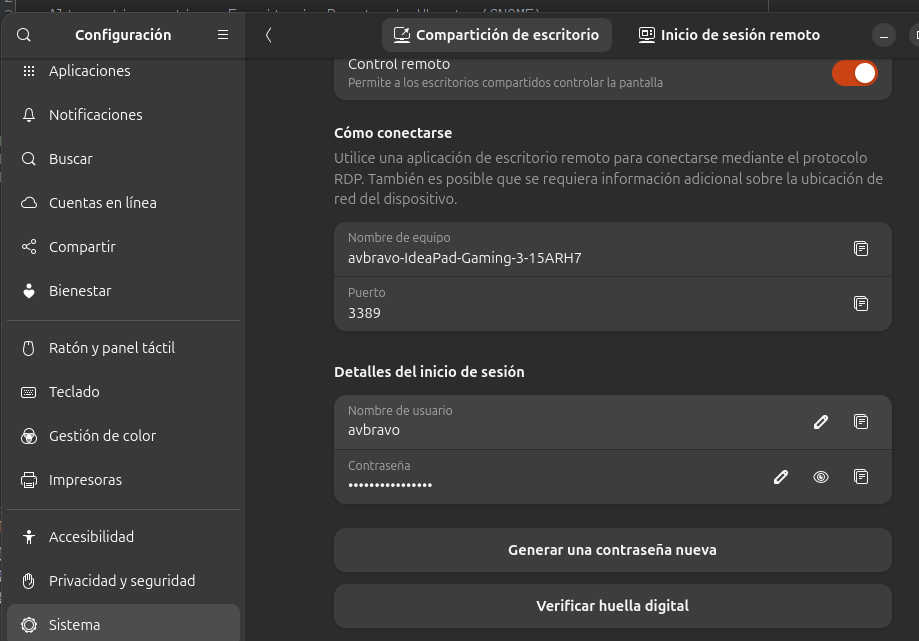

# Alternativa nativa: Escritorio Remoto de Ubuntu (GNOME)

Alternativa nativa: Escritorio Remoto de Ubuntu (GNOME)
Si tu Ubuntu usa el entorno GNOME predeterminado:

En Ubuntu, ve a Configuración > Sistema > Compartir > Escritorio Remoto.

Activa la opción y anota la dirección (por ejemplo, vnc://192.168.1.50:5900) junto con el usuario y la contraseña.

En tu Samsung A36, descarga un cliente VNC como bVNC Viewer o VNC Viewer desde la Play Store.

Introduce la IP y credenciales para conectarte dentro de tu misma red Wi-Fi.

