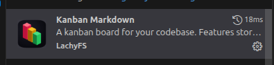

# Instalar Markdown Plugin

[https://marketplace.visualstudio.com/items?itemName=LachyFS.kanban-markdown](https://marketplace.visualstudio.com/items?itemName=LachyFS.kanban-markdown)

Buscar
ext install LachyFS.kanban-markdown

Para instalar presione CTRL+P

seleccionar 

Para ejecutarlo presione CTRL+SHIFT+P

CTRL+ SHIFT+ P: Open Kanban Board

Se guarda dentro de la carpeta

.devtool/features/

Del Workspace
en este caso lo guardo dentro de jettraexamplecontainers
