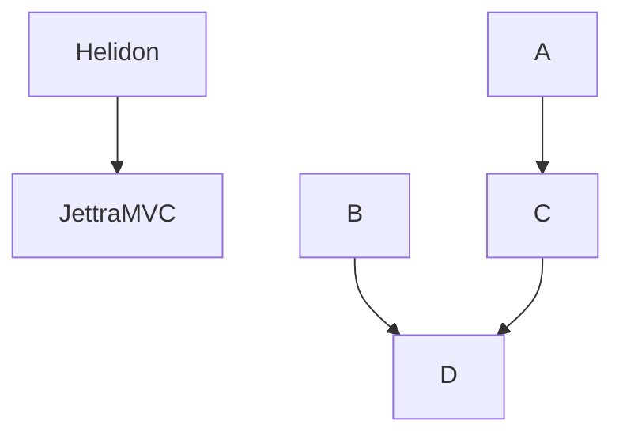
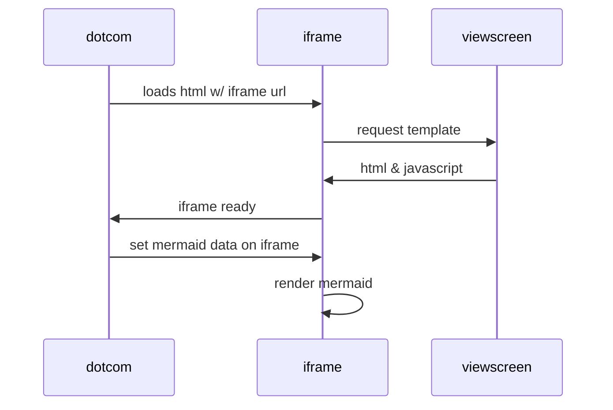

# Arquitectura

* Implementa Arquitectura [Self-contained Systems (SCS)](https://scs-architecture.org/index.html)

* Estilo Flutter

Helidon

```mermaid
  graph TD;
      Helidon-->JettraMVC;
      A-->C;
      B-->D;
      C-->D;
```

```mermaid
sequenceDiagram
    participant dotcom
    participant iframe
    participant viewscreen
    dotcom->>iframe: loads html w/ iframe url
    iframe->>viewscreen: request template
    viewscreen->>iframe: html & javascript
    iframe->>dotcom: iframe ready
    dotcom->>iframe: set mermaid data on iframe
    iframe->>iframe: render mermaid
```
