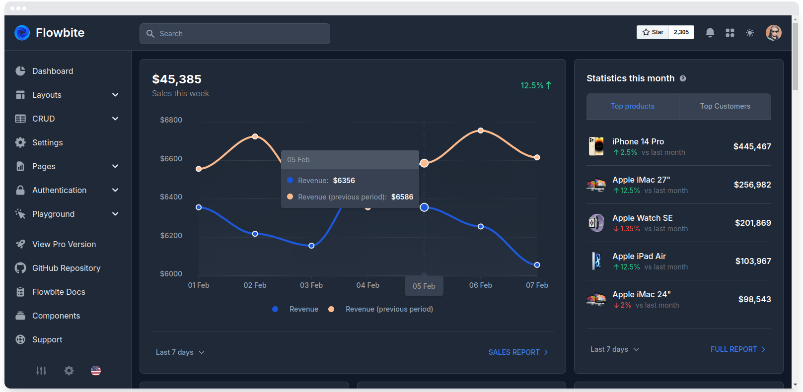

# Dashbard Tailwindcss

https://www.tailwindawesome.com/resources/flowbite-admin-dashboard/demo

https://github.com/themesberg/flowbite-admin-dashboard/blob/main/content/authentication/sign-up.html

[Tailwind CSS Dark Mode - Flowbite](https://flowbite.com/docs/customize/dark-mode/)

[Creating Tailwind CSS Dark Mode Using HTML and JS](https://dev.to/parzival_computer/creating-tailwind-css-dark-mode-using-html-and-js-43pe)