# Minio

[Tutorial Minio: Domina la solución para persistencia de objetos esencial para Data Lakes, Apps, ...](https://www.youtube.com/watch?v=XQrX-jQk5zM)

[Introduction to MinIO con Java SDK](https://www.baeldung.com/minio)

[Create Your Local Object Storage with MiniO, PySpark, and Delta Lake](https://blog.stackademic.com/create-your-local-object-storage-with-minio-pyspark-and-delta-lake-48157309bb94)

[Top 10 MinIO Alternatives In 2024](https://www.lucidity.cloud/blog/minio-alternatives)


[AlbertCoronado.com](https://www.albertcoronado.com/)

[Tutorial Minio: Domina la solución para persistencia de objetos esencial para Data Lakes, Apps, ...](https://www.youtube.com/watch?v=XQrX-jQk5zM)


---
# Instalación

MinIO Object Storage for Container

[MinIO Object Storage for Container](https://min.io/docs/minio/container/index.html)

```shell
mkdir -p ~/minio/data

docker run \
   -p 9000:9000 \
   -p 9001:9001 \
   --name minio \
   -v ~/minio/data:/data \
   -e "MINIO_ROOT_USER=avbravo" \
   -e "MINIO_ROOT_PASSWORD=denver16" \
   quay.io/minio/minio server /data --console-address ":9001"

```
   
   CONSULTA
```shell
   http://127.0.0.1:9000
   
   
API: http://172.17.0.3:9000  http://127.0.0.1:9000 
WebUI: http://172.17.0.3:9001 http://127.0.0.1:9001

```

---
# Crear Usuario

En la sección Identity seleccione User y agregue el usuario

```
user: admin
password: denver16

```


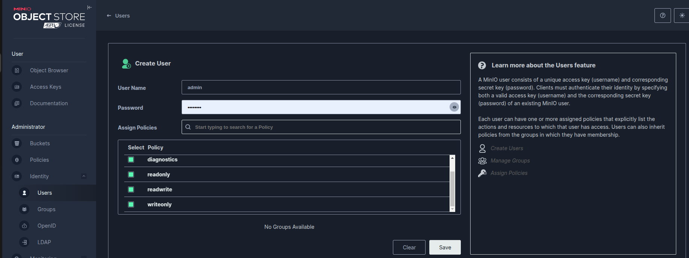

Una vez creado el usuario

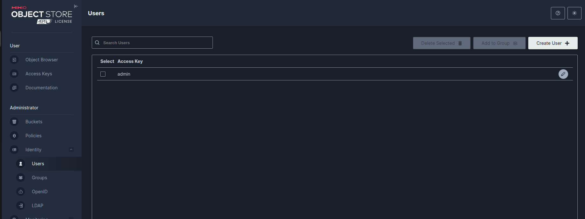

Seleccione el usuario y de clic en el botón editar al final de la fila

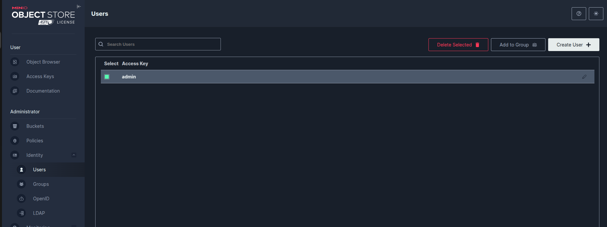


Seleccione Services Account

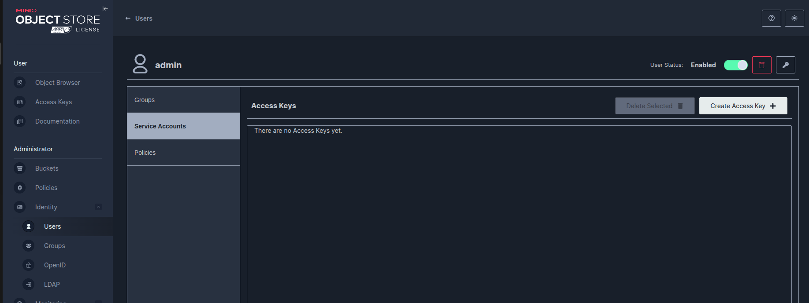


de clic en Create Acceskey +

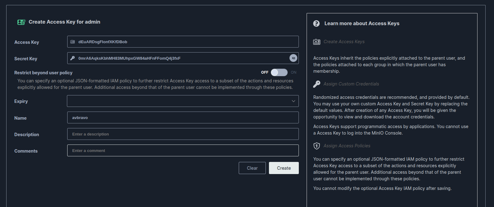

Genera para user Home

```
AccessKey: dEuARDsgFIonfXKfDBob
SecretKey: 0mrA6AqksKbhMH83MUhpxGW84aHFnFFomQ4j3fxF

```

De clic en Create, y nos permite generar el archivo de claves para autentificación

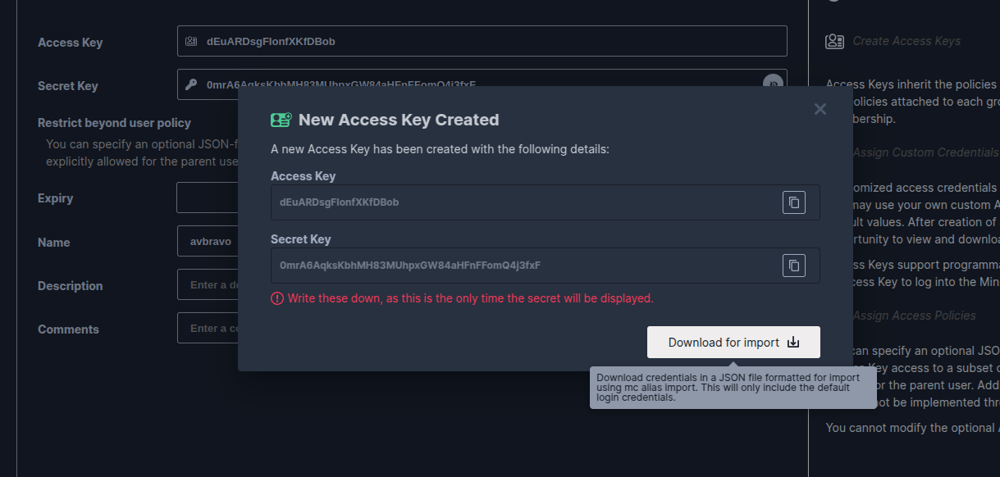

---

# Crear Grupo

Puedes crear grupos y asignar a los usuarios a esos grupos

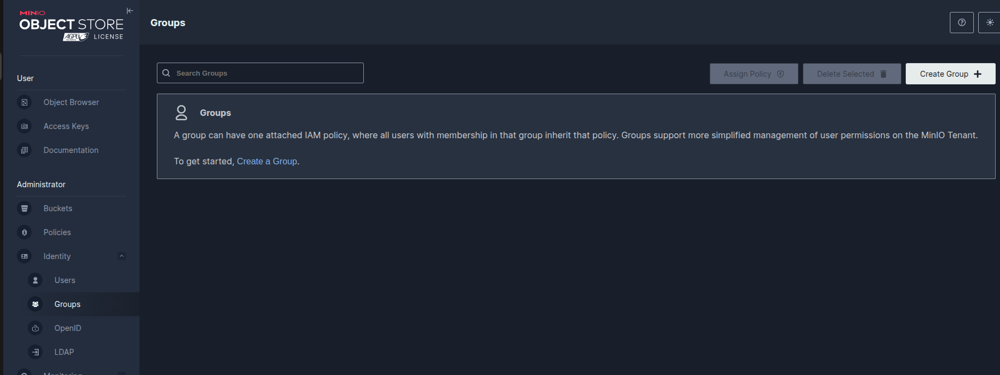

Cree un grupo llamado administradores y agregue los usuarios deseados.

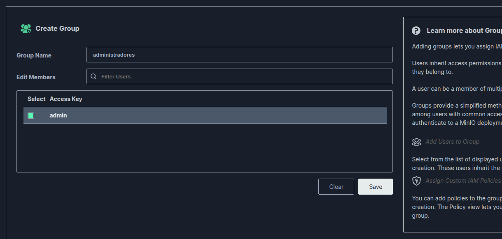


---
# Bucket

Los Bucket son los espacios de almacenamiento


Seleccione Bucket

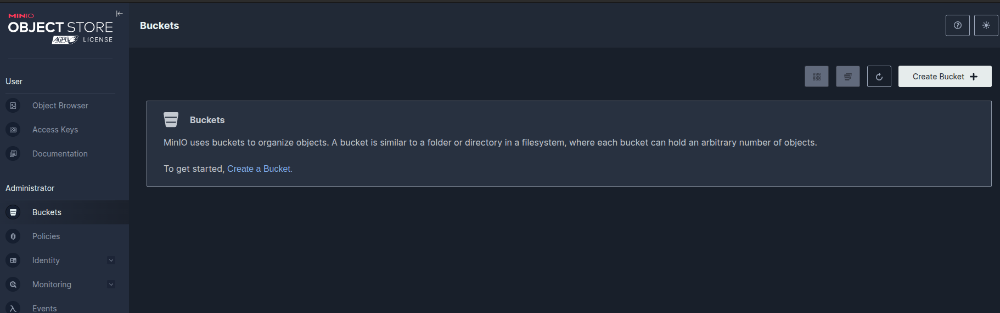

de clic en Create a Bucket

Indicamos el nombre photos y selecciones la opción Versioning, luego de clic en Create Bucket

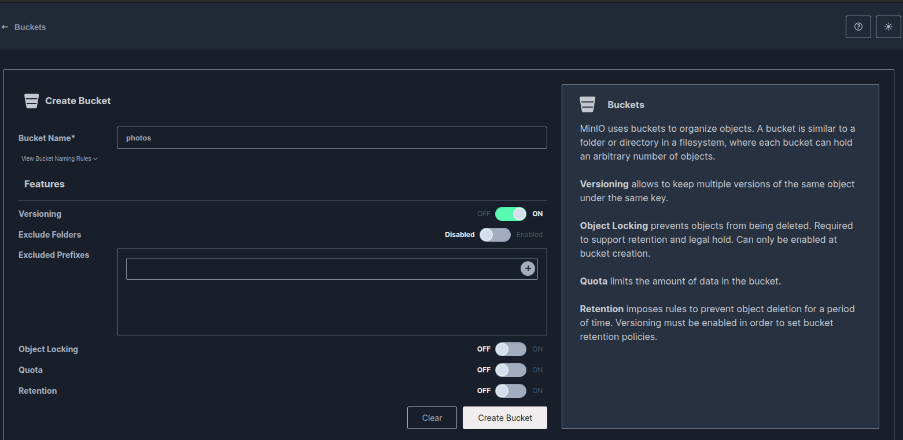

Se muestra el bucket creado, con el espacio ocupado y el total de objetos creados

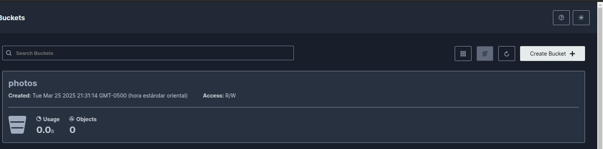

De clic en el bucket y podra ingresar a la opción de administración donde se podra administrar:

* Eventos

* Replicación

* Accesos

* Anonimo


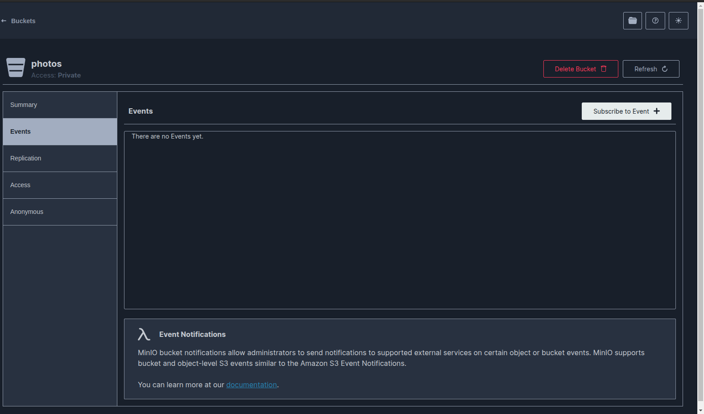


---

# Object Browser

Aqui podemos administrar los objetos de los diferentes buckets

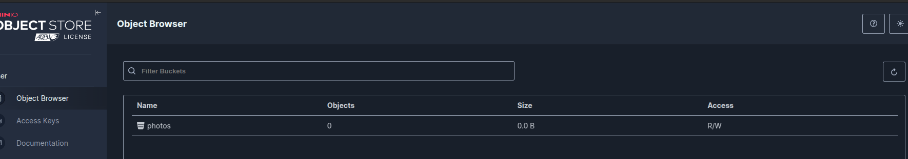

Dar clic en el bucket photos

Se muestra el bucket con los objetos que contiene

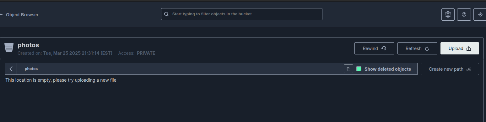

Para agregar nuevos objetos de click en Upload

Una vez que se sube el objeto se muestra en la lista

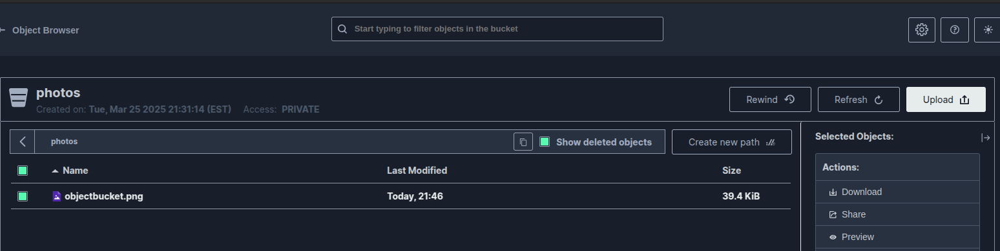

Podemos darle Shared para compartir el Objeto por un tiempo estipulado

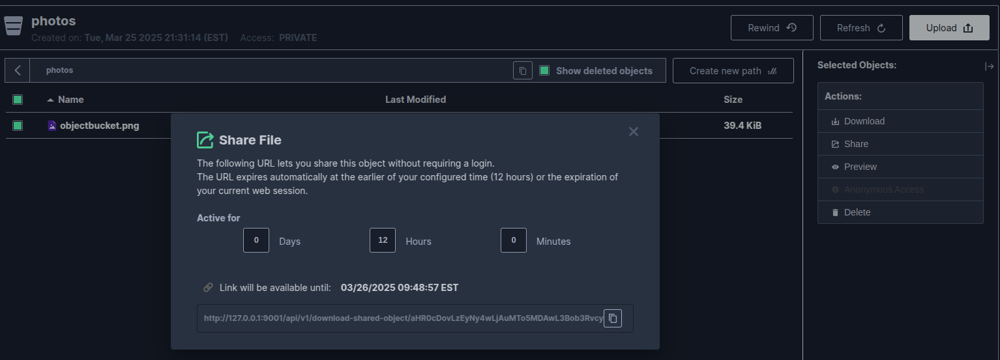

De esta manera podemos administrar los buckets y Objetos
---


# Instalar el Cliente

## Descargamos el cliente
```shell
wget https://dl.min.io/client/mc/release/linux-amd64/mc
```
## Le damos permisos de ejecución

```shell
chmod +x mc
```

---

# Credenciales

**Recuerde verificar sus credenciales**

En nuestro caso creamos instalaciones en varios lugares por lo cual tenemos las siguientes

Genera para user Home

```
AccessKey: dEuARDsgFIonfXKfDBob
SecretKey: 0mrA6AqksKbhMH83MUhpxGW84aHFnFFomQ4j3fxF

```

Data Server Work
```shell
User: admin
password: denver16
ACCESS KEY: CVSVCmpVtoARmRyEs4ZB
SECRET KEY: HJgFrciX3NutRfZGVk9sO5aI7gnX3I95PfANBT9b

```


# Crear Alias

## Creando alias Home
```shell
./mc alias set minio http://172.17.0.2:9000 dEuARDsgFIonfXKfDBob 0mrA6AqksKbhMH83MUhpxGW84aHFnFFomQ4j3fxF
```

## o Creando alias Work
```shell
./mc alias set minio http://172.17.0.2:9000 CVSVCmpVtoARmRyEs4ZB HJgFrciX3NutRfZGVk9sO5aI7gnX3I95PfANBT9b
```

## Haciendo ping para asegurar la conectividad
```shell
./mc ping minio
```

---
# Trabajando con el bucket

# Listar los objetos/ficheros del alias 'minio' y bucket 'test'(Creado vía consola web)

```shell
./mc ls minio/photos
```

 ## Copiando archivos desde ./Documentos/repository.txt a minio

```shell
./mc cp ./Documentos/repository.txt minio/photos

```

## Creando nuevas carpetas. Igual para crear nuevo buckets
```shell
./mc mb minio/photos/archivos/2025
```

---

# Montando un bucket de MinIO como carpeta

* Después hemos montado el bucket dentro de un contenedor ubuntu como una carpeta.
  
* Esta es la forma mas transparente para acceder a los buckets por parte de los usuarios.
  
* El primer paso es arrancar el contenedor(Importante con el parámetro --privileged):

```shell
docker run --privileged -it ubuntu:latest
```

* El proceso para instalar las dependencia y montar la carpeta es el siguiente:

# Instalación de dependencias

```shell
apt update && apt install -y s3fs
```

# Creamos la carpeta donde vamos a montar el bucket

```shell
mkdir miniofs

ls miniofs/

```

# Almacenamos las credenciales en un fichero y le damos permisos

*  User Home
```shell
echo "dEuARDsgFIonfXKfDBob:0mrA6AqksKbhMH83MUhpxGW84aHFnFFomQ4j3fxF" > .passwd-s3fs

```


* o User Work
```shell
echo "CVSVCmpVtoARmRyEs4ZB:HJgFrciX3NutRfZGVk9sO5aI7gnX3I95PfANBT9b" > .passwd-s3fs

```

Ejecutar

```shell
chmod 600 .passwd-s3fs
```


# Con s3fs montamos la carpeta

```shell
s3fs photos ./miniofs \
  -o dbglevel=info -f -o curldbg \
  -o passwd_file=.passwd-s3fs \
  -o host=http://172.17.0.2:9000 \
  -o endpoint=us-east-1 \
  -o use_path_request_style \
  -o allow_other
```

---
# Abrir otra consola de comandos 

Ejecutar

```shell
docker ps

```

Muestra las imagenes similar a esta salida en Home


```shell
CONTAINER ID   IMAGE                 COMMAND                  CREATED         STATUS             PORTS                                                           NAMES
936dac88370c   ubuntu:latest         "/bin/bash"              2 minutes ago   Up 2 minutes                                                                       tender_colden
3b211a9cf1e4   quay.io/minio/minio   "/usr/bin/docker-ent…"   22 hours ago    Up About an hour   0.0.0.0:9000-9001->9000-9001/tcp, :::9000-9001->9000-9001/tcp   minio

```

o Muestra las imagenes similar a esta salida en Work

```shell
CONTAINER ID   IMAGE                 COMMAND                  CREATED          STATUS          PORTS                                                           NAMES
790aeadee025   ubuntu:latest         "/bin/bash"              26 minutes ago   Up 26 minutes                                                                   epic_cerf
0fb082c5b5cf   quay.io/minio/minio   "/usr/bin/docker-ent…"   3 hours ago      Up 3 hours      0.0.0.0:9000-9001->9000-9001/tcp, :::9000-9001->9000-9001/tcp   minio


```

o Entrar al shell en Home

```shell

docker exec -it 936dac88370c bash

```

o Entrar al shell en Work

```shell

docker exec -it 790aeadee025 bash

```

Ingresar a la carpeta

```shell

cd miniofs

```

Ejecutar ls para ver los archivos

```shell

ls

```

Lo que se grabe esa carpeta se ira al backend y lo que se almacene en el backend se ira a esa carpeta

* Crear un archivo 
```shell
echo "desdeubuntu" > ub.txt

ls
```

* Entrar al Minio desde el browser
* 
```shell
http://172.17.0.2:9001/browser/photos
```
Se observa el archivo creado

---
# Phyton

Entrar a una consola nueva

* Crear una nueva parqueta

```shell
mkdir miniofs

cd miniofs
```

* Instalar virtualenv

```shell
sudo apt install python3-virtualenv
```

* Ejecute

```shell

virtualenv env

```

Ejecute

```shell
source env/bin/activate
```

Instalar minio

```shell

pip install minio

```

* Crear el archivo script.py
  
```shell

gnome-text-editor script.py

```

* Contenido del archivo para work con las credenciales

* Recuerde que si usa home seria
  **access_key="dEuARDsgFIonfXKfDBob"** y **secret_key="0mrA6AqksKbhMH83MUhpxGW84aHFnFFomQ4j3fxF"**
* Recuerde que si usa work seria:
  **access_key="CVSVCmpVtoARmRyEs4ZB"** y **secret_key="HJgFrciX3NutRfZGVk9sO5aI7gnX3I95PfANBT9b"**

```shell

from minio import Minio
 
client = Minio(
    "127.0.0.1:9000",
    access_key="CVSVCmpVtoARmRyEs4ZB",
    secret_key="HJgFrciX3NutRfZGVk9sO5aI7gnX3I95PfANBT9b",
    secure=False
)

# Creamos un nuevo bucket, cuidado porque la segunda vez dará error porque ya existirá
client.make_bucket("my-test-bucket2")

# Listamos todos los buckets
print("Buckets")
print("=======")
buckets = client.list_buckets()
for bucket in buckets:
    print(bucket.name, bucket.creation_date)

# Listamos los objetos/ficheros del 'bucket test'
print("")
print("Objetos en 'test'")
print("=================")
objects = client.list_objects("photos")
for obj in objects:
    print(vars(obj))

```

---
# Ejecutar

```shell
python3 --version

python3 script.py
```

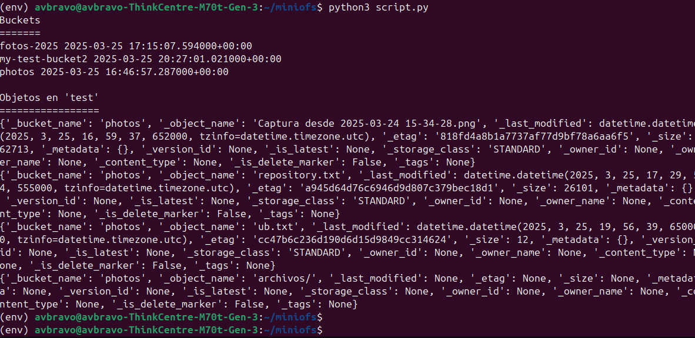


