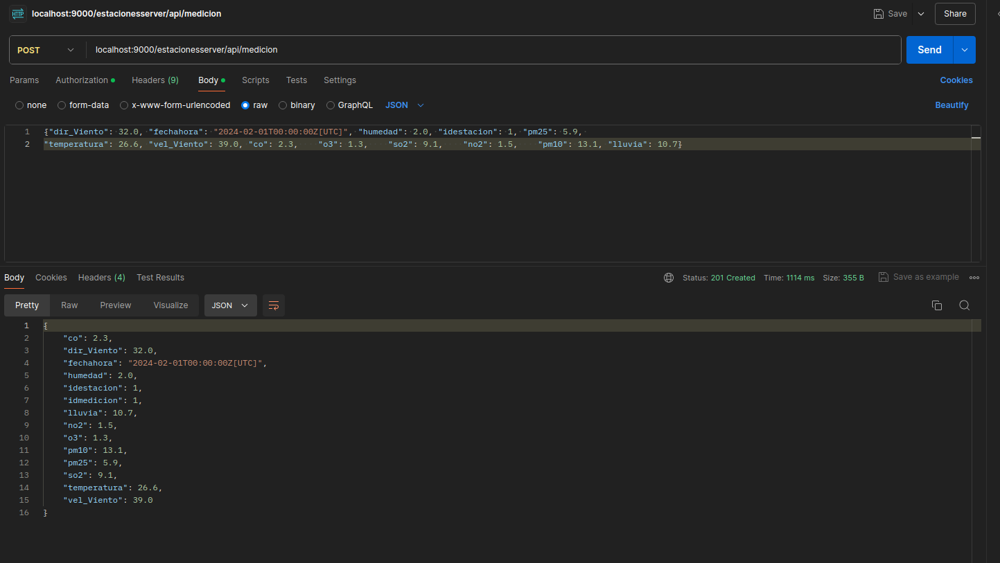

# Postman
## POST

Selecciones BODY luego raw




Para hacer la consulta POST: localhost:9000/estacionesserver/api/medicion y mando los siguientes datos:


### (Se guarda en la colección de Enero)
```


{"dir_Viento": 32.0, "fechahora": "2024-02-01T00:00:00Z[UTC]", "humedad": 2.0, "idestacion": 1, "pm25": 5.9, 

"temperatura": 26.6, "vel_Viento": 39.0, "co": 2.3,    "o3": 1.3,    "so2": 9.1,    "no2": 1.5,    "pm10": 13.1, "lluvia": 10.7}


{"dir_Viento": 32.0, "fechahora": "2024-02-01T01:00:00Z[UTC]", "humedad": 0.0, "idestacion": 1, "pm25": 5.9, 

"temperatura": 26.6, "vel_Viento": 39.0, "co": 2.3,    "o3": 1.3,    "so2": 9.1,    "no2": 1.5,    "pm10": 13.1, "lluvia": 0.7}


{"dir_Viento": 32.0, "fechahora": "2024-02-01T02:00:00Z[UTC]", "humedad": 2.0, "idestacion": 1, "pm25": 5.9, 

"temperatura": 26.6, "vel_Viento": 39.0, "co": 2.3,    "o3": 1.3,    "so2": 9.1,    "no2": 1.5,    "pm10": 13.1, "lluvia": 10.7}


{"dir_Viento": 32.0, "fechahora": "2024-02-01T03:00:00Z[UTC]", "humedad": 2.0, "idestacion": 1, "pm25": 5.9, 

"temperatura": 26.6, "vel_Viento": 39.0, "co": 2.3,    "o3": 1.3,    "so2": 9.1,    "no2": 1.5,    "pm10": 13.1, "lluvia": 10.7} 


{"dir_Viento": 32.0, "fechahora": "2024-02-01T04:00:00Z[UTC]", "humedad": 2.0, "idestacion": 1, "pm25": 5.9, 

"temperatura": 26.6, "vel_Viento": 39.0, "co": 2.3,    "o3": 1.3,    "so2": 9.1,    "no2": 1.5,    "pm10": 13.1, "lluvia": 10.7} 

```
### (Se guarda en la colección de Febrero)

```
{"dir_Viento": 32.0, "fechahora": "2024-02-01T05:00:00Z[UTC]", "humedad": 2.0, "idestacion": 1, "pm25": 5.9, 

"temperatura": 26.6, "vel_Viento": 39.0, "co": 2.3,    "o3": 1.3,    "so2": 9.1,    "no2": 1.5,    "pm10": 13.1, "lluvia": 10.7} 

```

