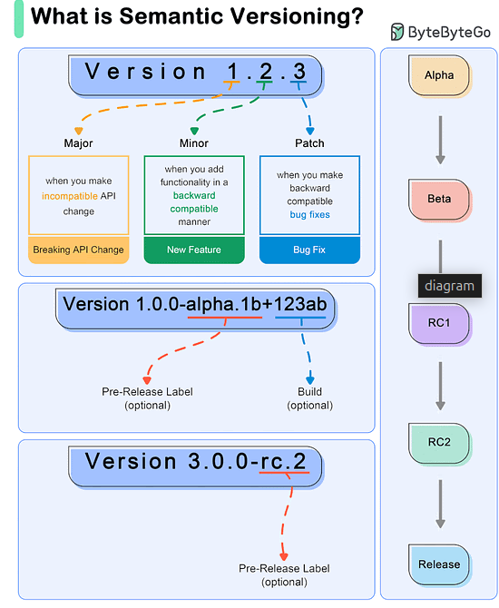

# Semantic Version

[ByteByteGo Newsletter](https://blog.bytebytego.com/)

SemVer uses a three-part version number: MAJOR.MINOR.PATCH.

MAJOR version: Incremented when there are incompatible API changes.

MINOR version: Incremented when functionality is added in a backward-compatible manner.

PATCH version: Incremented when backward-compatible bug fixes are made.

Example Workflow
1 - Initial Development Phase
Start with version 0.1.0.

2 - First Stable Release
Reach a stable release: 1.0.0.

3 - Subsequent Changes
Patch Release: A bug fix is needed for 1.0.0. Update to 1.0.1.

Minor Release: A new, backward-compatible feature is added to 1.0.3. Update to 1.1.0.

Major Release: A significant change that is not backward-compatible is introduced in 1.2.2. Update to 2.0.0.

4 - Special Versions and Pre-releases
Pre-release Versions: 1.0.0-alpha, 1.0.0-beta, 1.0.0-rc.1.
Build Metadata: 1.0.0+20130313144700.
