# JMeter


## Testing de Microservicios con Autentificacion Basica


Deseamos conectarnos a un endpoint

```

http://localhost:9002/cancerdetectorserver/api/applicative

```
Que tiene las soguientes credenciales
* username  iJYxBAmcCfr016hVry8MCKS0xA4S6SExizJM442E+18=
* password  2tbHQCWpe69CvNbAAmCXcJxTFEQtjRxXNA5yIYz7lbE=

Pasos:
1. Crear un plan Nuevo

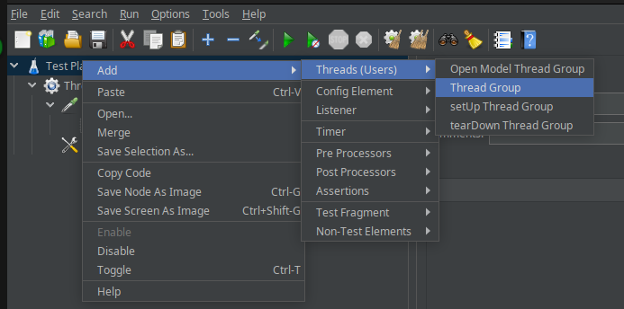

   
2. Cree un http request

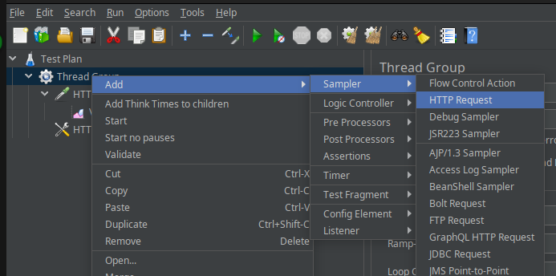


3. Configurar

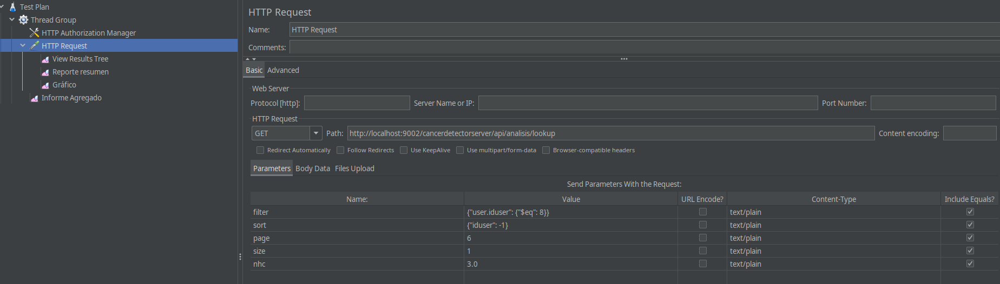

* Http Request: GET
* Path: http://localhost:9002/cancerdetectorserver/api/analisis/lookup

Agregar los parametros:

filter  {"user.iduser": {"$eq": 8}}

sort {"fecha": -1}

page  1

size 1

nhc  3.0


4. Ubiquese en Http Request y seleccione Add --> Listener --> View Result

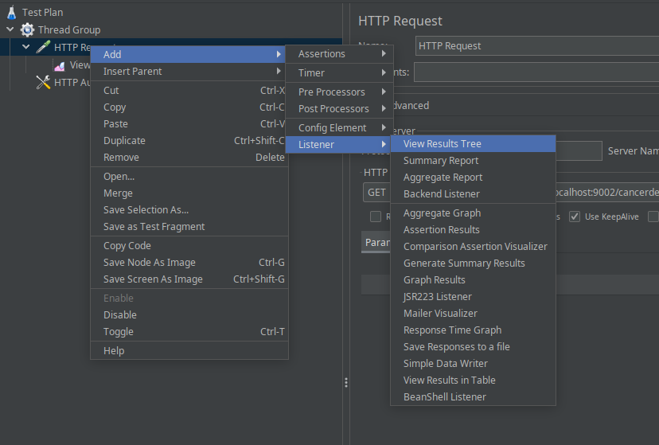

5. Ubiquese en Tread Group Selecciona Add --> Config Element --> Http Header Manager

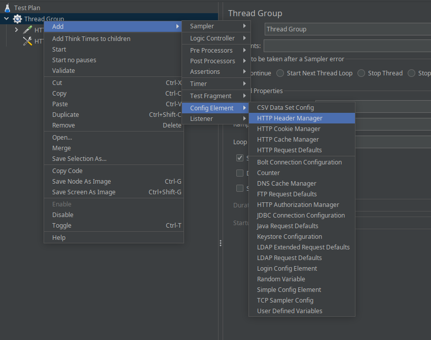


6. Agregue los parametros

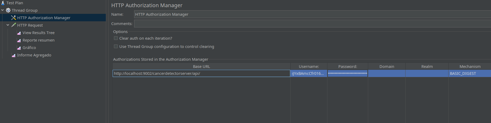

Base URL : http://localhost:9002/cancerdetectorserver/api/

Username: iJYxBAmcCfr016hVry8MCKS0xA4S6SExizJM442E+18=

Password: 2tbHQCWpe69CvNbAAmCXcJxTFEQtjRxXNA5yIYz7lbE=

Mechanism: BASIC_DIGEST

7. Ejecute mediante start

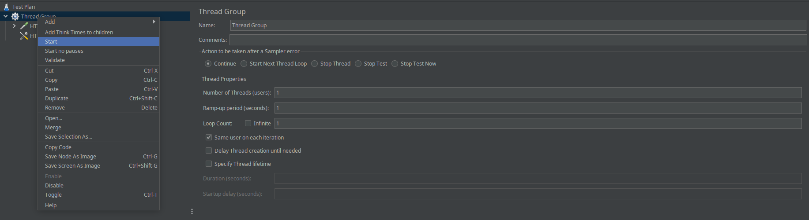


8. Puede ver el resultado

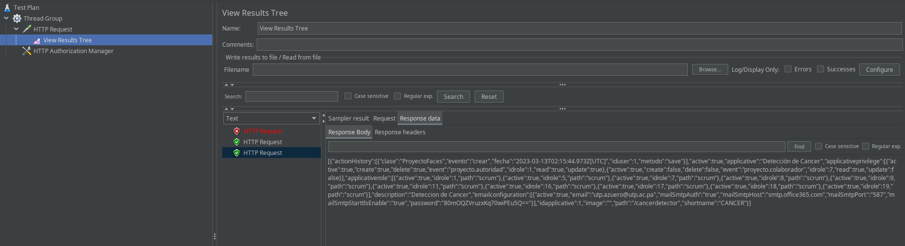

9. Modifique las peticiones

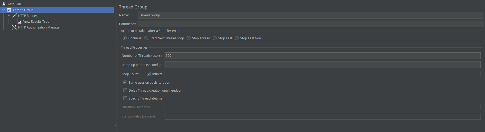


10. Agregue un Receptor --> Informe Agregado

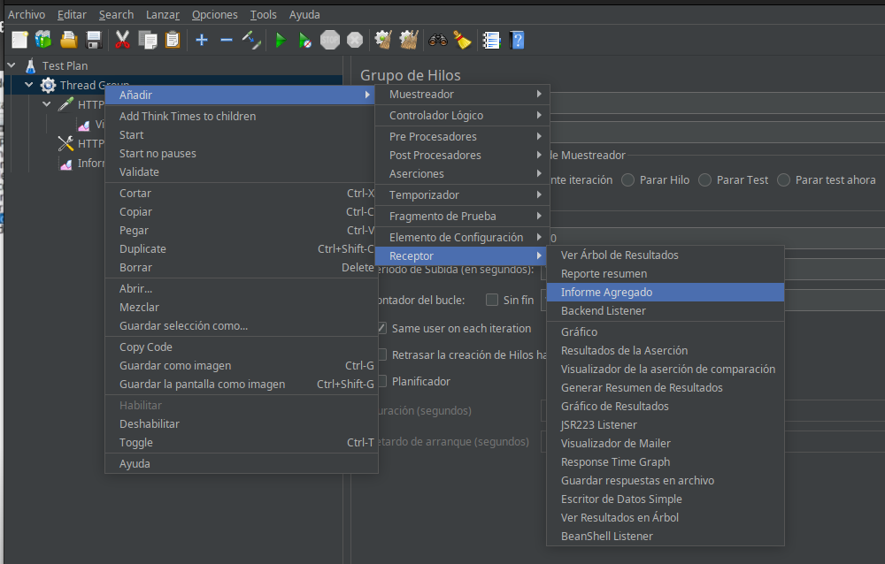

Se muestra el informe


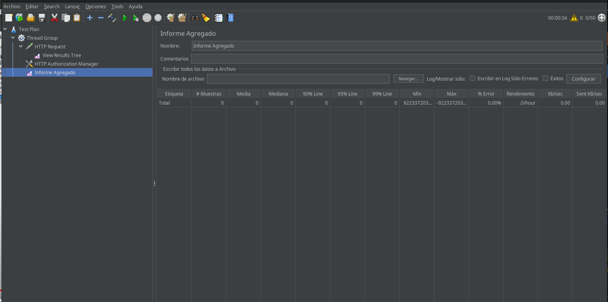


11. Mueva al top Http Autorization Manager


12. Modifique el Tread

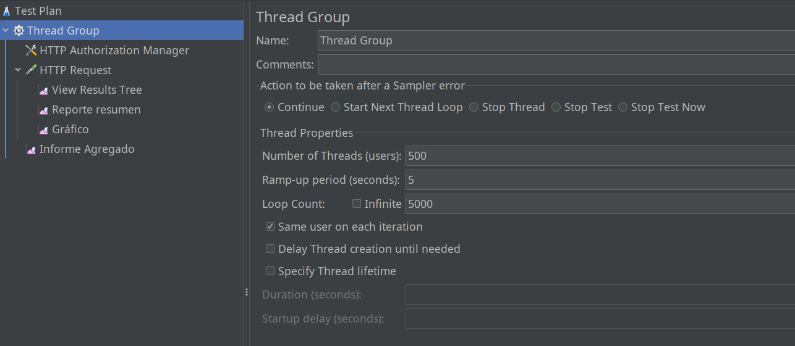

Number Of Thread (Users): 500

Ram-up period (seconds): 5

Loop Count: 5000


13. Ejecutar


puede ver los resultados

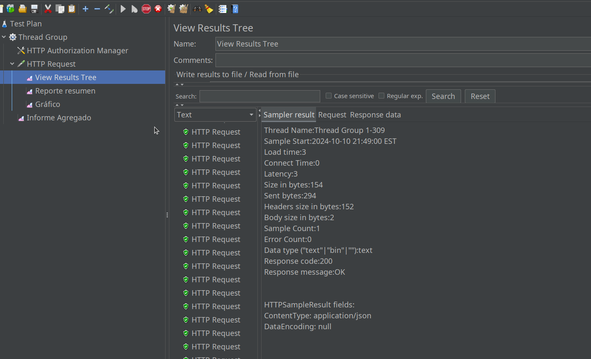

Resumen

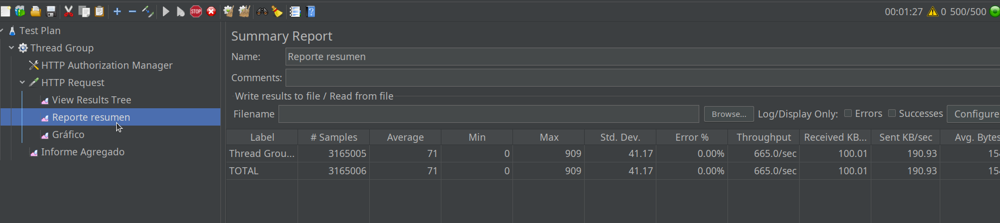

Grafico

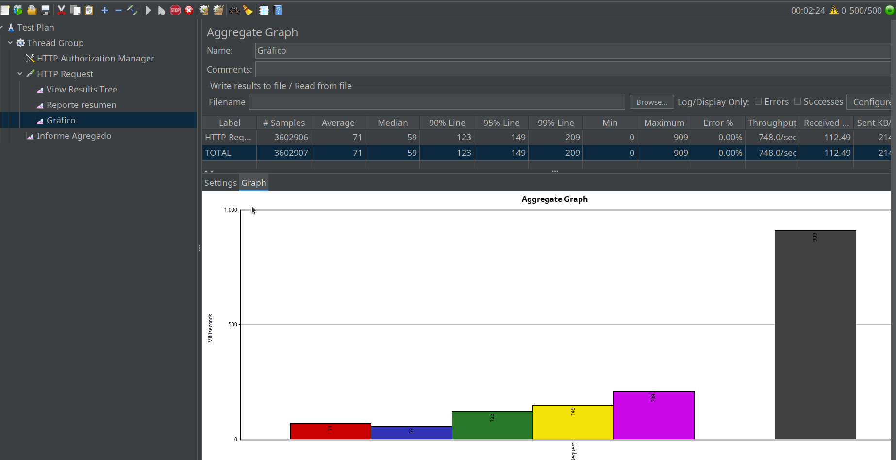