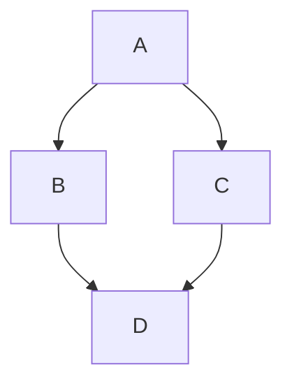

# Mermaid
https://mermaid-js.github.io/mermaid/#/

[https://docs.github.com/en/get-started/writing-on-github/working-with-advanced-formatting/creating-diagram](https://docs.github.com/en/get-started/writing-on-github/working-with-advanced-formatting/creating-diagrams)

Permite crear:
- diagramas
- mapas
- flowchart
- arboles de decisiones
- 
Para crear diagramas siga estas instrucciones

https://mermaid-js.github.io/mermaid/#/

https://docs.github.com/es/get-started/writing-on-github/working-with-advanced-formatting/creating-diagrams

Ejemplo:

Otros Ejemplos
[Otros Ejemplos](https://github.com/mermaid-js/mermaid#readme)
