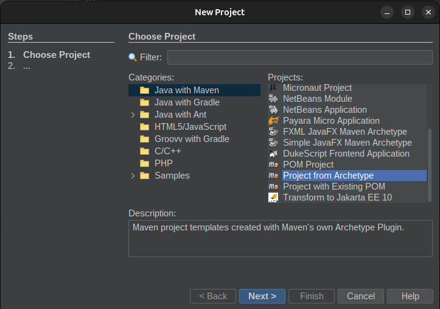
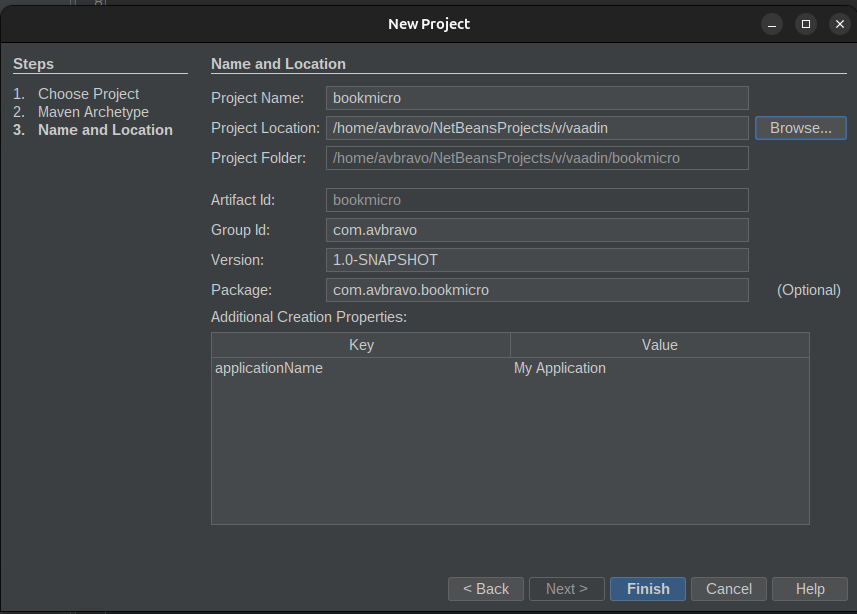
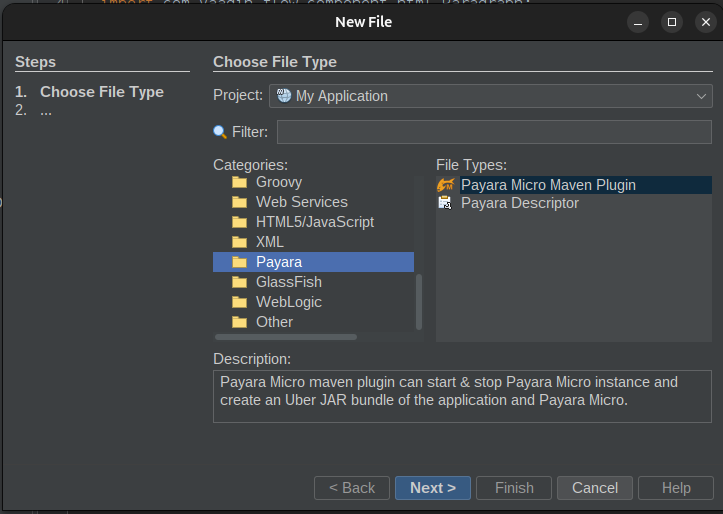
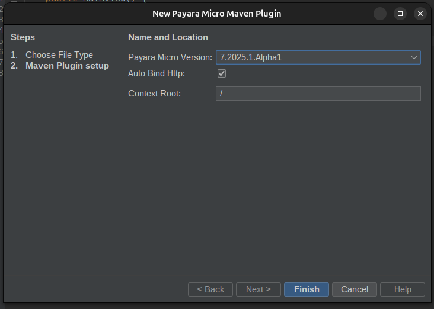
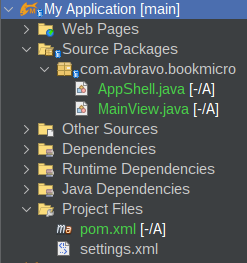
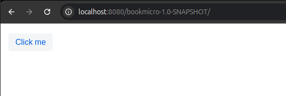
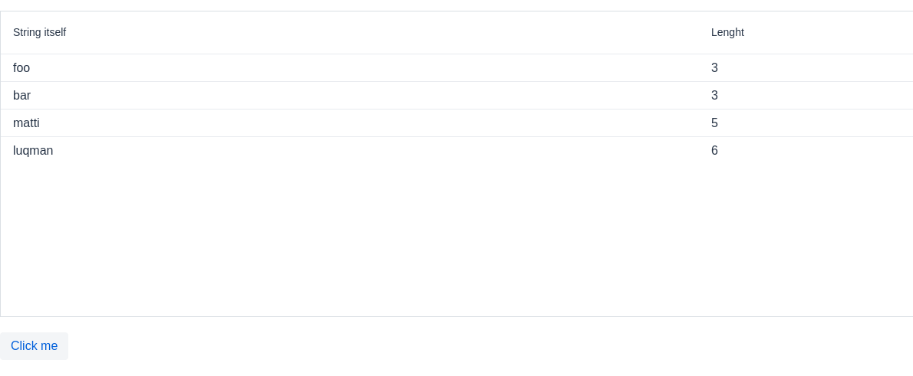

# JakartaEE con Vaadin Book

[Enterprise Java Application Development With Jakarta EE and Vaadin](https://www.youtube.com/watch?v=Qyz_ewRgo4A)

Proyecto

[https://github.com/avbravo/bookmicro](https://github.com/avbravo/bookmicro)


Crear un proyecto Web 

Categories: Java with Maven 

Projects: Project from Archetype




```
vaadin-archetype-application
```

Indicar el nombre del proyecto




Editar el archivo pom.xml

Cambiar

```
<dependency>
    <groupId>jakarta.servlet</groupId>
    <artifactId>jakarta.servlet-api</artifactId>
    <version>6.0.0</version>
    <scope>provided</scope>
</dependency>

```

por

```
<dependency>
    <groupId>jakarta.platform</groupId>
    <artifactId>jakarta.jakartaee-api</artifactId>
    <version>10.0.0</version>
    <scope>provided</scope>
</dependency>


```


Agregue

```
<dependency>
    <groupId>com.vaadin</groupId>
    <!-- Replace artifactId with vaadin-core to use only free components -->
    <artifactId>vaadin-cdi</artifactId>
</dependency>

```

## Convertir el proyecto a payara-micro

Seleccionar el proyecto y dar clic en New--> Other en Categories: Payara  Type: Payara Micro Maven Plugin





Luego seleccione la versión a utilizar



Puede observar el esqueleto del proyecto



Ejecutar el proyecto

```
[2025-03-27T10:58:16.780-0500] [] [INFO] [] [PayaraMicro] [tid: _ThreadID=1 _ThreadName=main] [timeMillis: 1743091096780] [levelValue: 800] [[
  
Payara Micro URLs:
http://localhost:8080/bookmicro-1.0-SNAPSHOT

]]

[2025-03-27T10:58:16.780-0500] [] [INFO] [] [PayaraMicro] [tid: _ThreadID=1 _ThreadName=main] [timeMillis: 1743091096780] [levelValue: 800] Payara Micro 7.2025.1.Alpha1 #badassmicrofish (build 14) ready in 7.148 (ms)

```

Ingrese al navegador




## Cambiar nombre al proyecto

Si desea cambiar el nombre del proyecto, edite el archivo pom.xml y cambie

```
<name>My Application</name>
```

Por

```
<name>Bookmicro</name>
```


* Abra la clase MainView.java

```java
import com.vaadin.flow.component.button.Button;
import com.vaadin.flow.component.html.Paragraph;
import com.vaadin.flow.component.orderedlayout.VerticalLayout;
import com.vaadin.flow.router.Route;

@Route
public class MainView extends VerticalLayout {

    public MainView() {
        Button button = new Button("Click me",
                event -> add(new Paragraph("Clicked!")));

        add(button);
    }
}
```


# Agregar un Grid

Inserte el siguiente codigo

```java
Grid<String> grid = new Grid<String>();
grid.addColumn(s -> s).setHeader("String itself");
grid.addColumn(s -> s.length()).setHeader("Lenght");
grid.setItems("foo", "bar", "matti", "luqman");
add(grid);

```

Quedaria

```java
import com.vaadin.flow.component.button.Button;
import com.vaadin.flow.component.grid.Grid;
import com.vaadin.flow.component.html.Paragraph;
import com.vaadin.flow.component.orderedlayout.VerticalLayout;
import com.vaadin.flow.router.Route;

@Route
public class MainView extends VerticalLayout {

    public MainView() {
        Button button = new Button("Click me",
                event -> add(new Paragraph("Clicked!")));
        Grid<String> grid = new Grid<String>();
        grid.addColumn(s -> s).setHeader("String itself");
        grid.addColumn(s -> s.length()).setHeader("Lenght");
        grid.setItems("foo", "bar", "matti", "luqman");
        add(grid);
        add(button);

    }
}


```


